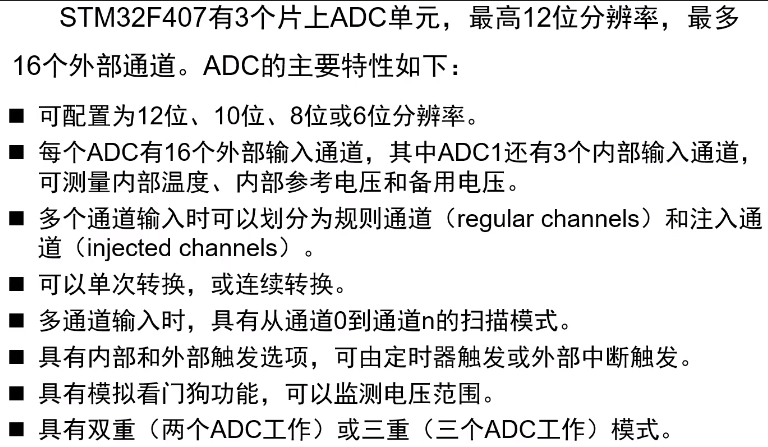
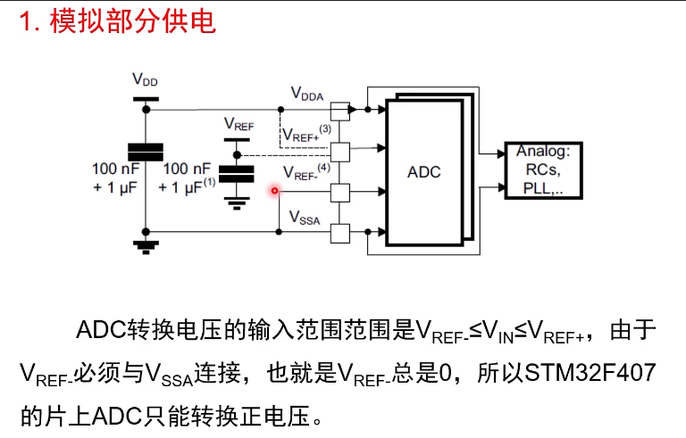
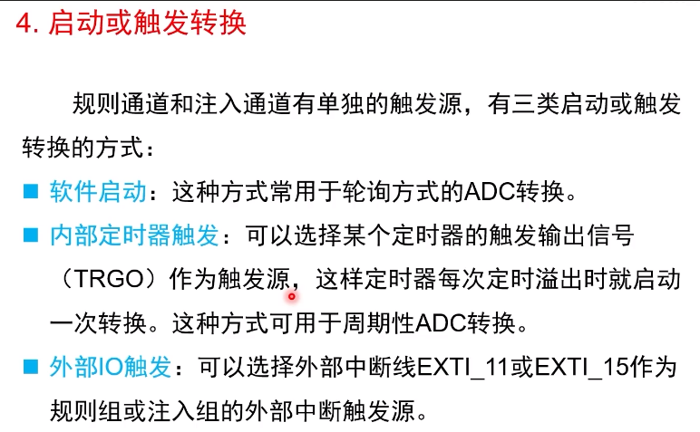
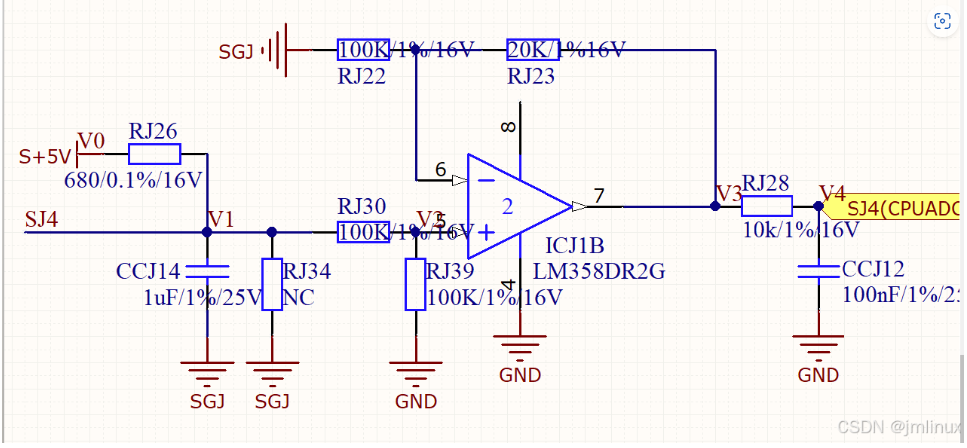

# STM32的ADC采样放大电路

## 芯片内部基本ADC原理

## ADC采集运放电路

### 设计要点

* ### 基准源的设计，基准电压肯定要稳，而且应该要有一定的驱动能力。有一篇关于基准的文章https://www.bilibili.com/read/cv35121342/值得仔细研读。

* 运算放大电路

* [STM32 HAL库 + LM358运算放大器 + ADC + VDO温度传感器：电路设计及代码实现_stm32 adc lm358-CSDN博客](https://blog.csdn.net/m0_37371085/article/details/144202755)

