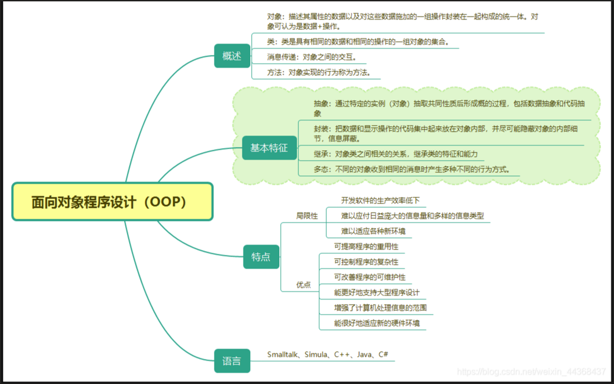

1.面向对象程序设计

- 完全支持面向对象的程序设计，包括面向对象开发的四大特性：封装、**抽象**、继承、多态。

 

2.C++ 程序可以定义为对象的集合，这些对象通过调用彼此的方法进行交互。

 

对象 - 对象具有状态和行为，对象是类的实例。

类 - 类可以定义为描述对象行为/状态的 模板/蓝图。

方法 - 从基本上说，一个方法表示一种行为。一个类可以包含多个方法。可以在方法中写入逻辑、操作数据以及执行所有的动作。

即时变量 - 每个对象都有其独特的即时变量。对象的状态是由这些即时变量的值创建的。

内联函数（关键字：inline）

每当程序中出现对该函数的调用时，C++编译器使用函数体中的代码插入到调用该函数的语句之处，同时使用实参代替形参，以便在程序运行时不再进行函数调用。引入[内联函数](https://so.csdn.net/so/search?q=内联函数&spm=1001.2101.3001.7020)主要是为了消除调用函数时的系统开销，以提高运行速度。

说明：

- 内联函数在第一次被调用之前必须进行完整的定义，否则编译器将无法知道应该插入什么代码
- 在内联函数体内一般不能含有复杂的控制语句，如for语句和switch语句等
- 使用内联函数是一种空间换时间的措施，若内联函数较长，较复杂且调用较为频繁时不建议使用

函数重载：

在同一作用域内，只要函数参数的类型不同，或者参数的个数不同，或者二者兼而有之，两个或者两个以上的函数可以使用相同的函数名。

 作用域标识符 "::"

如果有两个同名变量，一个是全局的，另一个是局部的，那么局部变量在其作用域内具有较高的优先权，

它将屏蔽全局变量。

在局部变量的作用域内使用同名的全局变量，可以在该变量前加上“::”，此时::value代表全局变量value，

“::”称为作用域标识符。

 一、类和对象

类声明中的内容包括数据和函数，分别称为数据成员和成员函数。

按访问权限划分，数据成员和成员函数又可分为共有、保护和私有3种。

class 类名{

  public：

​    公有数据成员；

​    公有成员函数；

  protected:

​    保护数据成员；

​    保护成员函数；

  private:

​    私有数据成员；

​    私有成员函数；

};

 

**对象中成员的访问**

对象名.数据成员名对象名.成员函数名[(参数表)]

op1.setScore(89, 99);

op1.showScore();

 

类的作用域和类成员的访问属性

私有成员只能被类中的成员函数访问，不能在类的外部，通过类的对象进行访问。

公有成员是类的对外接口，而私有成员是类的内部数据和内部实现，不希望外界访问。

将类的成员划分为不同的访问级别有两个好处：

一是信息隐蔽，即实现封装，将类的内部数据与内部实现和外部接口分开，这样使该类的外部程序不需要了解类的详细实现；

二是数据保护，即将类的重要信息保护起来，以免其他程序进行不恰当的修改。

构造函数

构造函数是一种特殊的成员函数，它主要用于为对象分配空间，进行初始化。构造函数的名字必须与类名相同，而不能由用户任意命名。它可以有任意类型的参数，但不能具有返回值。它不需要用户来调用，而是在建立对象时自动执行。

说明：

 

构造函数的名字必须与类名相同，否则编译程序将把它当做一般的成员函数来处理。

构造函数没有返回值，在定义构造函数时，是不能说明它的类型的。

与普通的成员函数一样，构造函数的函数体可以写在类体内，也可写在类体外。

构造函数一般声明为共有成员，但它不需要也不能像其他成员函数那样被显式地调用，它是在定义对象的同时被自动调用，而且只执行一次。

构造函数可以不带参数。

 

成员初始化列表

类名::构造函数名([参数表])[:(成员初始化列表)]

{

  //构造函数体

}

析构函数

析构函数也是一种特殊的成员函数。它执行与构造函数相反的操作，通常用于撤销对象时的一些清理任务，如释放分配给

对象的内存空间等。析构函数有以下一些特点：

析构函数与构造函数名字相同，但它前面必须加一个波浪号（~）。

析构函数没有参数和返回值，也不能被重载，因此只有一个。

当撤销对象时，编译系统会自动调用析构函数。

 

说明：在以下情况中，当对象的生命周期结束时，析构函数会被自动调用：

如果定义了一个全局对象，则在程序流程离开其作用域时，调用该全局对象的析构函数。

如果一个对象定义在一个函数体内，则当这个函数被调用结束时，该对象应该被释放，析构函数被自动调用。

若一个对象是使用new运算符创建的，在使用delete运算符释放它时，delete会自动调用析构函数