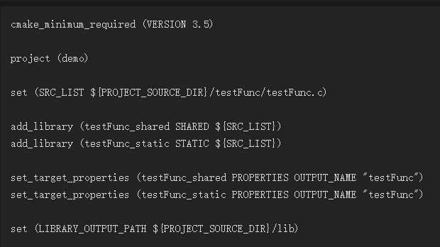
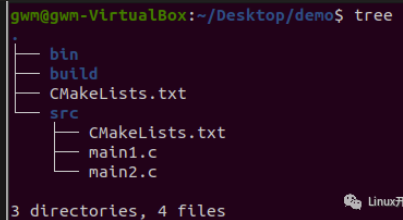

[深入了解CMake：高级技巧与最佳实践 (qq.com)](https://mp.weixin.qq.com/s/66hniR8GhWRBYCe6u8UQyA)

1.基本使用,单个文件CmakeLists.txt构建

文件结构如下:

CmakeLists.txt文件结构：

2.编译多个文件，CmakeLists.txt构建

文件结构如下：

CmakeLists.txt文件结构：

3.如果有大量的源文件，使用2这个方法就不行了，所以有这个方法：

因此cmake提供了一个命令可以把指定目录下所有的源文件存储在一个变量中，这个命令就是：aux_source_directory(dir var)

第一个参数dir是指定目录，第二个参数var是用于存放源文件列表的变量。

 

文件结构：

CmakeLists.txt文件结构：

使用aux_source_directory把当前目录下的源文件存列表存放到变量SRC_LIST里;

然后在add_executable里调用SRC_LIST（注意调用变量时的写法）。

 

aux_source_directory()也存在弊端，它会把指定目录下的所有源文件都加进来，可能会加入一些我们不需要的文件，此时我们可以使用set命令去新建变量来存放需要的源文件，如下：

4.在不同的目录下有多个源文件

文件结构：

CmakeLists.txt文件结构：

这里出现了一个新的命令：include_directories。

该命令是用来向工程添加多个指定头文件的搜索路径，路径之间用空格分隔。

我们使用了2次aux_source_directory，因为源文件分布在2个目录下，所以添加2次。

- 项目级的组织结构

一般会把源文件放到src目录下，把头文件放入到include文件下，生成的对象文件放入到

build目录下，最终输出的可执行程序文件会放到bin目录下，这样整个结构更加清晰。

1.文件结构:

2.CmakeLists.txt文件结构

add_subdirectory共有三个参数，后两个是可选参数.

source_dir 源代码目录

指定一个包含CMakeLists.txt和代码文件所在的目录，该目录可以是绝对路径，也可以是相对路径，对于后者相对路径的起点是CMAKE_CURRENT_SOURCE_DIR。此外，如果子目录再次包含的CMakeLists.txt，则将继续处理里层的CMakeLists.txt，而不是继续处理当前源代码。

 

binary_dir 二进制代码目录

这个目录是可选的，如果指定，cmake命令执行后的输出文件将会存放在此处，若没有指定，默认情况等于source_dir没有进行相对路径计算前的路径，也就是CMAKE_BINARY_DIR。

 

EXCLUDE_FROM_ALL标记

这个标志是可选的，如果传递了该参数表示新增加的子目录将会排除在ALL目录之外（可能是make系统中的make all？），表示这个目录将从IDE的工程中排除。用户必须显式在子文件这个编译目标（手动cmake之类的）。指定了这个文件夹，表示这个文件夹是独立于源工程的，这些函数是有用但是不是必要的，比如说我们一系列的例子。

 

add_subdirectory 这个命令用于添加源文件子目录，同时还可以指定中间二进制和目标二进制的生成路径。

EXCLUDE_FROM_ALL将会将这个目录从编译中排除，如工程的例子需要等待其他编译完成后再进行单独的编译。通常子目录应该包含自己的project()命令，这样以来整个编译命令将会产生各自的目标文件。

如果把CMakeLists.txt与VS IDE比较，总的CMakeLists.txt就相当于解决方案，子CMakeLists.txt就相当于在解决方案下的工程文件。还有一个需要注意的是，如果编译父CMakeLists时依赖了子CMakeLists.txt中的源文件，那么该标志将会被覆盖（也就是也会处理），以满足编译任务。

3.因为src目录下存放了源文件，当执行cmake时，就会进入src目录下去找src目录下的CMakeLists.txt，所以在src目录下也建立一个CMakeLists.txt，内容如下:

EXECUTABLE_OUTPUT_PATH ：目标二进制可执行文件的存放位置

PROJECT_SOURCE_DIR：工程的根目录

这里set的意思是把存放elf文件的位置设置为工程根目录下的bin目录。

4.也可以只使用一个CMakeLists.txt,将最外层的CmakeLists.txt修改为：

要把src目录下的CMakeLists.txt删除.

动态库和静态库的编译控制

有时只需要编译出动态库和静态库，然后等着让其它程序去使用

1.生成库文件的文件结构

Cmakelists.txt文件结构：

- add_library:     生成动态库或静态库(第1个参数指定库的名字；第2个参数决定是动态还是静态，如果没有就默认静态；第3个参数指定生成库的源文件)
- set_target_properties:     设置最终生成的库的名称，还有其它功能，如设置库的版本号等
- LIBRARY_OUTPUT_PATH:     库文件的默认输出路径，这里设置为工程目录下的lib目录

2.使用并链接库文件

1.文件结构：

2.CmakeLists.txt文件结构：

- find_library: 在指定目录下查找指定库，并把库的绝对路径存放到变量里，其第一个参数是变量名称，第二个参数是库名称，第三个参数是HINTS，第4个参数是路径，其它用法可以参考cmake文档
- target_link_libraries: 把目标文件与库文件进行链接

- 条件编译

有时编译程序时想添加一些编译选项，如-Wall，-std=c++11等，就可以使用add_compile_options来进行操作。

可以使用cmake的option命令，主要遇到的情况分为2种：

- 本来要生成多个bin或库文件，现在只想生成部分指定的bin或库文件
- 对于同一个bin文件，只想编译其中部分代码（使用宏来控制）

1.文件结构：

2.CmakeLists.txt文件结构：

使工程生成2个bin文件，main1和main2，则可以使用option命令，CmakeLists.txt文件构成就是：

