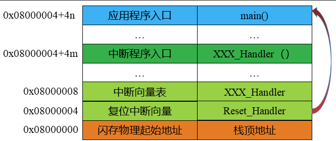
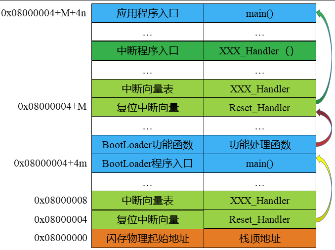
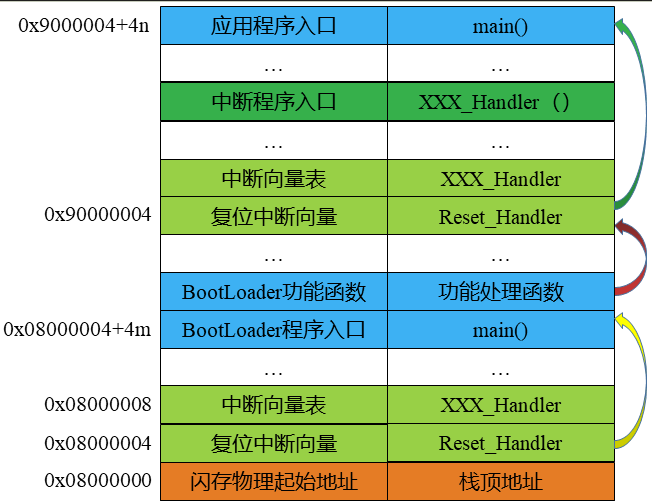
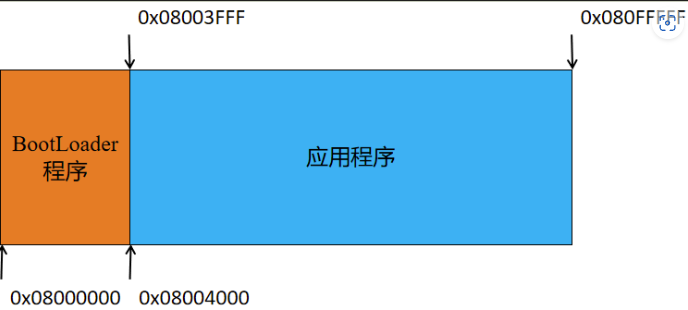
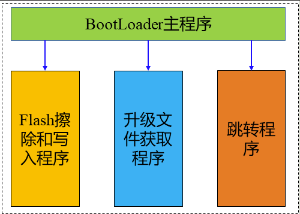
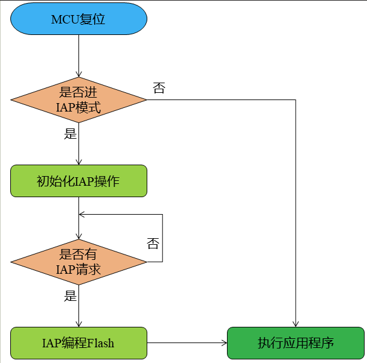
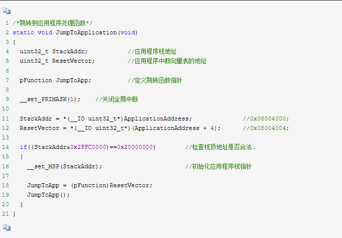

1.BootLOader基本原理

BootLOader程序肯定是要实现系统的引导，这是BootLOader程序的基本功能。

来自 <https://www.cnblogs.com/foxclever/p/13173493.html> 

应用程序从指定的内部Flash地址运行等等。在这些时候我们就需要一个单独的BootLoader程

序。系统首先启动BootLoader程序，系统准备就绪后进入到应用程序执行，具体如图所示：

让应用程序存储于外部Flash中，然后BootLoader程序跳转到外部Flash去执行应用程序，不过前

提是外部Flash内购执行程序。具体过程如下：

2.目标BootLoader设计

以STM32F407VET6为目标MCU，这款MCU具有512K的Flash和192K的SRAM。我们将Flash划分为2个部分，一个是启动程序区(0x0800 0000 - 0x0800 3FFF )大小为16K Bytes，剩下的为应用程序区（0x08004000 - 0x0808 FFFF）。具体分配如下图：

一是基本的配置，如时钟等，我们在主程序中实现；

二是对Flash的操作，我们升级应用程序肯定会对Flash进行查处和写入操作；

三是跳转控制程序，我们最终是需要去执行应用程序的，跳转功能必不可少。

四是添加了IAP文件的获取功能

 

具体如下图所示：

BootLoader运行判断系统是否有IAP的需求，如果有IAP请求则进入IAP模式，完成后再跳转到应用程序执行，如果没有IAP请求则直接跳转到应用程序执行。具体流程如下：

首先定义应用程序的首地址并声明一个函数指针类型。具体如下：

　　#define ApplicationAddress 0x08004000  //应用程序首地址定义

　　typedef void (*pFunction)(void);    //定义跳转函数指针类型

1.应用程序是裸机程序则在配置时钟前我们需要打开全局中断

/*开启全局中断，在BootLoader中关闭的*/

 　 __set_PRIMASK(0);

2.还需要修改中端向量表的偏移量地址。在system_stm32f4xx.c文件中修改。

　　#define VECT_TAB_OFFSET 0x4000

　　实现了上述修改并不能达到我们想要的目的，我们还需要在开发环境中做必要的修改

3.注意：在BootLoader程序中我们关闭了全局中断，在应用程序初始化系统时钟之前一定要记得打开全局中断，否则SystemTick不能工作会产生硬件故障（hardfault）。

4.如果App是运行在RTOS上，则打开中断可能会出错，这一点需要注意。