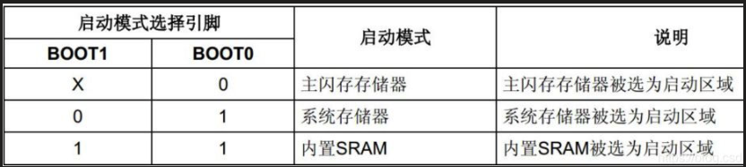
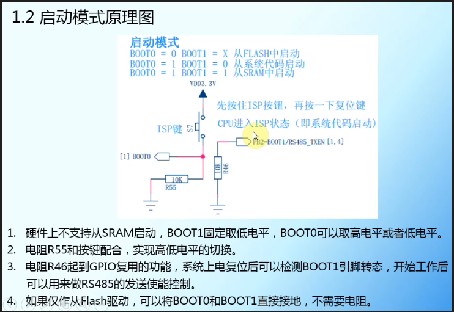
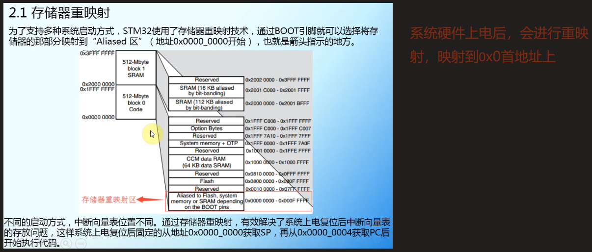
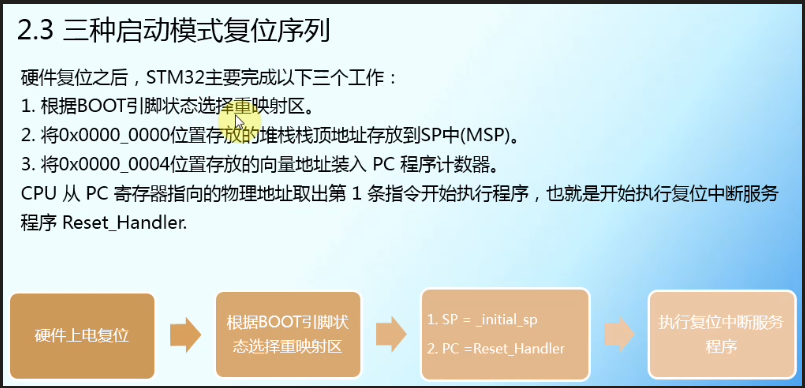

启动，一般来说就是指我们下好程序后，重启芯片时，SYSCLK的第4个上升沿，BOOT引脚的值将被锁存。用户可以通过设置BOOT1和BOOT0引脚的状态，来选择在复位后的启动模式。

第二种：System memory【从系统存储器启动】

 

从系统存储器启动，这种模式启动的程序功能是由厂家设置的。一般来说，这种启动方式用的比较少。系统存储器是芯片内部一块特定的区域，STM32在出厂时，由ST在这个区域内部预置了一段BootLoader， 也就是我们常说的ISP程序， 这是一块ROM，出厂后无法修改。一般来说，我们选用这种启动模式时，是为了从串口下载程序，因为在厂家提供的BootLoader中，提供了串口下载程序的固件，可以通过这个BootLoader将程序下载到系统的Flash中。但是这个下载方式需要以下步骤：

Step1：将BOOT0设置为1，BOOT1设置为0，然后按下复位键，这样才能从系统存储器启动BootLoader

Step2：最后在BootLoader的帮助下，通过串口下载程序到Flash中。

