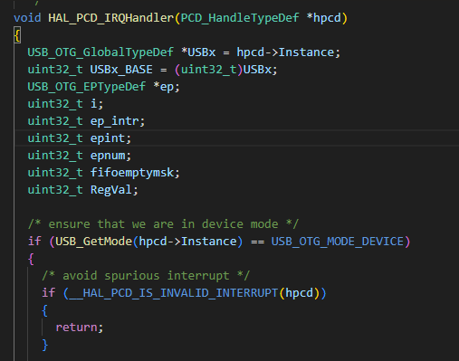
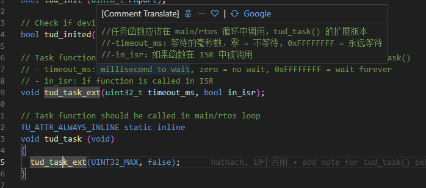

- STM32上的USB_CDC 工作原理和流程

- 在STM32上实现的CDC虚拟串口不需要主机（如个人电脑）不断地查询其状态。

- USB通信的工作方式更多是基于事件驱动和中断驱动，这意味着数据的传输和状态的更新是通过中断和请求来完成的。

-  

- - 当STM32（作为USB设备）连接到主机时，它会被枚举，并且主机操作系统将加载相应的CDC虚拟串口驱动程序。一旦设备成功枚举，主机和设备之间的通信就可以开始了。
  - 在正常的数据传输过程中：

- - **数据发送**：STM32设备可以通过USB的批量（Bulk）或中断（Interrupt）端点发送数据到主机。当STM32有数据准备好发送时，它将数据放入端点的传输缓冲区，并生成一个USB IN传输请求。主机将定期轮询这个端点，发现有数据待接收时，就会读取数据。
  - **数据接收**：主机向STM32发送数据时，会通过OUT端点发送一个USB OUT数据包。STM32端的USB堆栈会处理这些数据包，并将数据放入端点的接收缓冲区。STM32通常会有一个中断来通知它数据已经到达，应用程序可以从接收缓冲区中读取数据。
  - **状态更新和控制**：对于一些控制请求，如设置波特率或获取设备状态，主机会使用控制传输。这些是通过USB的控制端点完成的。STM32必须识别和响应这些控制请求消息，但它们通常不是连续发送的，而是根据需要由主机发送。
  - 通信流程主要是基于事件驱动，而不是主机不断主动查询状态。主机和STM32设备之间的通信效率会较高，因为它们只在必要时才进行数据传输和状态更新。

-  

- STM32上的CDC虚拟串口工作流程

-  

-  

- 1. **固件准备**：

-   \- 配置USB设备描述符，包括设备类、厂商ID（VID）、产品ID（PID）和端点的配置。

-   \- 编写USB CDC接口的相关函数，包括数据发送、接收和各种USB事件的处理（如设备枚举、端点配置、控制请求处理等）。

-  

- 2. **设备枚举**：

-   \- 连接STM32设备到主机（比如PC）后，主机会通过USB的标准请求来读取STM32的设备描述符，并进行设备枚举。

-   \- 主机根据描述符中的信息加载适当的CDC虚拟串口驱动程序。

-  

- 3. **驱动程序加载和虚拟串口创建**：

-   \- 主机操作系统识别STM32为CDC设备后，会加载内置的CDC虚拟串口驱动程序。

-   \- 驱动程序创建一个新的虚拟COM端口，使应用程序能够通过标准的串口API与STM32进行通信。

-  

- 4. **数据通信**：

-   \- **主机到STM32**：当主机上的应用程序向虚拟COM端口写入数据时，驱动程序将数据封装成USB数据包，并通过OUT端点发送给STM32。STM32的USB堆栈处理这些数据，并通过相关的回调函数或事件将数据传送给用户的应用代码。

-   \- **STM32到主机**：STM32应用程序将数据发送给USB堆栈，数据会被封装并通过IN端点发送到主机。主机的CDC驱动程序会处理这些数据包，并将数据传递到读取虚拟COM端口的应用程序。

-  

- 5. **控制传输**：

-   \- 除了数据端点外，还会使用控制端点来处理如设置波特率、控制线状态和其他串口相关的控制信号的USB请求。

-   \- 这些控制请求由STM32的USB堆栈处理，并响应主机的控制命令。

-  

- 6. **中断处理**：

-   \- STM32通常会使用USB中断来处理USB事件，如数据包的接收和发送完成，这些中断会触发堆栈中相应的处理函数。

- 在STM32的pcd.c文件下的，HAL_PCD_IRQHandler(PCD_HandleTypeDef *hpcd)，函数控制usb的中断

- 

-  

- 7. **断开和重新连接**：

-   \- 如果STM32被从主机断开，主机会检测到这个变化并卸载虚拟COM端口。

-   \- 重新连接时，上述的枚举和配置过程会重新开始。

-  

- 在整个过程中，STM32通过其USB接口与主机通讯，同时固件中的USB堆栈负责管理USB协议的复杂细节，为用户的应用程序提供相对简单的串口通讯接口。只需要关注如何处理发送和接收的数据，以及如何响应USB事件，无需深入USB协议的底层实现。

-  

-  Pico的TinyUSB工作流程及原理

- TinyUSB是一个跨平台的USB Host/Device协议栈，它支持多种微控制器，包括Raspberry Pi Pico（使用RP2040芯片）。对于树莓派Pico，TinyUSB允许用户实现USB设备（如CDC、HID、MSC等）和USB主机功能。

-  

- ## 以下是在树莓派Pico上使用TinyUSB作为USB设备协议栈的工作原理及流程概述：

-  

- 1. **初始化**：

-   \- 在应用程序的初始化阶段，TinyUSB栈需要被配置和初始化。这通常包括设定USB设备描述符，例如设备的VID、PID、产品字符串和序列号等。

-   \- 初始化还涉及到设置USB设备的类特定信息，例如，如果设备作为CDC虚拟串口，还需要配置CDC接口描述符和端点。

-  

- 2. **USB设备枚举**：

-   \- 当Pico与主机（如计算机）通过USB连接时，主机会发送一系列标准的USB请求以枚举设备。这包括获取设备描述符、配置描述符以及可能的字符串描述符等。

-   \- TinyUSB栈会响应这些请求，并提供所有必要的描述符信息。这一阶段完成后，Pico上的TinyUSB栈将进入配置状态，随时准备通信。

-  

- 3. **USB端点配置**：

-   \- 枚举过程中，主机还将设置USB设备的端点。端点是USB数据传输的通道，不同类型的端点适用于不同类型的数据传输（如控制、中断、批量和等时传输）。

-   \- TinyUSB栈负责管理这些端点，并根据设备类的需要来处理传入和传出数据包。

-  

- 4. **数据传输**：

-   \- **Device to Host（设备到主机）**：当Pico有数据要发送到主机时，它会将数据放入相应的端点缓冲区，并告知USB栈数据已准备好发送。USB栈随后会在主机轮询时通过IN传输将数据发送出去。

-   \- **Host to Device（主机到设备）**：主机发送数据时，会通过OUT传输将数据发送到Pico的端点缓冲区。TinyUSB栈会处理这些数据包并将数据移交给应用程序。

-  

- 5. **事件处理**：

-   \- TinyUSB通过事件驱动机制来响应USB事件。这包括连接/断开事件、数据传输完成事件、USB复位事件等。

-   \- TinyUSB栈通常会提供一个主处理函数，`tinyusb_device_task()`，该函数要定期调用，以便栈可以处理事件和数据包。

-  

- 6. **回调函数**：

-   \- 应用程序通常需要实现一些回调函数，这些函数在特定的USB事件发生时被TinyUSB栈调用，比如数据接收或发送完成。

-   \- 这些回调函数让应用程序可以在正确的时机处理数据，而不是在固件的中断上下文中直接处理，从而提高了代码的模块化和可读性。

-  

- 7. **断开和重置**：

-   \- 当USB连接被断开时，TinyUSB栈会处理相应的断开事件，并将设备状态重置为默认状态。当USB设备被重新连接时，上述枚举过程会重新开始。

-  

- 8. **错误处理**：

-   \- 如果在任何时候USB传输出现错误，TinyUSB栈会处理错误事件，并执行适当的错误恢复机制，比如重新初始化端点或重

- 新启动传输。

在主循环中调用`tud_task()，就可以实现USB通信功能。

USB外设收到主机返回的应答（ PID为ACK的握手包）后

1、硬件：

触发 DTOG_TX@USB_EPnR；

硬件把该端点设置为invalid状态（STAT_TX=NAK）；

硬件置位CTR_TX，产生中断；

2、软件：

通过检查EP_ID和DIR@USB_ISTR来识别是哪个端点上的通信；

响应CTR_TX中断：

标志清零；

软件准备下次要发送的数据；

更新COUNTn_TX如有必要；

软件重新设置STAT_TX=VALID来重新把该EP设置到发送valid状态；