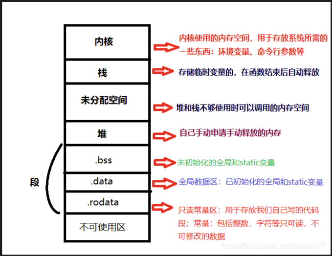

# c语言的[内存](https://so.csdn.net/so/search?q=内存&spm=1001.2101.3001.7020)分布图  <https://blog.csdn.net/takashi77/article/details/108171956> 

（1）当我们在一个函数内申请一个变量时(calloc，malloc等函数申请的内存空间和static修饰的变量除外)，它是存放在栈空间的数据，在当前函数退出时，该数据所拥有的内存空间也会被释放掉，因此我们在定义变量时要考虑该变量是否要被其他函数频繁调用等问题

(2) func中的a和b因为是只是一个函数内的普通变量，并非static修饰的变量也不是全局变量，因此是存放在栈里面的数据，存放在栈的数据的特点是：在函数执行结束后会被释放

（1）函数传参时传递的是数据的话，其实只是相当于这个函数的值赋值到另一个函数

 

（2）函数传参时传递的是地址的话，这个时候是把变量的地址传递过去，并不是数据的地址传递过去，然后接收的函数需要对变量所在的地址修改里面值的话是需要解引用该地址后才能修改和读取里面的数据

 

（3）函数传参传地址时，在其他函数通过修改该地址的数据后，它这个地址的值就已经改变了，并不会因为函数执行完销毁，因为是对地址操作，销毁的只是一个存放有变量地址的指针