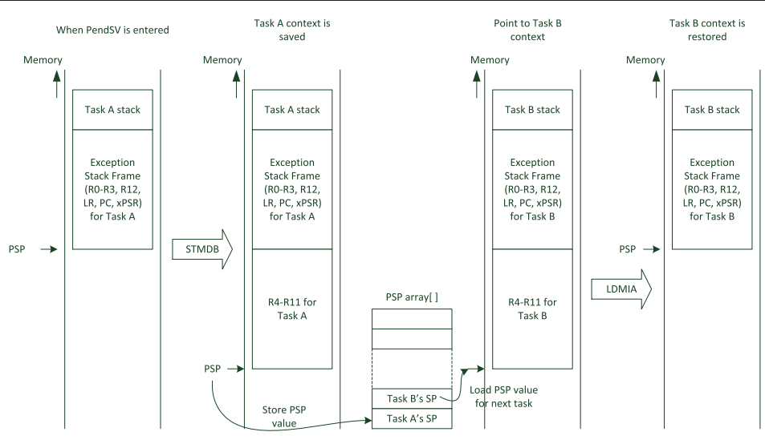

uint8_t定义变量地址要1字节对齐。

uint16_t定义变量地址要2字节对齐。

uint32_t定义变量地址要4字节对齐。

uint64_t定义变量地址要8字节对齐。

 

指针变量是4字节对齐。

**结构体成员对齐问题** 

首先明白一点，结构体里面的变量是什么类型，此变量的位置就是至少要几字节对齐，所以就存在结构体实际占用大小

不是这些变量之和。

 

typedef struct

{

​     uint8_t a;

​     uint16_t b;

​     uint32_t c;

​     uint64_t d;    

}info;

 

这种定义，info占用了16字节，a单字节对齐，b是两字节对齐，而c要是4字节对齐，从出现b定义完毕后空出来1个字节未

被使用。d是8字节对齐，这样就是16字节。而我们切换下变量定义顺序：

typedef struct

{

​     uint16_t b;

​     uint32_t c;

​     uint64_t d;    

​     uint8_t a;

}info;

 

这种定义就要占用24字节，b占用2字节对齐，c需要4字节对齐，这样就空出来2两个字节未使用，d占用8字节，最后一个

a占用了8字节。

 

如果想定义几个变量就几个字节，变量前面加前缀__packed即可。

 

不管是上面那种定义方式，都是占用15个字节。

 

__packed typedef struct

{

​     uint8_t a;  1个

​     uint16_t b; 2个

​     uint32_t c; 4个

​     uint64_t d; 8个     

}info;

**硬件浮点对齐问题**

如果使用的是带FPU硬件浮点单元的M内核芯片就要注意对齐访问了，访问单精度浮点数访问一定要4字节对齐，双精度要8字节对齐。

 

来自 <https://www.armbbs.cn/forum.php?mod=viewthread&tid=109400> 

 

**RTOS****的任务栈：**

 

RTOS的任务栈涉及到双栈指针问题，SP（R13寄存器）有两个栈指针，MSP主栈指针和PSP进程栈指针。简单的说，我们在中断服务程序里面都是用的MSP，而任务里面用的PSP。优势是方便任务和中断栈空间分别管理，了解了这点知识就够了。

RTOS任务栈的关键依然是8字节对齐问题，如果仅仅是满足4字节对齐，就会出现我们前面printf和sprintf浮点数或者64bit数据的错误问题，早年各种RTOS移植案例还不是那么发达的时候（现在问题依旧），经常在这个地方入坑，加上硬件浮点寄存器入栈出栈后更是玩不

转了。

比如大家搜索关键词 uCOS printf 或者uCOS 浮点数，一堆的问题，平时不用浮点不知道，一用浮点，各种问题就来了，特别是多任务都使

用浮点计算，更是懵。

根本原因是底层移植文件的堆栈8字对齐有问题，很多人都是采用的指令__align(8)来设置堆栈对齐问题，其实修改底层port文件才是解决

问题的根本。

为什么会造成这个问题，根本原因依然是前面AAPCS规约的要求，RTOS的移植都有个汇编的port文件，这个port文件的关键是实现任务切

换，任务切换的关键就是进入任务前保证PSP是8字节对齐。

 

来自 <https://www.armbbs.cn/forum.php?mod=viewthread&tid=109400> 

 

**DMA****对齐问题：**

 

DMA对齐指的是源数据地址和目的数据对齐问题。

这个问题最容易出错的地方就是网上倒腾SD卡移植FatFS的SDIO DMA方式。

大家网上搜关键词FatFS SDIO DMA，特别是BMP等格式图片显示的时候，这种问题就来了，因为很难保证每次的读取都是4字节对齐的。

以STM32F4的DMA为例，我们的底层移植无需再单独开一个缓冲做4字节对齐，本质是F4 DMA支持了源地址和目的地址的数据宽度可以不

同，但是数据地址必须要跟其数据类型对齐。

比如使用SDIO DMA从SD卡读取数据，我们就可以设置源地址依然是4字节对齐(外设访问要4字节对齐)，而目的地址设置为字节对齐，就

可以方便的解决4字节对齐问题。

 

 

\#pragma pack(1) 和 #pragma pack() 是预处理指令，用于设置内存对齐方式。

在C/C++编程中，结构体的成员通常按照默认的内存对齐规则排列，

以确保访问结构体成员时能够获得最佳的性能和可移植性。

\#pragma pack(1)：这行指令将内存对齐方式设置为 1 字节。

这意味着结构体的成员将按照一个字节的边界对齐，不会有额外的填充字节。

这可以用于确保结构体中的成员在内存中连续存储，通常用于与外部硬件通信或与特定文件格式进行交互时，

确保数据布局的精确控制。

\#pragma pack()：这行指令将内存对齐方式恢复到编译器的默认设置，通常是较大的边界，以提高访问速度和内存利用率。