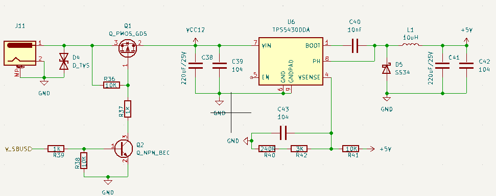

# power

**

**1. 输入电源控制与保护部分 (左侧 J11, D4, Q1, Q2, R36-R39):**

- **J11:** 电源输入连接器，接入12V。Pin 1是正，Pin 2是地。
- **D4 (D_TVS):** 瞬态电压抑制二极管 (TVS Diode)。跨接在输入电源两端，用于吸收和钳位输入端的过电压尖峰，保护后续电路。
- **Q1 (Q_PMOS_GDS):** 一个P沟道MOSFET。用作一个高边开关，控制VCC12电源的通断。
    - Source (Pin 3) 连接到J11的输入电压。
    - Drain (Pin 2) 输出为VCC12，供给后续的TPS5430DDA。
    - Gate (Pin 1) 由Q2控制。
- **R36 (10K):** Q1的栅极上拉电阻。将Q1的栅极上拉到其源极电压，确保在Q2截止时，Q1的Vgs接近0V，从而使Q1保持关断状态。
- **Q2 (Q_NPN_BEC):** 一个NPN型三极管。用作驱动Q1的开关。
    - Collector连接到Q1的栅极（通过R37）。
    - Emitter接地。
    - Base由信号Y_SBUSD通过R39控制。
- **R37 (1K):** 限制流入Q1栅极的电流，并在Q2导通时帮助将Q1栅极电压拉低。
- **R39 (1K):** Q2的基极限流电阻。
- **R38 (10K):** Q2的基极下拉电阻。确保在Y_SBUSD信号悬空或为低电平时，Q2可靠截止。
- **Y_SBUSD:** 这是一个控制信号。
    - 当Y_SBUSD为高电平时：Q2导通，其集电极将Q1的栅极电压拉低。对于P-MOSFET，栅极电压远低于源极电压 (Vgs < 0) 时导通。因此Q1导通，J11的输入电压通过Q1到达VCC12。
    - 当Y_SBUSD为低电平时：Q2截止。R36将Q1的栅极电压拉高至接近其源极电压，Vgs ≈ 0，Q1截止。VCC12电源被切断。
- **功能总结 (输入部分):** 这一部分实现了一个由Y_SBUSD信号控制的电源开关，并带有输入过压保护。当Y_SBUSD有效时，12V电源才供给后续的降压电路。

**2. DC-DC降压转换器核心 (U6 TPS5430DDA及其外围):**

- **U6 (TPS5430DDA):** 降压开关稳压器IC。
    - **Pin 7 (VIN):** 电源输入引脚，连接到VCC12。
    - **C38 (220uF/25V) 和 C39 (104 = 0.1uF):** 输入滤波电容。C38是大容量电解电容，用于稳定输入电压，提供瞬时大电流。C39是高频陶瓷电容，用于滤除高频噪声。
    - **Pin 5 (EN):** 使能引脚。这里直接连接到VIN。TPS5430DDA的EN引脚有精确的阈值，当VIN电压超过其UVLO（欠压锁定）和使能阈值时，芯片会自动启动。
    - **Pin 1 (BOOT):** 引导引脚，用于驱动内部高边N-MOSFET。
    - **C40 (10nF):** 引导电容 (Bootstrap Capacitor)。连接在BOOT引脚和PH引脚之间。用于产生高于VIN的电压，以完全导通内部的N沟道高边开关管。
    - **Pin 8 (PH):** 开关节点 (Phase Node)。这是内部高边开关管和外部电感L1的连接点。此点电压会在0V和VIN之间快速切换。
    - **L1 (10uH):** 储能电感。在Buck电路中，用于储存和释放能量，平滑电流。
    - **D5 (SS34):** 续流二极管 (Freewheeling Diode)。SS34是一款肖特基二极管，具有较低的正向压降和快速的开关速度。当U6内部高边开关管关断时，电感L1中的电流通过D5继续流动，防止PH节点产生过高的反向电压。这是异步Buck的典型特征。
    - **C41 (220uF/25V) 和 C42 (104 = 0.1uF):** 输出滤波电容。C41是大容量电解电容，用于稳定输出电压，平滑纹波，提供负载瞬态电流。C42是高频陶瓷电容，进一步滤除输出高频噪声。输出电压为+5V。
    - **Pin 6, 9 (GND, GNDPAD):** 接地引脚。GNDPAD是散热焊盘，需要良好接地以利于散热。

**3. 反馈与补偿网络 (R40, R41, R42, C43):**

- **Pin 4 (VSENSE):** 电压反馈引脚。U6通过此引脚监测输出电压，并调整开关占空比以维持输出电压稳定。
- **R41 (10K) 和 R42 (3K):** 电压反馈分压电阻。它们将+5V输出电压分压后送到VSENSE引脚。TPS5430DDA内部有一个参考电压Vref (通常为0.808V)。
    - Vout = Vref * (1 + R41/R42)
    - Vout = 0.808V * (1 + 10K/3K) = 0.808V * (1 + 3.333) = 0.808V * 4.333 ≈ **3.50V**
    - **注意：根据这些电阻值，该电路的输出电压应为约3.50V，而不是标签所示的+5V。** 如果目标输出确实是+5V，那么R41或R42的阻值需要调整。例如，若R42=3K，则R41应为 Vref * R41/R42 = (5 - Vref) => R41 = (5/0.808 - 1) * R42 = (6.188 - 1) * 3K = 5.188 * 3K ≈ 15.56K。或者若R41=10K，则R42 = R41 / (5/0.808 - 1) = 10K / 5.188 ≈ 1.927K。
- **R40 (240R) 和 C43 (104 = 0.1uF):** 这些元件与R42一起构成环路补偿网络。R40和C43串联后与R42并联，连接在VSENSE引脚和地之间（或者说R40与C43串联，从VSENSE到地；R42也从VSENSE到地）。这组RC网络用于调整反馈环路的频率响应，以确保转换器的稳定性，提供足够的相位裕度和增益裕度。
    - 它们在反馈环路中引入一个零点 (fz = 1 / (2π * R40 * C43)) 和一个极点 (fp = 1 / (2π * (R40+R42) * C43))，用于优化瞬态响应和稳定性。

# **总结电路功能：**

1. **输入控制与保护：** 提供一个由Y_SBUSD信号控制的12V电源输入开关，并带有TVS过压保护。
2. **降压转换：** 使用TPS5430DDA异步降压转换器将通过开关的VCC12电压（理论上是12V）降低。
3. **输出电压：** 电路的标签指示输出为+5V，但根据反馈电阻R41和R42的配置，实际输出电压应为约3.50V。这可能是一个设计错误，或者标签与实际配置不符。
4. **环路补偿：** 使用R40, C43和R42对反馈环路进行补偿，以确保稳压器在各种负载条件下的稳定运行。