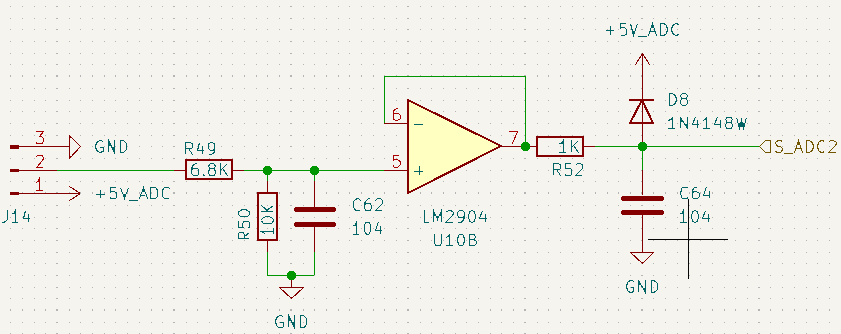

# 该电路是一个模拟信号前端调理电路，其主要功能是：

1. **衰减:** 将输入信号幅度按比例缩小 (约0.595倍)。
2. **滤波:** 通过两级RC低通滤波器 (第一级截止频率约393Hz，第二级截止频率约1591Hz) 滤除输入信号中的高频噪声，提高信噪比。
3. **缓冲:** 使用电压跟随器提供高输入阻抗和低输出阻抗，隔离前后级电路，并提供驱动能力。
4. **保护:** 使用二极管D8对输出信号进行过压钳位，保护ADC输入端。

## 各部分详细解释

1. **输入衰减与低通滤波 (R49, R50, C62):**
    - **R49 (6.8KΩ) 和 R50 (10KΩ):** 这两个电阻构成一个分压器。施加在Pin 2的信号，经过R49后，在R49和R50的连接点（也是运放U10B的同相输入端）被衰减。
        衰减比例 = R50 / (R49 + R50) = 10kΩ / (6.8kΩ + 10kΩ) = 10 / 16.8 ≈ 0.595。
        即输入信号幅度被衰减到原来的约59.5%。
    - **C62 (104 = 0.1µF):** 这个电容与R50并联，并与R49（从信号源看过去的等效电阻）构成一个RC低通滤波器。更准确地说，它与R49和R50构成的分压网络的戴维南等效电阻 (R_th = R49 || R50) 形成低通滤波器。
        R_th = (6.8k * 10k) / (6.8k + 10k) ≈ 4.047 kΩ。
        截止频率 f_c1 = 1 / (2π * R_th * C62) = 1 / (2π * 4047 Ω * 0.1µF) ≈ 1 / (2.543 * 10^-3 s) ≈ 393 Hz。
        这个滤波器用于滤除输入信号中的高频噪声。
2. **电压跟随器/缓冲器 (U10B - LM2904):**
    - **LM2904:** 这是一个双运放，这里使用了其中的一个 (U10B)。
    - **配置:** 运放的输出端 (Pin 7) 直接连接到其反相输入端 (Pin 6)。同相输入端 (Pin 5) 连接到R49/R50/C62滤波网络的输出。
    - **功能:** 这是一个电压跟随器（或缓冲器）。它的电压增益约等于1。主要作用是提供高输入阻抗和低输出阻抗。
        - 高输入阻抗：确保不对前级的R49/R50/C62滤波网络造成负载效应，从而保持滤波特性的准确性。
        - 低输出阻抗：能够驱动后续的负载（如R52和C64，以及ADC的输入），并提供足够的电流。
    - **电源:** LM2904会使用+5V_ADC作为正电源，GND作为负电源（或单电源的地）。LM2904的输出电压摆幅并非轨到轨，在5V供电时，其最高输出电压可能在3.5V到4V左右。
3. **输出滤波与保护 (R52, D8, C64):**
    - **R52 (1KΩ):** 串联电阻。
        - 与C64一起构成另一个RC低通滤波器。
        - 限制可能流入D8或流出运放的电流，起到一定的保护作用。
        - 有助于隔离运放输出与C64这个容性负载，提高运放的稳定性。
    - **C64 (104 = 0.1µF):** 对地电容。
        - 与R52构成一个RC低通滤波器，截止频率 f_c2 = 1 / (2π * R52 * C64) = 1 / (2π * 1kΩ * 0.1µF) ≈ 1591 Hz。
        - 这个滤波器进一步滤除信号中的噪声，特别是运放可能引入的噪声或前级滤波器未完全滤掉的较高频率成分。
        - 为ADC的采样保持电路提供一个稳定的电压源，帮助在ADC采样瞬间快速提供电荷。
    - **D8 (1N4148W):** 肖特基二极管或快恢复二极管。其阳极连接到输出信号S_ADC2，阴极连接到+5V_ADC。
        - **功能:** 过压保护。如果S_ADC2处的电压试图超过 +5V_ADC + V_f (D8的正向压降，约0.7V)，D8会导通，将S_ADC2的电压钳位在 +5V_ADC + V_f 左右。这可以保护后续连接的ADC输入引脚，防止其输入电压超过其允许的最大值（通常是ADC的电源电压）。
        - 考虑到LM2904在5V供电时输出摆幅的限制，这个二极管更多的是防止意外的外部高压瞬变或在运放供电异常（例如高于+5V_ADC）时保护ADC。
4. **输出信号 (S_ADC2):**
    - 这是经过衰减、两级滤波、缓冲和钳位保护后的最终模拟信号，准备送给ADC的输入通道进行转换。