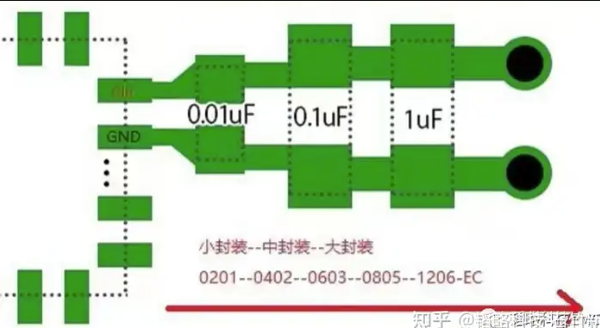
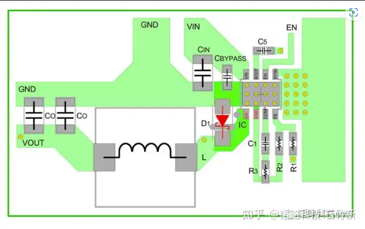

XDW芯片的DCDC高频噪声分析及解决思路：

来源:

1.模块工作时开关管的开关频率引起的噪声；

2.模块工作时由于开关环路中的寄生电感和电容产生谐振引起振铃电压引起的噪声；

噪声传输的路径：

1.辐射：噪声通过IC和线缆形成的环路以电磁波的方式辐射到空间（环路面积越大辐射越强）。

2.传导：噪声以差模和共模噪声的形式通过线缆传输到上级设备和下级设备。

 

三：抑制噪声的方法

通过对噪声产生的原因分析，可以总结出以下几点噪声抑制方法和对应的措施：

（1）优化噪声回流路径，减小回路面积：

a. 在输入输出端增加不同pF值的电容，高频电容应该靠近输入输出端放置；

b. 电容和IC放在同一层PCB；

c.电容地要和芯片地以最短的距离链接；

来自 <https://zhuanlan.zhihu.com/p/620970591> 

合理的电容放置图

（2）抑制噪声在输入输出的路径上传导：在输入端加适当的磁珠进行隔离；在端口加共模电感滤波；

（3）削减开关频率的[振铃幅度](https://zhida.zhihu.com/search?q=振铃幅度&zhida_source=entity&is_preview=1)：在可接受的功率损耗范围内，在芯片SW脚和续流二极管之间加RC吸收电路；

（4）优化PCB布局，减小回路路径面积：续流二极管要紧贴芯片端；电感下端同一层掏空；

来自 <https://zhuanlan.zhihu.com/p/620970591> 