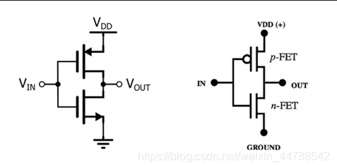
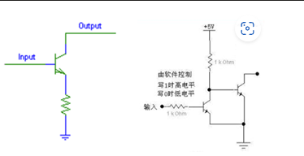
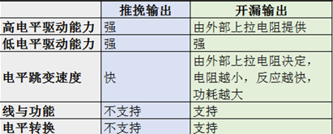

推挽：内部有MOS管或者上下拉电阻，IO速度很快，能真正实现输出高电平和低电平的能力。

驱动能力：输出电流的能力。

不能实现”线与“

推挽输出的结构：由两个三极管或者MOS管受到互补信号的控制，两个管子始终保持一个处于截止，另一个处于导通的状态。电路工作时，两只对称的开关管每次只有一个导通，所以导通损耗小、效率高、既提高电路的负载能力，又提高开关速度。

开漏：

使用一个MOS管，其中的"漏"指的就是MOS管的漏极；

开漏输出无法真正输出高电平，即高电平时没有驱动能力，需要借助外部上拉

电阻完成对外驱动。

开漏输出最主要的特性：

就是高电平没有驱动能力，需要借助外部上拉电阻才能真正输出高电平，

明显的优势就是可以很方便的调节输出的电平，因为输出电平完全由上拉电阻连接的电源电平决定。所以在需要进行电平转换的地方，非常适合使用开漏输出。

可以实现"线与"功能，所谓的"线与"指的是多个信号线直接连接在一起，只有当所有信号全部为高电平时，合在一起的总线为高电平；只要有任意一个或者多个信号为低电平，则总线为低电平。而推挽输出就不行，如果高电平和低电平连在一起，会出现短路电流倒灌，损坏器件。

OPEN-DRAIN提供了灵活的输出方式，但是也有其弱点，就是带来上升沿的延时。因为上升沿是通过外接上拉无源电阻对负载充电，所以当电阻选择小时延时就小，但功耗大；反之延时大功耗小。所以如果对延时有要求，则建议用下降沿输出。

 

什么是“线与”？

在一个结点(线)上， 连接一个上拉电阻到电源 VCC 或 VDD 和 n 个 NPN 或 NMOS 晶体管的集电极 C 或漏极 D， 这些晶体管的发射极 E 或源极 S 都接到地线上， 只要有一个晶体管饱和， 这个结点(线)就被拉到地线电平上。 因为这些晶体管的基极注入电流(NPN)或栅极加上高电平(NMOS)，晶体管就会饱和， 所以这些基极或栅极对这个结点(线)的关系是或非 NOR 逻辑。 如果这个结点后

面加一个反相器， 就是或 OR 逻辑。

[GPIO推挽输出和开漏输出模式区别详解_gpio的推挽输出和开漏输出有何区别-CSDN博客](https://blog.csdn.net/weixin_44788542/article/details/115303125)