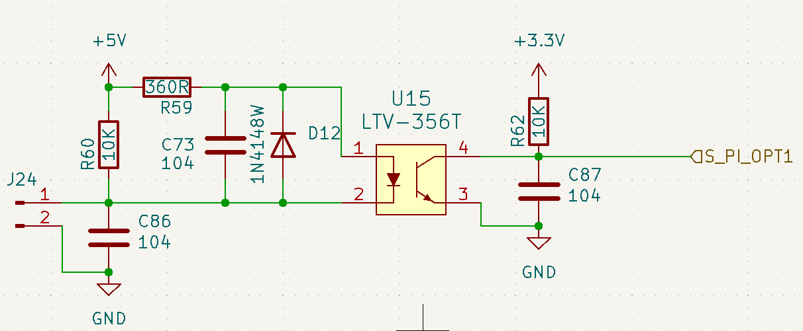

# 电路原理图

## 输入侧 (LED驱动侧 - 与+5V电源相关):

- **Pin 1:** 外部输入信号。
- **Pin 2:** 连接到GND。

- **R60 (10K):** 上拉电阻。它将Pin 1上拉到+5V。如果 Pin 1悬空或连接到一个开漏/开集输出的设备，R60会确保该点默认为高电平（+5V）。
- **C86 (104 = 0.1µF):** 输入滤波/去抖电容。它与R60（以及外部信号源的输出阻抗）构成一个RC低通滤波器，用于滤除J24输入信号上的高频噪声，或者对来自机械开关的信号进行去抖动。
- **R59 (360R):** LED限流电阻。当J24 Pin 1被拉低时，电流从+5V流经R59，再流经光耦U15内部的LED（Pin 1到Pin 2），最后到J24 Pin 1（低电平）。R59限制了流过LED的电流，防止其烧毁。
    - 假设LED的正向压降 (Vf) 约为1.2V，当J24 Pin 1为0V时，流过LED的电流 I_LED ≈ (5V - 1.2V) / 360Ω ≈ 3.8V / 360Ω ≈ 10.5 mA。这个电流值对于驱动光耦是合适的。
- **U15 (Pin 1 - Anode, Pin 2 - Cathode):** 光耦的LED输入端。
    - Pin 1 (阳极) 连接到R59的输出端。
    - Pin 2 (阴极) 连接到J24的Pin 1。
- **D12 (1N4148W):** 反向并联保护二极管。它与光耦内部的LED反向并联。如果J24 Pin 1处出现意外的负电压（相对于LED阳极），或者在输入端有感性负载断开时产生反向电动势，D12会导通，将反向电压钳位在约-0.7V，从而保护光耦内部的LED免受反向击穿损坏。
- **C73 (104 = 0.1µF):** 局部电源去耦电容。它跨接在+5V和LED阳极（R59与U15 Pin 1的连接点）之间。更常见的做法是直接跨接在+5V和GND之间，靠近用电器。这里的接法略有不同，它为R59和LED的组合提供了高频电流的通路，有助于稳定LED的驱动电流并减少对+5V电源轨的噪声干扰。

### 输入侧工作逻辑

- 当Pin 1为高电平 (或悬空，被R60拉高至+5V)：U15的Pin 2 (阴极) 电压接近Pin 1 (阳极) 电压，LED两端压降很小，几乎没有电流流过，LED不发光。
- 当J24 Pin 1为低电平 (被外部设备拉至GND)：电流从+5V流经R59，再流经U15内部的LED到J24 Pin 1，LED发光。

## 输出侧 (光敏三极管侧 - 与+3.3V电源相关):

- **U15 (Pin 4 - Collector, Pin 3 - Emitter):** 光耦的光敏三极管输出端。
    - Pin 4 (集电极) 连接到输出信号S_PI_OPT1和上拉电阻R62。
    - Pin 3 (发射极) 连接到GND。
- **R62 (10K):** 上拉电阻。它将光敏三极管的集电极（U15 Pin 4）上拉到+3.3V。
- **C87 (104 = 0.1µF):** 输出滤波电容。它与R62构成一个RC低通滤波器，用于滤除输出信号S_PI_OPT1上的高频噪声，或者平滑输出信号的边沿。
- **S_PI_OPT1:** 隔离后的输出信号。

**输出侧工作逻辑：**

- 当输入侧LED发光时：光线照射到光敏三极管的基区，使其导通（饱和）。U15 Pin 4 (集电极) 被拉低至接近Pin 3 (发射极，即GND) 的电平。因此，S_PI_OPT1输出低电平 (接近0V)。
- 当输入侧LED不发光时：光敏三极管截止（不导通）。R62将U15 Pin 4 (集电极) 拉高至+3.3V。因此，S_PI_OPT1输出高电平 (+3.3V)。

# **总结电路功能与特性：**

1. **电气隔离：** 最主要的功能。输入侧电路（5V域）和输出侧电路（3.3V域）之间没有直接的电气连接，只有光耦合。这可以防止输入侧的噪声、浪涌或地电位差异影响到输出侧的敏感电路，反之亦然。
2. **信号传输：** 将J24输入的数字信号（高/低电平）传输到S_PI_OPT1。
3. **电平转换：** 输入信号是基于5V逻辑的（由R60上拉至5V，由外部拉低至0V），而输出信号S_PI_OPT1是基于3.3V逻辑的（由R62上拉至3.3V，由光耦拉低至0V）。
4. **逻辑非反相：**
    - J24 Pin 1 LOW -> LED ON -> Transistor ON -> S_PI_OPT1 LOW.
    - J24 Pin 1 HIGH -> LED OFF -> Transistor OFF -> S_PI_OPT1 HIGH.
        所以，这是一个逻辑非反相的隔离缓冲器。
5. **输入保护与滤波：** D12提供反向电压保护，C86提供输入滤波/去抖。
6. **输出滤波：** C87提供输出信号滤波。

**应用场景：**
这种电路常用于：

- 隔离来自嘈杂环境（如工业现场的开关、传感器）的输入信号。
- 连接不同地电位或不同电源域的电路。
- 保护微控制器或其他数字逻辑电路的输入引脚。
- 作为简单的数字信号隔离接口。