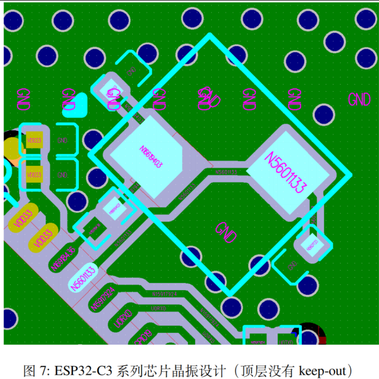

**1.****工作性能上分为****：****石英晶体谐振器（无源）、石英晶体震荡器（有源，带电压的）****。**

**晶体振荡器又可分为****Package****石英振荡器****(SPXO)****、温度补偿石英振荡器****(TCXO)****、电压控制石英振荡器****(VCXO)****、恒温槽式石英振荡器****(OCXO)****）。** 

①无源晶体——无源晶体需要用DSP片内的振荡器。

②有源晶振——有源晶振不需要DSP的内部振荡器，信号质量好，比较稳定，而且连接方式相对简单（主要是做好电源滤波，通常使用一个电容和电感构成的PI型滤波网络，输出端用一个小阻值的电阻过滤信号即可），不需要复杂的配置电路。 

 

2.**有源晶振的主要参数****：** 

1）总频差：在规定的时间内，由于规定的工作和非工作参数全部组合而引起的晶体振荡器频率与给定标称频率的最大偏差。 

2）率压控线性：与理想（直线）函数相比的输出频率-输入控制电压传输特性的一种量度，它以百分数表示整个范围频偏的可容许非线性度。 

3）频率温度稳定度：在标称电源和负载下，工作在规定温度范围内的不带隐含基准温度或带隐含基准温度的最大允许频偏。 

4）频率老化率：在恒定的环境条件下测量振荡器频率时，振荡器频率和时间之间的关系。这种长期频率漂移是由晶体元件和振荡器元件的缓慢变化造成的。因此，其频率偏移的速率叫老化率，可用规定时限后的最大变化率（如±10ppb/天，加电72小时后），或规定的时限内最大的总频率变化（如：± 1ppm/（第一年）和±5ppm/（十年））来表示。 

5）开机特性（频率稳定预热时间）：指开机后一段时间（如 5 分钟）的频率到开机后另一段时间（如1小时）的频率的变化率，表示了晶振达到稳定的速度。    

 

 

二、与晶振相关的术语解释专业词：

**1****、****标称频率****：**晶振是一种频率元器件，每一款晶振都有自己的频率。

2、温度频差：在规定条件下，在工作温度范围内相对于基准温度（25±2℃）时工作频率的允许偏差。

**3****、****工作频率**：晶体与工作电路共同产生的频率。

**4****、****调整频差**：在规定条件下,基准温度（25±2℃）时工作频率相对于标称频率所允许的偏差。

**5****、****负载谐振频率（****fL****）**：在规定条件下，晶体与一负载电容相串联或相并联，其组合阻抗呈现为电阻性时的两个频率中的一个频率.在串联负载电容时，负载谐振频率是两个频率中较低的一个,在并联负载电容时，则是两个频率中较高的一个。

**6****、****动态电阻****：**串联谐振频率下的等效电阻。用R1表示。

**7****、****负载谐振电阻**：在负载谐振频率时呈现的等效电阻。用RL表示.RL＝R1（1+C0/CL）2

**8****、****激励电平****：**晶体工作时所消耗功率的表征值。激励电平可选值有：2mW、1mW、0.5mW 、0.2mW、0.1mW、50μW、20μW、10μW、1μW、0.1μW等。

**9****、****基频****：**在振动模式最低阶次的振动频率。

**10****、****老化率**：在规定条件下，晶体工作频率随时间而允许的相对变化。以年为时间单位衡量时称为年老化率。

**11****、****静电容****：**等效电路中与串联臂并接的电容，也叫并电容，通常用C0表示。

**12****、****负载电容****：**与晶体一起决定负载谐振频率fL的有效外界电容，通常用CL表示。负载电容系列是：8PF、12PF、15PF、20PF、30PF、50PF、100P。只要可能就应选推荐值：  10PF、20PF、30PF、50PF、100PF。32.768K晶振常用的负载电容为12.5PF，6PF，9PF等。

**13****、****泛音****：**晶体振动的机械谐波。泛音频率与基频频率之比接近整数倍但不是整数倍，这是它与电气谐波的主要区别。泛音振动有3次泛音，5次泛音，7次泛音，9次泛音等。

三、影响晶振精度的因素：

晶振的精度单位是（PPM），一般常用的精度为20PPM。

一个石英晶体振荡器的频率精度是正负20PPM，但可能会因为电压变动有正负10PPM的影响，焊接温度有正负5PPM的影响，机械振动与冲击有正负3PPM的影响，温度范围可能有正负5-20PPM的影响等等。

 这些都十分常见的影响精度的因素，必须考虑进去，单石英晶体振荡器厂商却只告诉客户产品的精度是正负20PPM。事实上，实际应用环境中精度可能只能达到50PPM。因此，客户需要50PPM精度的时候，选择了20PPM的石英晶体振荡器是正确的。

四、晶体振荡器选购指南：

（1）如果需要使设备即开即用，您就必须选用VCXO或温补晶振

（2）如果要求稳定度在0.5ppm以上，则需选择数字温补晶振（MCXO）。

（3）模拟温补晶振适用于稳定度要求在5ppm～0.5ppm之间的需求。

（4）VCXO只适合于稳定度要求在5ppm以下的产品。

（5）不需要即开即用的环境下，如果需要信号稳定度超过0.1ppm的，可选用OCXO。

五、晶体振荡器输出

（1）相位噪声、抖动

（3）电压特性

（4）负载特性

（5）功耗

（6）封装形式

  晶体振荡器可HCMOS/TTL兼容、ACMOS兼容、ECL和正弦波输出。每种输出类型都有它的独特波形特性和用途。应该关注三态或互补输出的要求。对称性、上升和下降时间以及逻辑电平对某些应用来说也要作出规定。许多DSP和通信芯片组往往需要严格的对称性（45%至55%）和快速的上升和下降时间（小于5ns）。

   相位噪声和抖动：在频域测量获得的相位噪声是短期稳定度的真实量度。它可测量到中心频率的1Hz之内和通常测量到1MHz。晶体振荡器的相位噪声在远离中心频率的频率下有所改善。

TCXO和OCXO振荡器以及其它利用基波或谐波方式的晶体振荡器具有最好的相位噪声性能。采用锁相环合成器产生输出频率的振荡器比采用非锁相环技术的振荡器一般呈现较差的相位噪声性能。

  抖动与相位噪声相关，但是它在时域下测量。以微微秒表示的抖动可用有效值或峰—峰值测出。许多应用，例如通信网络、无线数据传输、ATM和SONET要求必须满足严格的拌动指标。需要密切注意在这些系统中应用的振荡器的抖动和相位噪声特性。

 

电源和负载的影响：振荡器的频率稳定性亦受到振荡器电源电压变动以及振荡器负载变动的影响。正确选择振荡器可将这些影响减到最少。

设计者应在建议的电源电压容差和负载下检验振荡器的性能。不能期望只能额定驱动15pF的振荡器在驱动50pF时会有好的表现。

在超过建议的电源电压下工作的振荡器亦会呈现较差的波形和稳定性。

对于需要电池供电的器件，一定要考虑功耗。引入3.3V的产品必然要开发在3.3V下工作的振荡器。较低的电压允许产品在低功率下运行。大部分市售的表面贴装振荡器在3.3V下工作。许多采用传统5V器件的穿孔式振荡器正在重新设计，以便3.3V下工作。

 

**检测**

对于晶振的检测，通常仅能用示波器（需要通过电路板给予加电）或频率计实现。

晶振常见的故障有：（a）内部漏电；（b）内部开路；（c）变质频偏；（d）与其相连的外围电容漏电。从这些故障看，使用万用表的高阻档和测试仪的Ⅵ曲线功能应能检查出（C),(D）项的故障，但这将取决于它的损坏程度。

六、晶振不起振原因分析：

① PCB板布线错误;

②单片机质量有问题;

③ 晶振质量有问题; 

④负载电容或匹配电容与晶振不匹配或者电容质量有问题;

⑤PCB板受潮，导致阻抗失配而不能起振;

⑥ 晶振电路的走线过长; 

⑦晶振两脚之间有走线;

⑧外围电路的影响。 

 

解决方案： 

① 排除电路错误的可能性，因此可以用相应型号单片机的推荐电路进行比较。

② 排除外围元件不良的可能性，因为外围零件无非为电阻，电容，很容易鉴别是否为良品。

③ 排除晶振为停振品的可能性，因为不会只试了一二个晶振。

④试着改换晶体两端的电容，也许晶振就能起振了，电容的大小请参考晶振的使用说明。

⑤在PCB布线时晶振电路的走线应尽量短且尽可能靠近IC，杜绝在晶振两脚间走线。

 

来自 <http://bbs.ntpcb.com/read-htm-tid-69591.html> 

晶振设计应遵循以下规范： 

• 需要保证射频、晶振和芯片有一个完整的地平面。

• 晶振需离芯片时钟管脚稍远一些放置，防止晶振干扰到芯片。间距应至少为 2.0 mm。同时晶振走 

线须用地包起来周围密集地孔屏蔽隔离。 

• 晶振的时钟走线不可打孔走线，即不能跨层，不可交叉，也不可跨层交叉。

• 晶振上的串联元器件请靠近芯片放置。

• 晶振外接的对地调节电容请靠近晶振左右两侧摆放，不可直接连接在串联元器件上。电容尽量置于

时钟走线连接末端，保证电容的地焊盘靠近晶振的地焊盘放置。 

• 晶振下方都不能走高频数字信号，最好是晶振下方不走任何信号线。晶振时钟走线两侧的电源线上

的过孔应尽可能地远离时钟走线放置，并使时钟走线两侧尽可能包地。 

• 晶振为敏感器件，晶振周围不能放置磁感应器件，比如大电感等，保证晶振周围有干净的大面积地

平面