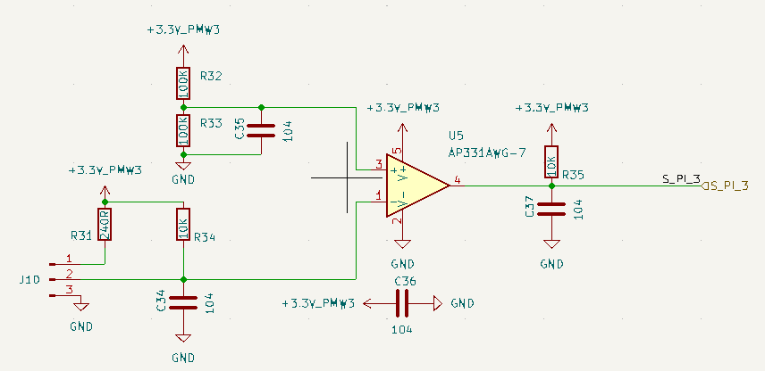

# 作用

1. **阈值检测：** 判断输入信号是否超过或低于某个预设的电压水平。
2. **电平转换：** 将一个模拟信号（或一个有噪声的数字信号）转换为一个清晰的数字信号。
3. **简单的开关输入接口：** J10可以连接一个开关或传感器，R31作为上拉电阻。

## 各元器件作用

- **R31 (240R)：**
    - **功能：** 上拉电阻。它将J10的输入端（Pin 1/2）通过一个较小的电阻上拉到+3.3V_PMW3。如果J10输入端悬空或连接到一个集电极开路/漏极开路类型的传感器输出，R31会确保输入端为高电平（接近+3.3V）。当外部设备将J10输入端拉低时，该引脚电压会下降。
- **R34 (10K)：**
    - **功能：** 下拉电阻/分压电阻。它与R31以及外部连接到J10的设备共同决定比较器V-端的输入电压。如果J10没有被外部强驱动，R31和R34会形成一个分压器。如果J10被外部驱动，R34则为输入信号提供一个对地的电阻路径，有助于确定输入阻抗。
- **C34 (104 = 0.1µF)：**
    - **功能：** 输入滤波电容。它与输入端的等效电阻（由R31、R34以及J10外部源的输出阻抗构成）形成一个低通滤波器，用于滤除输入信号V- (Pin 1 of U5) 上的高频噪声，防止比较器因噪声而误触发。
- **R32 (100K) 和 R33 (100K)：**
    - **功能：** 分压电阻。它们构成一个精密分压器，从+3.3V_PMW3电源为比较器的同相输入端V+ (Pin 3 of U5) 提供一个参考电压。
        - V_ref = +3.3V_PMW3 * (R33 / (R32 + R33)) = +3.3V * (100K / (100K + 100K)) = +3.3V * 0.5 = **1.65V**。
- **C35 (104 = 0.1µF)：**
    - **功能：** 参考电压滤波电容。它与R32和R33构成的分压网络的戴维南等效电阻 (R32 || R33 = 50K) 形成一个低通滤波器，用于稳定比较器的参考电压V+，滤除电源噪声或电阻本身引入的噪声，确保参考电压的纯净。

**比较器及输出部分：**

- **U5 (AP331AWG-7)：** 电压比较器。
    - **Pin 1 (-V_IN)：** 反相输入端，连接到来自J10的经过滤波的输入信号。
    - **Pin 2 (GND)：** 接地。
    - **Pin 3 (+V_IN)：** 同相输入端，连接到1.65V的参考电压。
    - **Pin 4 (OUTPUT)：** 输出端。AP331A是集电极开路输出比较器，需要外部上拉电阻。
    - **Pin 5 (VCC)：** 电源正端，连接到+5V。
- **C36 (104 = 0.1µF)：**
    - **功能：** 电源去耦电容。它紧靠比较器U5的电源引脚 (Pin 5) 和地之间，为比较器提供一个低阻抗的局部高频电流通路，滤除电源线上的高频噪声，保证比较器稳定工作。
- **R35 (10K)：**
    - **功能：** 上拉电阻。由于比较器U5是集电极开路输出，当比较器内部输出晶体管截止时（V- < V+），R35将输出端 (Pin 4) 上拉至+3.3V_PMW3，使输出S_PI_3为高电平。当比较器内部输出晶体管导通时（V- > V+），输出端被拉至GND，输出S_PI_3为低电平。
- **C37 (104 = 0.1µF)：**
    - **功能：** 输出滤波电容。它与上拉电阻R35形成一个RC低通滤波器。
        1. **滤除输出噪声：** 滤除比较器输出信号S_PI_3上的高频噪声或毛刺。
        2. **延缓边沿：** 减缓输出信号的上升时间（当输出从低变高时，C37通过R35充电）。这有时用于简单的“去抖动”或防止后续电路对快速边沿过于敏感。

## 电路功能

1. 比较V-和V+的电压：
    - 如果 V_in (在V-) **<** 1.65V (V+)，则比较器输出内部晶体管截止，R35将输出S_PI_3拉高至+3.3V（1高电平）。
    - 如果 V_in (在V-) **>** 1.65V (V+)，则比较器输出内部晶体管导通，将输出S_PI_3拉低至GND（0 低电平）。

