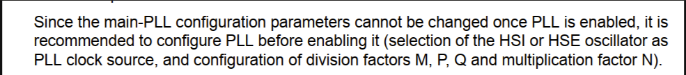

来自 <https://blog.csdn.net/xiaoyuanwuhui/article/details/108772487> 

Q:将Bootloader和APP程序分别下载到板子上，Bootlader程序可以正常运行，而APP程序会死在Error_Handler()的while(1)循环中。

具体调试发现程序是在执行HAL_RCC_OscConfig()函数的PLL 配置部分检测到当前PLL已经被配置为了系统时钟而返回了HAL_ERROR的返回值导致进入了Error_Handler()。为什么bootloader程序中的时钟配置没有问题，而APP中的时钟配置就会有问题呢？

分析

PLL在启动之后便不能够重新配置,一旦启用了PLL，就无法更改主PLL配置参数，因此建议在启用PLL之前先对其进行配置（选择HSI或HSE振荡器为PLL时钟源，以及除法因子M，P，Q和乘法因子N的配置）。

参考手册中的描述将这个问题的原因描述的很清楚了

具体实现例程：

在开启外部时钟前先切换到内部时钟

 /* -1- Select HSI as system clock source to allow modification of the PLL configuration */

 RCC_ClkInitStruct.ClockType = RCC_CLOCKTYPE_SYSCLK;

 RCC_ClkInitStruct.SYSCLKSource = RCC_SYSCLKSOURCE_HSI;

 if(HAL_RCC_ClockConfig(&RCC_ClkInitStruct, FLASH_LATENCY_1) != HAL_OK)

 {

  /* Initialization Error */

  Error_Handler();

 }

 

 /* -2- Enable HSE Oscillator, select it as PLL source and finally activate the PLL */

  

 /* -3- Select the PLL as system clock source and configure the HCLK, PCLK1 and PCLK2 clocks dividers */

 

 /* -4- Optional: Disable HSI Oscillator (if the HSI is no more needed by the application)*/

 

 

 