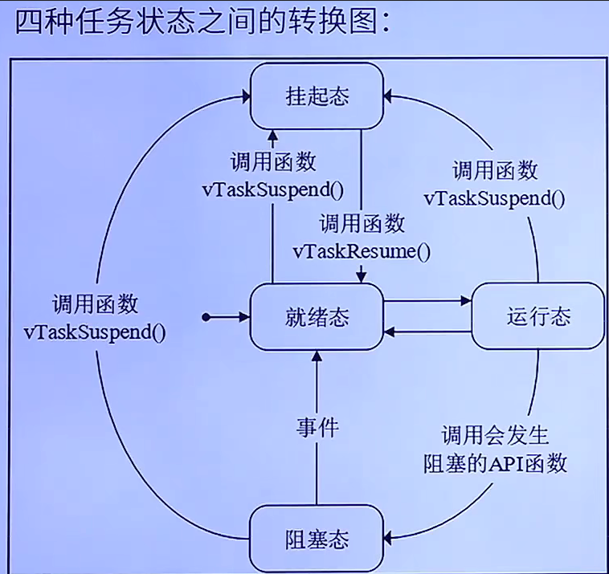
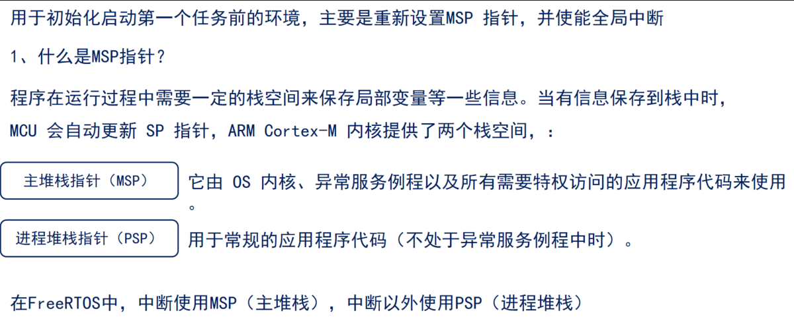
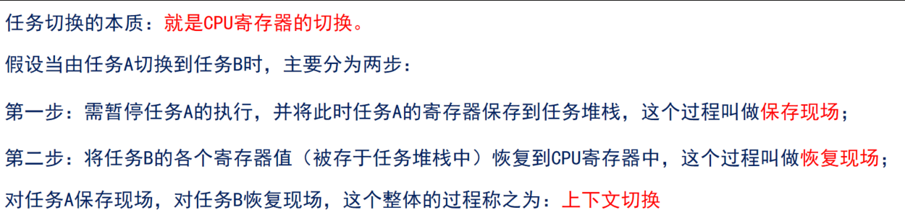
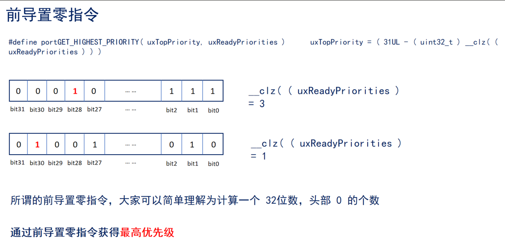
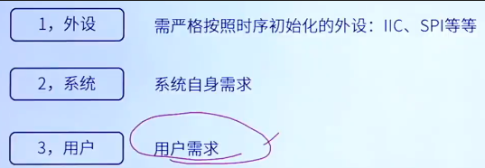
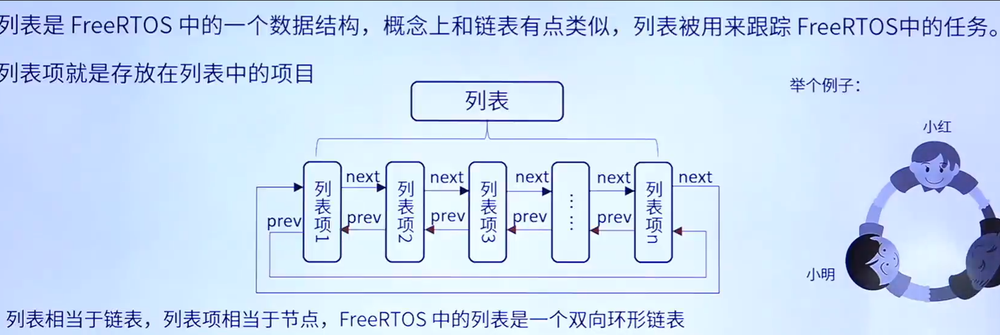

调度：

1.抢占式调度：高优先级任务，优先执行；高优先级任务不停止，低优先级任务无法执行；被抢占的任务将会进入就绪态。

2.时间片调度：同等优先级任务，轮流执行，时间片流转；一个时间片大小，取决为滴答定时器中断周期； 

​            没有用完的时间片不会再使用，下次任务才能够得到执行，还是按照一个时间片的时钟节拍运行。

FreeRTOS中任务设置数值越大，优先级越高

任务状态：

1.运行态：正在执行的任务，注意在STM32中，同一时间仅一个任务处于运行态

2.就绪态： 任务已经能够被执行，但当前还未被执行

3.阻塞态：任务因延时或等待外部事件发生

4.挂起态：类似暂停，调用函数VTaskSuspend()进入挂起态，需要调用解挂函数VTaskResume()才可以进入就绪态

总结：

1.仅就绪态可转变为运行态

2.其他状态任务想要运行，必须先转变为就绪态

 

四种状态中，除了运行态，其他三种任务状态的任务都有其对应的任务状例表

 

调度器总是在所有处于就绪列表的任务中，选择具有最高优先级的任务来执行

### 启动第一个任务:

 

1.需要将任务A的寄存器值恢复到CPU寄存器,任务A的寄存器值，在一开始创建任务时就保存在任务堆栈里.

2.中断产生时，硬件自动将xPSR，PC(R15)，LR(R14)，R12，R3-R0出/入栈,而R4~R11需要手动出/入栈.

3.进入中断后硬件会强制使用MSP指针 ，此时LR(R14）的值将会被自动被更新为特殊的EXC_RETURN

 

什么是MSP指针？

因为需从 0xE000ED08 获取向量表的偏移，为啥要获得向量表呢？因为向量表的第一个是 MSP 指针！

PendSV中断是如何触发的？

通过向中断控制和状态寄存器 ICSR 的bit28 写入 1 挂起 PendSV 来启动 PendSV 中断

查找最高优先级任务

vTaskSwitchContext( )

