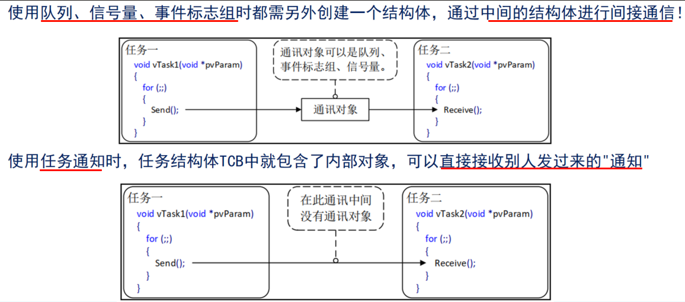
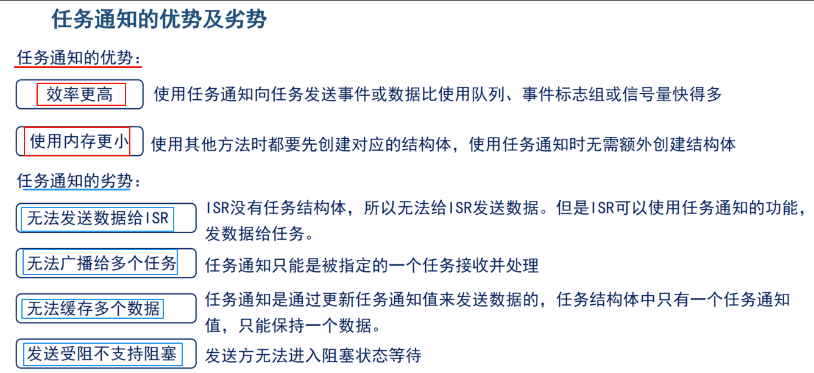
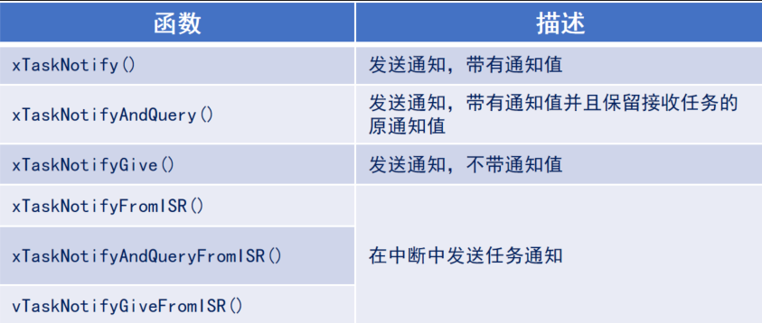
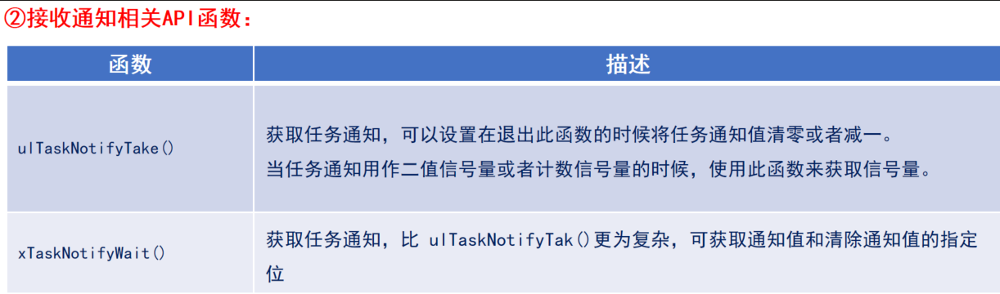
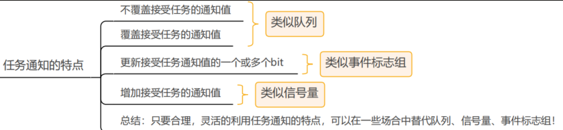

用来通知任务的，任务控制块中的结构体成员变量 ulNotifiedValue就是这个通知值。

任务通知值的更新方式：

- 不覆盖接受任务的通知值
- 覆盖接受任务的通知值
- 更新接受任务通知值的一个或多个bit
- 增加接受任务的通知值

任务通知值：

- 计数值（数值累加，类似信号量）
- 相应位置一（类似事件标志组）
- 任意数值（支持覆写和不覆写，类似队列）

 

任务通知状态：

- 任务未等待通知     ：任务通知默认的初始化状态
- 等待通知：接收方已经准备好了（调用了接收任务通知函数），等待发送方给通知
- 等待接收：发送方已经发送出去（调用了发送任务通知函数），等待接收方接收

任务通知API函数主要有两类：①发送通知 ，②接收通知。

注意：发送通知API函数可以用于任务和中断服务函数中；接收通知API函数只能用在任务中。

任务通知功能：模拟二值信号量和计数型信号量。

任务通知功能：模拟消息邮箱

