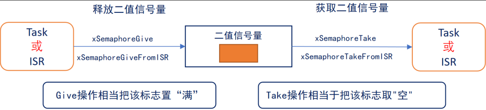
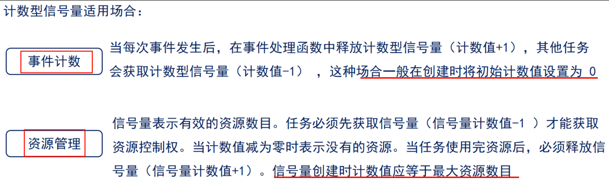
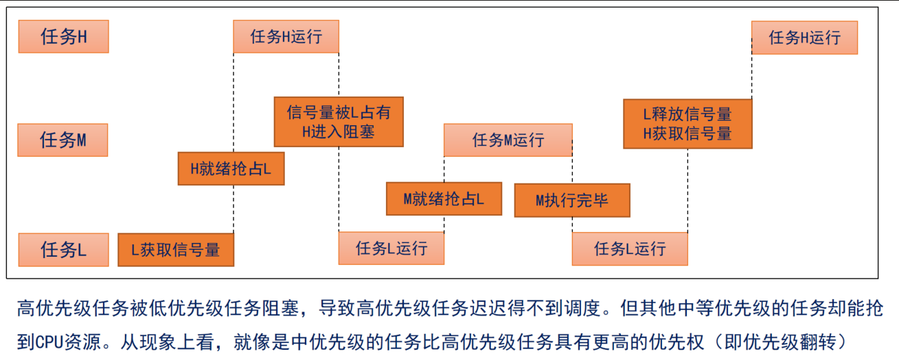
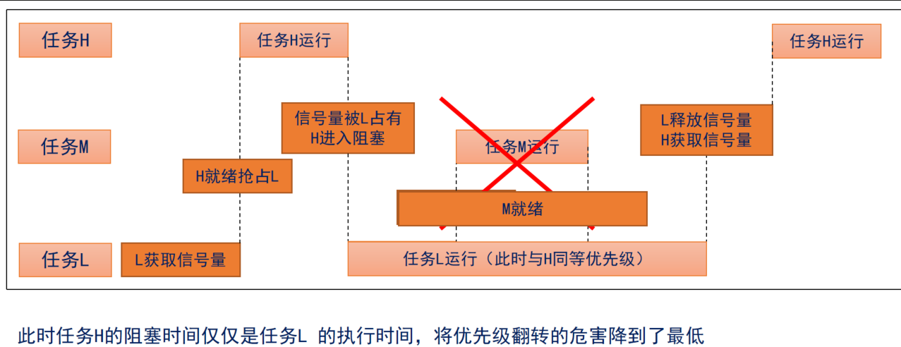
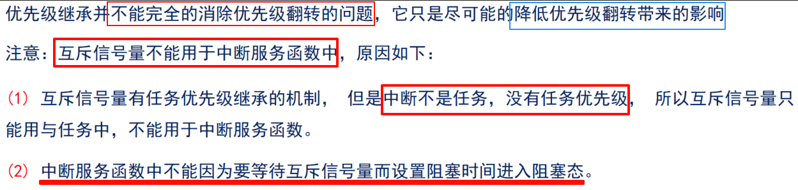

1.信号量：用于传递状态

 

1.1 二值信号量

二值信号量的本质是一个队列长度为 1 的队列 ，该队列就只有空和满两种情况。

用于互斥访问或任务同步， 与互斥信号量比较类似，但是二值信号量有可能会导致优先级翻转的问题 ，

所以二值信号量更适合用于同步。

1.2 计数信号量

计数型信号量相当于队列长度大于1 的队列。计数型信号量的释放和获取与二值信号量相同 。

1.3 优先级翻转

高优先级的任务反而慢执行，低优先级的任务反而优先执行。在使用二值信号量的时候，经常会遇到优先

级翻转的问题。

1.4 互斥信号量

一个拥有优先级继承的二值信号量。

在同步的应用中二值信号量最适合，互斥信号量适合用于那些需要互斥访问的应用中。

 

- 高优先级的任务会将低优先级任务的优先级提升到与自己相同的优先级。

互斥信号量的释放和获取函数与二值信号量相同 ，互斥信号量不支持中断中调用

注意：创建互斥信号量时，会主动释放一次信号量