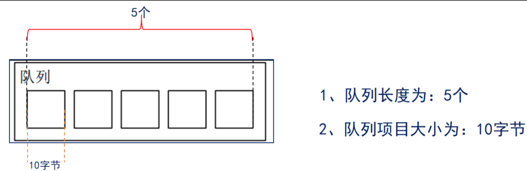
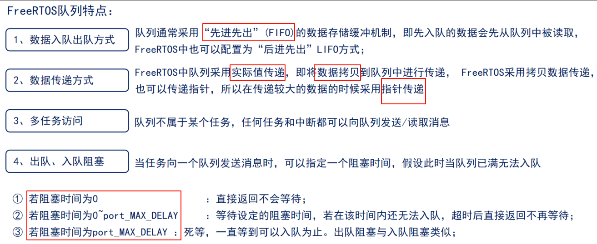
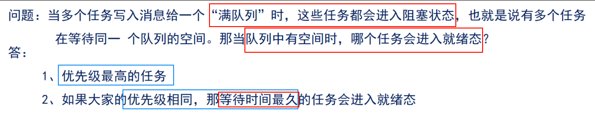
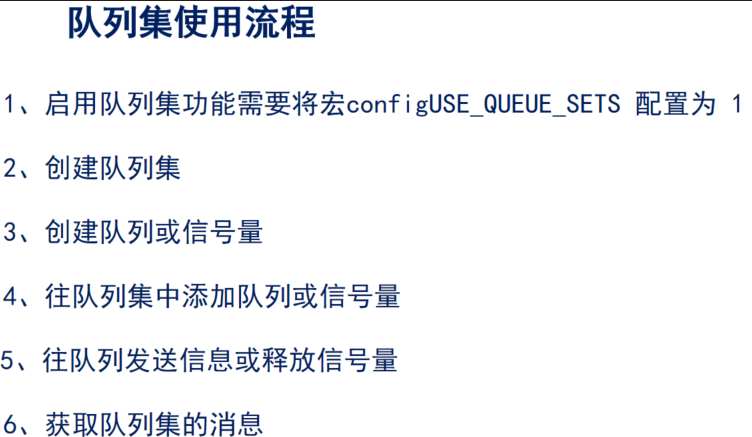

队列是任务到任务、任务到中断、中断到任务数据交流的一种机制（消息传递）

解决：全局变量的弊端

数据无保护，导致数据不安全，当多个任务同时对该变量操作时，数据易受损。

 

包括 ：队列集、互斥信号量、计数型信号量、二值信号量、 递归互斥信号量。

 

1.队列中可以存储数量有限、大小固定的数据

2.队列的项目以及队列长度

1. 队列集

在任务间传递不同数据类型的消息。

作用：用于对多个队列或信号量进行“监听”，其中不管哪一个消息到来，都可让任务退出阻塞状态

