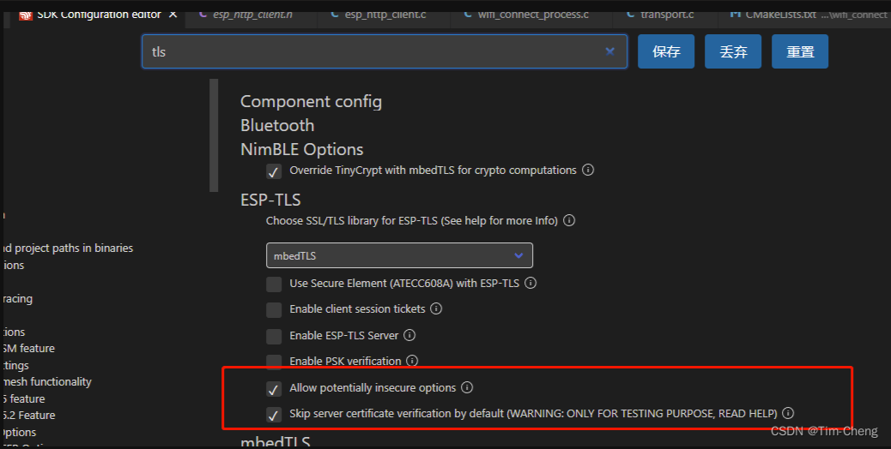

错误类型：E (4775)esp-tls-mbedtls:No server verification option set in esp_tls_cfg_t structure.Check esp_tls API reference

 

关于无服务器认证配置调整

来自 <https://blog.csdn.net/u014028690/article/details/130079556> 