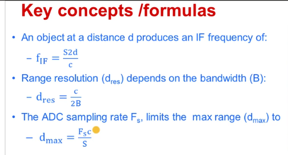
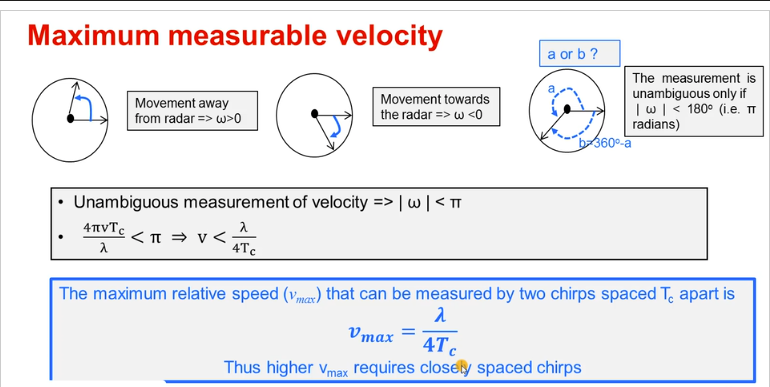
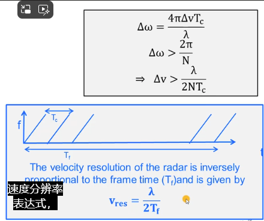
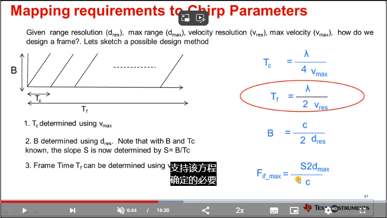
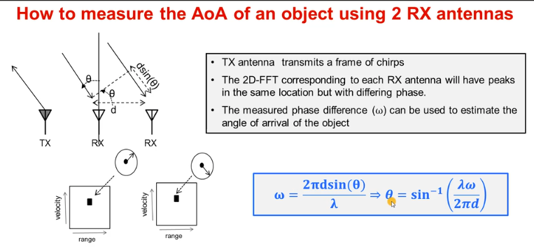

1.天线

偶极子、微带贴片天线

2.方向性和功率增益

- 增益是衡量天线将能量聚焦到特定方向的能力。方向性增益(也称为方向性)描述了天线     的基本辐射方向图。
- 对于运动和手势感应，宽视场更为重要，并且天线应设计得尽可能接近全向。     这意味着在视野范围内：主光束应宽且平 坦、旁瓣应该很高，并且零点应尽可能浅。
- 高通滤波器是消除直流附近的泄漏和干扰所必需的，低通滤波器用于限制信号的带宽并防止     ADC 采样过程中的混叠。
- 在许多雷达系统中，LNA     被用作第一个放大组件，以最大限度地降低总体噪声系数。

3.动态范围 

-  动态范围是接收器可以同时处理而不会降低性能的最大输入信号功率与最小输入信号功率的比率。
- 天线从来都不是各向同性的，而是方向性的。
- RCS     更多地由目标的形状、材料和方位角决定，而不是由其物理大小决定。
- 为了在噪声中检测到目标，需要一定水平的信噪比
- 通过电源产生，精心设计的电源线滤波器和旁路电容有助于最大限度地减少干扰影响。
- 雷达对电源电压纹波很敏感，紧密排列的     LDO 和旁路电容有助于减轻纹波。

 

4.信号模型

- 使用复信号建模来分析窄带雷达系统要简单得多，因为我们只需要考虑基带系统中的幅度和相位调制，可以忽略载波频率分量。
- 匹配滤波器的设计目的是匹配发射的信号，以便在接收器输出处实现最大可能的信噪比。

IF信号

Doopler具有分辨相同距离下的不同速度的物体，使用相位差来计算两个物体的速度

