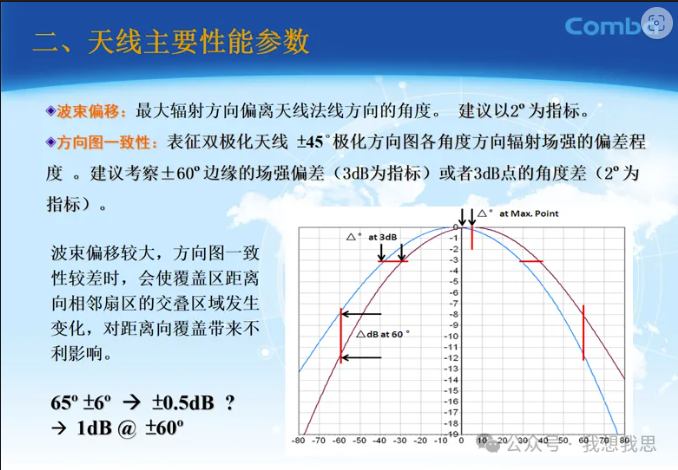
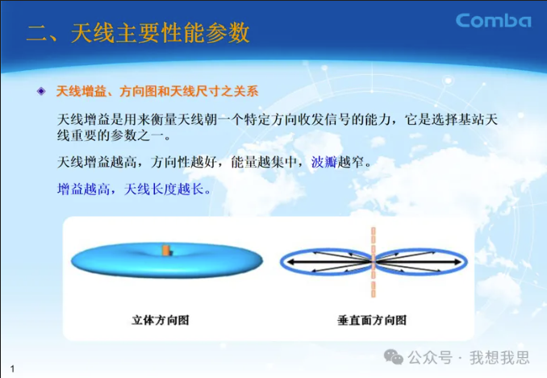
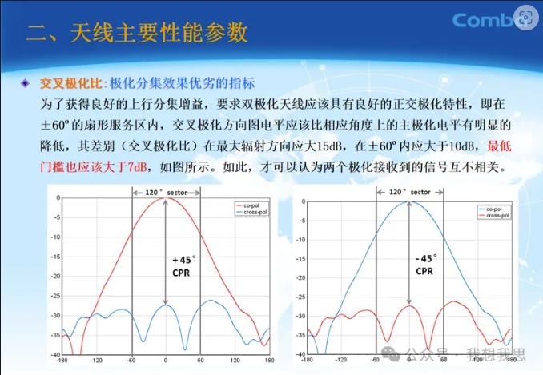

把天线和发射机或接收机连接起来的系统称为馈线系统。馈线的形式随频率的不同而又分为导线传输线、同轴线传输线、波导或微带

线等。所谓馈线，实际上就是传输线。

一、天线的电参数

①天线的方向性

衡量天线将能量向所需方向辐射的能力。主瓣宽度：主瓣宽度是衡量天线的最大辐射区域的程度的物理量。越宽越好。旁瓣电平：旁瓣电平是指离主瓣最近且电平[敏感词]的第一旁瓣的电平。实际上，旁瓣区是不需要辐射的区域，所以其电平越低越好。方向系数：在离天线某一距离处，天线在最大辐射方向上的辐射功率流密度与相同辐射功率的理想无方向性天线在同一距离处的辐射功率流密度之比。这是方向性中最重要的指标，能[敏感词]比较不同天线的方向性，表示了天线集束能量的电参数。

 

②天线效率

天线效率定义为天线辐射功率与输入功率之比。

 

③增益系数

增益系数是综合衡量天线能量转换和方向特性的参数，它的定义为：方向系数与天线效率的乘积。

为定向天线与理想全向天线（其辐射在各方向均等）在一定的距离上的某点处产生一定大小的信号之比。

 

④极化方向

极化特性是指天线在最大辐射方向上电场矢量的方向随时间变化的规律。极化方向，就是天线电场的方向。天线的极化方式有线极化（水平极化和垂直极化）和圆极化（左旋极化和右旋极化）等方式。

 

⑤频带宽度

当工作频率变化时，天线的有关电参数不应超出规定的范围，这一频率范围称为频带宽度，简称为天线的带宽。

 

⑥输入阻抗

当天线本身的阻抗与发信机的阻抗相等是，才能得到最大的发射功率！

