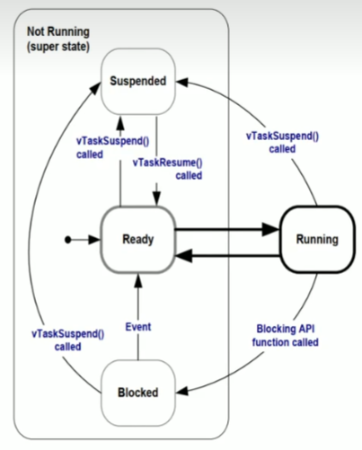

# 嵌入式八股文

## 1.指针函数和函数指针

**指针函数：**

`指针函数`是一个函数，返回值是指针。

**示例：**

```c
int* get_array() {
    static int arr[5] = {1, 2, 3, 4, 5};
    return arr; // 返回指向数组的指针
}
```

**函数指针：**

`函数指针`是一个指向函数的指针。

**示例：**

```c
int add(int a, int b) {
    return a + b; 	// 返回两个整数的和
}

int (*fp)(int, int); // 声明一个函数指针
fp = add; 			 // 将 add 函数的地址赋给函数指针
int result = fp(2, 3); // 通过函数指针调用 add 函数
```

>上述示例中，也可写作`fp = &add;`。这是一种更明确的方式，表明我们明确地将函数指针赋值为函数的地址。

## 2.指针的大小

指针的大小在 C语言中，指针的大小取决于**编译器**和目标平台。

**在32 位平台上**

在32 位平台上，指针的大小通常是4 字节（32 位）。

**在64 位平台上**

在64 位平台上，指针的大小通常是8 字节（64 位）。

> **为什么指针的大小不同？**
>
> 指针的大小不同是因为不同的平台有不同的地址空间大小。
>
> 在32 位平台上，地址空间的大小是2^32（4GB），因此指针只需要4 字节来存储地址。
>
> 在64 位平台上，地址空间的大小是2^64（16EB），因此指针需要8 字节来存储地址。

## 3.strlen和sizeof的区别

`strlen` 是一个**函数**（需包含头文件`<string.h>`），用于计算字符串的长度。（运行期）

`sizeof` 是一个**操作符**（运算符、关键字），用于计算变量或类型的大小（以字节为单位）。（编译期）

**示例：**

```c
printf("%d %d", sizeof("\0"), strlen("\0"));
```

输出：

```c
2 0
// 字符串以\0结尾，\0不需要计算长度。
```

> 1. sizeof("\0"):
>    - "\0" 是一个字符串字面量，它包含一个空字符（'\0'）。
>    - 在 C 语言中，字符串字面量总是以额外的 '\0' 结尾。
>    - 所以 "\0" 实际上包含两个 '\0' 字符。
>    - 因此，sizeof("\0") 返回 2。
> 2. strlen("\0"):
>    - strlen 函数计算字符串的长度，直到遇到第一个 '\0'。
>    - 在 "\0" 中，第一个字符就是 '\0'。
>    - 所以 strlen 立即停止计数。
>    - 因此，strlen("\0") 返回 0。
>
> 这个例子很好地展示了 sizeof 和 strlen 的区别：
>
> - sizeof 计算的是分配给对象的总字节数。
> - strlen 计算的是字符串中 '\0' 之前的字符数。

## 4.数组指针和指针数组

`数组指针`：指向数组的指针，本质是一个**指针**。

```c
int (*p)[5];					// 声明一个指针 p，它指向一个包含 5 个 int 的数组。
char (*str)[10];			 // 声明一个指针 str，它指向一个包含 10 个 char 的数组。
float (*matrix)[3][4];	  // 声明一个指针 matrix，它指向一个 3x4 的 float 二维数组。
```

`指针数组`：本质是一个**数组**，数组里的元素是指针。

```c
int *parr[5];						// 声明一个数组 parr，它包含 5 个指向 int 的指针。
char *strarr[10];				 // 声明一个数组 strarr，它包含 10 个指向 char 的指针。
float *matrixarr[3][4];		  // 声明一个 3x4 的数组 matrixarr，它包含指向 float 的指针。
```

**关键点：**

- **数组指针** ：在括号中包含 `*`，表示这个指针指向的是一个数组。
- **指针数组** ：`*` 符号位于数组名称之前，方括号在后，表示数组的每个元素都是一个指针。

## 5.C语言内存分配的方式有几种

1. **静态存储区分配**

   - 用于**全局变量**和**静态变量**
   - 在程序开始运行时分配，程序结束时释放
   - 存储在程序的数据段或bss段

2. **栈区分配**

   - 用于**函数的局部变量**
   - 在函数调用时自动分配，函数返回时自动释放
   - 操作快速，但空间有限

3. **堆区分配**

   - 使用malloc()、calloc()等函数动态分配
   - 在C++中还可以使用new关键字
   - 需要手动管理内存（分配和释放）
   - 空间较大，但操作相对较慢

## 6.结构体和联合体区别

结构体（struct）和联合体（union）的主要区别可以简洁地总结如下：

1. **内存分配**：
   - 结构体：为每个成员分配独立的内存空间
   - 联合体：所有成员共享同一块内存空间
2. **大小**：
   - 结构体：大小等于所有成员大小之和（**考虑内存对齐**）
   - 联合体：大小等于最大成员的大小
3. **访问**：
   - 结构体：可以同时访问所有成员
   - 联合体：同一时间只能使用一个成员
4. 用途：
   - 结构体：用于组织相关但不同的数据
   - 联合体：用于在不同时间存储不同类型的数据
5. 内存效率：
   - 结构体：占用更多内存，但数据独立
   - 联合体：节省内存，但存在数据覆盖风险

## 7.野指针

**野指针是什么：**

野指针是指向不可用内存的指针。

**产生原因：**

- 创建指针时未初始化；
- 指针被释放后未赋值`NULL`；
- 指针越界；

## 8.数组和链表

**数组和链表的区别：**

1. 内存分配：
   - 数组：连续的内存空间，固定大小。
   - 链表：非连续的内存空间，可动态调整大小。
2. 访问元素：
   - 数组：通过索引直接访问，O(1) 时间复杂度。
   - 链表：需要从头节点遍历，O(n) 时间复杂度。
3. 插入和删除操作：
   - 数组：在中间插入或删除需要移动元素，O(n) 时间复杂度。
   - 链表：只需修改指针，O(1) 时间复杂度（如果已知位置）。
4. 大小灵活性：
   - 数组：固定大小，改变大小需要重新分配内存。
   - 链表：可以动态增长或缩小。
5. 随机访问：
   - 数组：支持高效的随机访问。
   - 链表：不支持高效的随机访问。

## 9.宏函数

在编写宏函数时，需要注意以下几点：

1. **参数使用括号包围**： 为了避免优先级问题，宏函数的每个参数都应该用括号括起来。

```c
#define MULTIPLY(x, y) ((x) * (y))
```

2. **整个表达式使用括号**： 整个宏定义的表达式也应该用括号括起来，以确保在复杂表达式中正确计算。

```c
#define SQUARE(x) ((x) * (x))
```

3. 避免使用自增或自减运算符： 在宏中使用++或--可能导致意外行为，因为宏是简单的文本替换。
4. 多行宏使用do-while(0)： 对于多行宏，使用do-while(0)结构可以确保宏在所有上下文中都能正确工作。

```c
#define COMPLEX_MACRO(x, y) do { \
    statement1; \
    statement2; \
} while(0)
```

5. 注意副作用： 宏可能多次计算其参数，这可能导致意外的副作用。

```c
// 可能导致问题的宏
#define MAX(a, b) ((a) > (b) ? (a) : (b))
// 使用时：MAX(x++, y) 可能会导致x被增加两次
```

6. 使用#和##操作符时要小心： '#'用于字符串化，'##'用于连接，但它们可能导致意外结果。

## 10.#include<>和#include""的区别

它们的主要区别在于编译器搜索头文件的顺序和位置。

1. `# include <>`
   - 用于包含标准库头文件。
   - 编译器会在预定义的系统目录中搜索头文件。
2. `# include ""`
   - 主要用于包含用户自定义的头文件。
   - 首先在当前源文件所在的目录中搜索。

## 11.全局变量和局部变量的区别

区别：

1. 定义位置
   - 全局变量：在所有函数外部定义
   - 局部变量：在函数或代码块内部定义
2. **作用域**
   - 全局变量：整个程序都可以访问
   - 局部变量：仅在定义它的函数或代码块内可访问
3. **生命周期**
   - 全局变量：程序开始时创建，程序结束时销毁
   - 局部变量：进入定义它的代码块时创建，离开时销毁
4. **内存分配**
   - 全局变量：通常存储在静态数据区
   - 局部变量：通常存储在栈上（除非是静态局部变量）
5. 可见性
   - 全局变量：可以被程序中的任何函数访问
   - 局部变量：只在其作用域内可见

## 12.define和typedef的区别

1. define 是一个预处理指令，typedef 是关键字；
2. define 不会做正确性检查，直接进行替换，typedef 会做正确性检查；
3. define 没用作用域限制，typedef 遵循普通的作用域规则（如局部/全局作用域）；
4. 对指针的操作不同。

> - define 用于创建宏，进行简单的文本替换
> - typedef 用于创建类型别名
>
> 
>
> 指针定义的方式:
>
> 使用 define：
>
> ```c
> #define INTPTR int*
> ```
>
> 使用 typedef：
>
> ```c
> typedef int* IntPtr;
> ```
>
> 
>
> 在多重指针声明时，区别最明显：
>
> 使用 define：
>
> ```c
> #define INTPTR int*
> INTPTR a, b;
> ```
>
> 这里 a 是 int*，但 b 仅仅是 int。因为宏展开后相当于：
>
> ```c
> int* a, b;
> ```
>
> 使用 typedef：
>
> ```c
> typedef int* IntPtr;
> IntPtr a, b;
> ```
>
> 这里 a 和 b 都是 int*。

## 13.static的作用

1. **局部变量**中的 static

   - **延长局部变量的生命周期**，使其在函数调用之间保持其值。
   - 变量**只初始化一次**，在程序的整个运行期间存在。
   - 仍然具有**局部作用域**，只在定义它的函数内可见。

   例子：

   ```c
   void func() {
       static int count = 0;
       count++;
       printf("%d\n", count);
   }
   ```

2. 全局变量中的 static

   - 将全局变量的作用域限制在当前文件内。
   - 防止其他文件访问该变量。

3. 函数中的 static

   - 将函数的作用域限制在当前文件内。
   - 防止其他文件调用该函数。

## 14.内存泄漏

**什么是内存泄漏：**

内存泄漏是指程序在动态分配内存后，因为疏忽或错误而无法正确释放这些内存，导致系统可用内存逐渐减少的现象。

## 15.内存对齐

**什么是内存对齐：**

内存对齐是在存储数据时，将数据按照一定的规则放置在内存中的过程，以优化CPU访问内存的速度。

内存对齐的基本规则如下：

1. 基本数据类型的对齐值通常等于其自身大小。
2. 结构体的对齐值是**其成员中最大对齐值**。
3. 结构体每个成员相对于结构体起始位置的偏移量必须是该成员大小的整数倍。
4. 结构体的总大小必须是其对齐值的整数倍。

示例说明：

```c
struct Example {
    char a;     // 1 byte
    int b;      // 4 bytes
    short c;    // 2 bytes
};
```

在一个32位系统上，假设int的对齐值为4，这个结构体的内存布局可能如下：

```
0     1     2     3     4     5     6     7     8     9    10   11
+---+---+---+---+---+---+---+---+---+---+---+---+
 |  a  |      |      |      |  b     b    b     b  |  c     c  |      |      |
+---+---+---+---+---+---+---+---+---+---+---+---+
```

解释：

1. `char a` 占1字节
2. 为了让`int b`对齐到4的倍数，在`a`后面填充3字节
3. `int b` 占4字节
4. `short c` 占2字节
5. 为了让整个结构体的大小是最大对齐值(4)的倍数，最后填充2字节

因此，这个结构体的实际大小是12字节，而不是理论上的7字节(1+4+2)。

## 16.数组名和指针的区别

1. 数组名就是数组首元素的地址，也可以看作一个指针常量（pointer constant），这个指针是不能修改指向的；
2. 使用指针访问数组是间接访问，需要使用`*`进行解引用，使用数组名访问数组是直接访问；
3. 对指针和数组名使用`sizeof`时不同，指针的大小和编译器有关，使用`sizeof`计算数组名是整个数组的大小；

## 17.堆和栈的区别

1. 内存分配方式：栈是系统自动创建（主要用于保存局部变量），当函数执行完成，栈被销毁；堆是程序员手动创建和释放的。
2. 内存大小：栈通常较小，堆空间较大。
3. 访问速度：栈的访问速度比堆快。
4. 生命周期：栈的生命周期是局部变量的生命周期，函数调用结束后自动释放；堆的生命周期由程序员控制，直到手动释放或程序结束。

## 18.malloc和new的区别

1. 层级
   - malloc是C语言中的标准库函数，是**库层面**的函数实现，也可在C++中使用
   - new是C++中**语言层面**的操作符
2. 返回类型
   - malloc返回void*指针，需要手动类型转换
   - new返回对应类型的指针，无需类型转换
3. 分配内存大小
   - malloc需要显式指定大小
   - new会根据数据类型自动计算大小
4. 构造函数调用
   - malloc不调用构造函数
   - new会调用对象的构造函数
5. 内存释放
   - malloc使用free()释放
   - new使用delete释放

## 19.指针常量和常量指针

**常量指针（pointer to constant）**

常量指针指的是指向一个常量的指针。

```c
const int* p = &a;  
// 或者 int const* p = &a;
```

- 指针指向的**值不能修改**，但指针的指向可以改变
- `*p = 20;` 错误，不能通过指针修改指向的值
- `p = &b;` 正确，可以改变指针指向

 **指针常量（constant pointer）**

指针常量指指针是一个常量，指针所指向的地址是固定的。

```c
int* const p = &a;
```

- 指针的**指向不能修改**，但指向的值可以通过指针修改
- `*p = 20;` 正确，可以通过指针修改值
- `p = &b;` 错误，不能改变指针指向

**既是指针常量又是常量指针**

```c
const int* const p = &a;
```

- 指针的指向和指向的值都不能修改
- `*p = 20;` 错误
- `p = &b;` 错误

记忆技巧：看`const`关键字在`*`的左边还是右边，在左边修饰的是指向的值，在右边修饰的是指针本身。

## 20.struct和class在C++中的区别

1. 默认访问权限
   - struct 默认成员为 public
   - class 默认成员为 private
2. 默认继承方式
   - struct 默认 public 继承
   - class 默认 private 继承
3. 使用场景
   - struct 多用于POD (Plain Old Data)类型（简单的数据结构）
   - class 多用于实现抽象数据类型和面向对象编程（**封装**和**继承**）

## 21.C++类的访问权限

在 C++中分别有三个访问权限：公有的、私有的、受保护的。

1. **public (公有)**

   - 类外可以访问

   - 子类可以继承

   - 通常用于声明接口

2. **private (私有)**

   - 类外不能访问
   - 子类不能继承
   - 默认的访问权限
   - 用于隐藏实现细节

3. **protected (保护)**

   - 类外不能访问
   - 子类可以继承
   - 用于需要继承但不想公开的成员

> 重要说明:
>
> - class 默认访问权限是 private
> - struct 默认访问权限是 public
> - 友元(friend)函数/类可以访问私有成员

示例：

```c
class Animal {
private:
    int age;  // 只能在类内部访问
protected:
    string name;  // 可以被子类访问
public:
    void setAge(int a) { age = a; }  // 公开接口
};

class Dog : public Animal {
    void bark() {
        cout << name;  // 可以访问protected成员
        // cout << age;  // 错误!不能访问private成员
    }
};
```

## 22.内联函数

**内联函数**(inline function)是用`inline`关键字声明的函数，它建议编译器在调用点**展开函数代码**，而不是进行普通的函数调用。

**特点**：

- **减少函数调用开销**(栈操作、参数传递、跳转等)
- 代码体积可能增大
- inline只是对编译器的建议，不是强制的
- 通常用于短小、简单、频繁调用的函数

使用场景：

1. 适合用inline的情况：

```c
// 1. 简单的取值函数
inline int getValue() { return value; }

// 2. 简单的设值函数
inline void setValue(int v) { value = v; }

// 3. 简单的运算
inline double square(double x) { return x * x; }
```

2. 不适合用inline的情况：

```c
// 1. 含有循环的函数
inline void badInline() {
    for(int i = 0; i < 1000; i++) {
        // 大量代码
    }
}

// 2. 含有递归的函数
inline int factorial(int n) {
    return (n <= 1) ? 1 : n * factorial(n-1);
}

// 3. 函数体太大的函数
inline void complexFunction() {
    // 大量代码...
}
```

## 23.使用C语言实现strcpy字符串拷贝函数

**实现一：**

```c
// 实现字符串拷贝 strcpy函数
// 明确参数和返回值
char* mystrcpy(char* dest, const char* src)
{
    char* temp = dest;
    while((*dest++ = *src++));
    
    return temp;
}
```

> ```c
> while((*dest++ = *src++));
> ```
>
> - 当复制到 '\0' 时，表达式值为0，循环结束
> - 注意这里不需要显式判断 `'\0'`，因为赋值表达式的值就是被复制的字符

这种实现最简洁优雅，一行代码完成复制。性能也好，因为减少了判断次数。

**实现二：**

```c
// 第3种安全实现
char* my_strcpy_safe(char* dest, const char* src) {
    char* temp = dest;
    
    // 检查空指针
    if (dest == NULL || src == NULL) {
        return NULL;
    }
    
    // 检查内存重叠
    if (dest > src && dest < src + strlen(src)) {
        // 从后向前复制
        const char* end = src + strlen(src);
        dest = dest + strlen(src);
        while (end >= src) {
            *dest-- = *end--;
        }
    } else {
        // 从前向后复制
        while ((*dest++ = *src++) != '\0');
    }
    
    return temp;
}
```

这种实现最安全，因为：

- 检查了空指针
- 处理了内存重叠问题
- 但性能相对较差，代码较复杂

**实现三：**

```c
// 第4种带边界检查实现
char* my_strcpy_bounded(char* dest, const char* src, size_t size) {
    char* temp = dest;
    if (size > 0) {
        size_t i;
        for (i = 0; i < size - 1 && src[i] != '\0'; i++) {
            dest[i] = src[i];
        }
        dest[i] = '\0';
    }
    return temp;
}
```

这种实现最实用，因为：

- 防止缓冲区溢出
- 确保目标字符串总是以'\0'结尾
- 适合实际项目使用

## 24.程序分为几个段

1. 代码段（Code Segment）：存储程序可执行指令，通常是只读的。
2. 数据段（Data Segment）：存储已初始化的全局变量和静态变量，整个程序生命周期有效。
3. BSS 段（Block Started by Symbol Segment）：存储未初始化的全局变量和静态变量，按零初始化。
4. 堆（Heap）：用于动态内存分配，通过 `malloc` 等函数管理，手动控制。
5. 栈（Stack）：存储局部变量、函数参数等，由操作系统自动管理，有限大小。

## 25.队列和栈的区别

1. 操作顺序

- 队列：先进先出 (FIFO - First In First Out)
- 栈：后进先出 (LIFO - Last In First Out)

2. 插入和删除

- 队列：

  - 插入（入队）在一端进行
  - 删除（出队）在另一端进行
  
- 栈：

  - 插入（压栈）和删除（弹栈）在同一端进行

3. 访问元素

- **队列**：只能访问队首元素
- **栈**：只能访问栈顶元素

4. 应用场景

- 队列：

  - 任务调度
  - 缓冲处理
  - 广度优先搜索
  
- 栈：

  - 函数调用
  - 表达式求值
  - 深度优先搜索

## 26.一个.c文件怎么转换为可执行程序

1. **预处理**

- 处理所有预处理器指令（如 #include, #define）
- 展开宏定义，生成没有注释的源代码
- 命令：`gcc -E file.c -o file.i`

2. **编译**

- 将预处理后的代码转换为汇编代码
- 命令：`gcc -S file.i -o file.s`

3. **汇编**

- 将汇编代码转换为目标文件（机器代码）
- 命令：`gcc -c file.s -o file.o`

4. **链接**

- 将目标文件与库文件链接，生成可执行文件
- 命令：`gcc file.o -o executable`

## 27.SPI和IIC寻址的区别

- SPI 寻址通过硬件选择，使用专用的片选（CS）线来选择设备
- IIC 寻址通过从机地址进行寻址（==7位==地址模式和==10位==地址模式）

## 28.什么是交叉编译

交叉编译是一种编译过程，它允许在一种平台上编译出在另一种不同平台上运行的可执行程序。

## 29.UART,IIC,SPI的区别

UART、I2C（IIC）和SPI是三种常用的串行通信协议，各有其特点和应用场景。以下是它们的主要区别：

1. **UART (Universal Asynchronous Receiver/Transmitter)**

- **通信方式**：异步通信
- **线路数**：通常2线（TX和RX）
- **设备数量**：通常只能连接两台设备（点对点）
- **速度**：较慢（常见波特率9600-115200）
- **工作模式**：全双工，半双工
- 距离：可达较远距离
- 寻址：无内置寻址机制
- 复杂度：简单
- 应用：常用于调试、简单设备间通信

2. **I2C (Inter-Integrated Circuit)**

- **通信方式**：同步通信
- **线路数**：2线（SDA数据线和SCL时钟线）
- **设备数量**：支持多主机和多从机之间的通信（通常支持127个在同一总线上）
- **速度**：中等（标准模式100kbps，快速模式400kbps，高速模式3.4Mbps）
- **工作模式**：半双工
- 距离：短距离（通常几米内）
- 寻址：有内置寻址机制（7位或10位地址）
- 复杂度：中等
- 应用：连接多个低速外设，如传感器、EEPROM等

3. **SPI (Serial Peripheral Interface)**

- **通信方式**：同步通信
- **线路数**：通常4线（MOSI、MISO、SCK、SS）
- **设备数量**：一主机与多从机通信（需要为每个设备提供独立的片选信号线）
- **速度**：快（可达几十MHz）
- **工作模式**：全双工
- 距离：短距离（通常板级通信）
- 寻址：使用独立的片选线
- 复杂度：相对复杂
- 应用：高速数据传输，如SD卡、显示屏、ADC等

比较表：

| 特性       | UART | I2C  | SPI                |
| ---------- | ---- | ---- | ------------------ |
| 通信方式   | 异步 | 同步 | 同步               |
| 线路数     | 2    | 2    | 4+                 |
| 速度       | 慢   | 中   | 快                 |
| 距离       | 远   | 近   | 近                 |
| 寻址       | 无   | 有   | 片选               |
| 复杂度     | 低   | 中   | 高                 |
| 多设备支持 | 困难 | 容易 | 容易但需要额外线路 |

选择哪种协议取决于具体应用需求，如速度、距离、设备数量等因素。

## 30.SPI有几根线，可以去除哪些线？

SPI（Serial Peripheral Interface）协议通常使用多根线进行通信，基本的连接通常包括以下四根主要线： 

1. MOSI (Master Out Slave In) ：主设备发送数据到从设备的线。 
2. MISO (Master In Slave Out) ：从设备发送数据到主设备的线。
3. SCK (Serial Clock) ：主设备生成的时钟信号，用于同步数据传输。 
4. SS / CS (Slave Select / Chip Select) ：用于选择特定从设备的线。主设备通过激活相应的片选线来选择要与之通信的从设备。

可以去除哪些线？

1. 不需要进行双向通信时，可以去除其中一根数据线MISO或MOSI；
2. 只进行一对一通信时，可以去除CS片选线

## 31.TCP和UDP的区别

TCP (传输控制协议) 和 UDP (用户数据报协议) 是两种主要的传输层协议。它们有以下主要区别：

1. 可靠性：

  - TCP: 可靠传输。保证数据按序到达，丢包时会重传。
  - UDP: 不可靠传输。不保证数据到达顺序，也不保证是否到达。

2. 连接性:

  - TCP: 面向连接的协议。在传输数据前需要先建立连接。
  - UDP: 无连接协议。发送数据前不需要建立连接。

3. 速度:

   - TCP: 相对较慢，因为有各种机制保证可靠性。
   - UDP: 相对较快，因为没有建立连接等额外开销。（UDP丢包概率较大）
4. 应用场景:
   - TCP: 适用于要求可靠传输的应用，如网页浏览、电子邮件、文件传输等。
   - UDP: 适用于实时性要求高的应用，如视频流、在线游戏、VoIP等。

## 32.线程和进程的区别

线程（Thread）和进程（Process）是操作系统中两个重要的概念，它们在资源管理、执行和调度等方面有以下主要区别：

1. **定义**:
- **进程**：**一个进程是执行中的程序的实例，是资源分配的基本单位**，包含程序代码和当前活动（例如程序计数器、栈、数据段等）。每个进程有自己的内存空间。
- **线程**：**线程是进程内的一个执行单元，是CPU调度的基本单位。**一个进程可以包含多个线程，这些线程共享同一进程的资源（如内存和打开的文件）。

2. 资源消耗:
- **进程**：创建和管理过程的开销相对较大，因为每个进程都有独立的内存空间和资源。
- **线程**：创建和管理线程的开销较小，因为线程共享进程的资源，可以更快速地创建和销毁。

3. **内存分配**:
- **进程**：每个进程拥有**独立**的内存空间，进程之间的内存是相互隔离的。
- **线程**：同一进程中的所有线程**共享**进程的地址空间，包括代码段、数据段和打开文件等，但每个线程有自己独立的堆栈和寄存器。

4. **调度**:
- **进程**：进程调度时需要保存和恢复整个进程的状态，因此相对较慢。
- **线程**：线程调度相对较快，因为仅需保存和恢复线程的状态。

5. 通信方式:
- **进程**：由于进程间的内存是隔离的，进程间通信（IPC）通常需要通过管道、消息队列、信号量和共享内存等机制，比较复杂。
- **线程**：同一进程内的线程可以直接访问共享数据，通信相对简单，但也需要同步机制来防止竞争条件。

6. **可靠性**:
- **进程**：**相对独立**，一个进程的崩溃不会直接影响其他进程。
- **线程**：同一进程内的线程如果发生错误，比如崩溃，会影响整个进程及其所有线程。

7. 适用场景:
- **进程**：适用于资源需求较大、功能相对独立的应用场景，如网络服务、数据库等。
- **线程**：适用于需要频繁任务切换和共享数据的场景，如实时应用、游戏、网络通信等。

8. 示例:
- **进程**：打开文本编辑器、浏览器、数据库等都是独立的进程。
- **线程**：在一个浏览器进程中，多个标签页可能使用不同的线程来同时加载不同的网站。

**综述**
- 进程是资源分配的基本单位，而线程是执行的基本单位。线程的创建和管理相对轻量，但需要注意共享数据引发的安全问题，而进程之间相对独立，运行更为安全。选择使用进程还是线程，通常取决于具体的应用场景和需求。

## 33.进程间通信有几种方式，哪几种需要借助内核

进程间通信（Inter-Process Communication, IPC）是指在不同进程之间传递数据和信息的机制。常见的进程间通信方式主要有以下几种： 

1. **管道（Pipes）**
   - 匿名管道（Anonymous Pipes） ：在父子进程或兄弟进程之间通信，通常是单向的。 
   
   - 命名管道（Named Pipes） ：允许无亲缘关系的进程进行双向通信。  
   
2. **消息队列（Message Queues）**
   - 允许进程将消息按照队列的方式进行发送和接收，可以通过一个识别符进行访问和操作。 
   
3. **共享内存（Shared Memory）**
   - 多个进程可以映射同一块内存区域以进行数据共享。通过共享内存，进程可以直接读写共同的数据，速度快，但通常需要其他机制（如信号量）来同步访问。  
   
4. **信号（Signals）** 
   - 信号是一种简单的异步通信机制，用于通知进程某个事件的发生。信号轻量，但只适合传递简单的通知信息。 
   
5. **套接字（Sockets）** 
   - 允许不同主机上的进程进行通信，也可以用于同一台主机上的进程。支持可靠和不可靠的通信。  
   
6. 内存映射文件（Memory-Mapped Files） 

  - 允许不同进程对同一文件进行映射，共享文件中的数据。  

7. **信号量（Semaphores）**
- 用于实现进程间的互斥和同步，尽管信号量本身并不传递数据，但常与共享内存结合使用。

需要借助内核的 IPC 方式：

管道、共享内存（在内核空间创建的共享内存）、信号量、消息队列、套接字

## 34.什么是DMA

DMA（Direct Memory Access，直接内存访问）是一种允许外部设备（如硬盘、网络适配器、图形卡等）直接访问系统内存的技术，而不需要通过中央处理器（CPU）进行数据传输。这种方式可以提高数据传输的效率，并减轻CPU的负担。

## 35.进程的状态

进程在其生命周期中会经历多个不同的状态。以下是典型的进程状态及其转换：

1. **新建状态（New）**
   - 进程刚被创建，尚未加入到可执行进程池中。
   - 操作系统完成进程创建的必要操作，如分配内存等。

2. **就绪状态（Ready）**
   - 进程已经准备好运行，等待CPU分配时间片。
   - 处于就绪队列中，随时可以运行，但尚未得到CPU。

3. **运行状态（Running）**
   - 进程正在CPU上执行。
   - 在单核系统中，任一时刻只有一个进程处于此状态。

4. **阻塞状态（Blocked 或 Waiting）**
   - 进程正在等待某个事件的发生（如I/O完成、信号接收等）。
   - 不能立即进行，也不会被CPU调度。

5. **终止状态（Terminated）**
   - 进程已结束执行，或因错误而被强制终止。
   - 进程占用的资源可能还未被完全回收。

一些操作系统可能还包括以下状态：

6. 挂起状态（Suspended）
   - 进程被暂时从内存转移到磁盘，释放内存资源。
   - 可以细分为就绪挂起和阻塞挂起两种。

7. 僵尸状态（Zombie）
   - 进程已经结束，但其父进程还未调用wait()来获取其状态信息。
   - 仍然在进程表中占有一个位置。

---

**状态转换：**

1. 新建 → 就绪：当系统完成进程创建并将其加入就绪队列。

2. 就绪 → 运行：当调度器选中该进程并分配CPU时间。

3. 运行 → 就绪：
   - 时间片用完被强制切换。
   - 被高优先级进程抢占。

4. 运行 → 阻塞：进程等待某个事件（如I/O）。

5. 阻塞 → 就绪：等待的事件发生，进程重新进入就绪队列。

6. 运行 → 终止：
   - 进程正常完成。
   - 出现不可恢复的错误。
   - 被其他进程或用户终止。

7. 就绪 → 挂起：系统出于资源管理考虑将进程挂起。

8. 阻塞 → 挂起：长期阻塞的进程可能被挂起以释放内存。

9. 挂起 → 就绪：当内存资源足够时，挂起的进程被重新加载到内存。

理解这些状态和转换对于掌握操作系统的进程管理机制非常重要，也是理解多任务处理和资源调度的基础。

## 36.僵尸进程，孤儿进程，守护进程

在操作系统中，僵尸进程、孤儿进程和守护进程是与进程管理相关的重要概念。

1. 僵尸进程(Zombie Process):
   - 子进程结束,但父进程未调用`wait()`或`waitpid()`来获取子进程的退出状态。
   - 子进程的进程描述符仍然保留在系统中,占用系统资源。
   - 解决:父进程应及时调用`wait()`相关函数。

2. 孤儿进程(Orphan Process):
   - 父进程先于子进程结束,导致子进程成为孤儿。
   - 被init进程(PID 1)收养,由系统自动管理。
   - 不会造成资源泄露,因为系统会妥善处理。

3. 守护进程(Daemon Process):
   - 在后台运行,独立于控制终端的进程。
   - 通常用于执行特定的系统任务或服务。
   - 创建方法:父进程`fork`后退出,子进程继续在后台运行。

## 37.FreeRTOS中调度算法

1. **抢占式调度（Preemptive Scheduling）**：
   - 高优先级任务可以打断低优先级任务的执行。
   - 适用于任务优先级不同的场景，确保重要任务及时得到处理。
2. **时间片轮转（Round Robin Scheduling）**：
   - 相同优先级的任务获得相同大小的时间片（如 1ms）。
   - 当时间片到达时，任务会被强制切换，确保所有同优先级任务有机会运行。
3. **协作式调度（Cooperative Scheduling）**：
   - 任务通过调用 `vTaskDelay()` 等函数主动释放 CPU，让其他任务运行。
   - 依赖于任务之间的合作，有效利用资源。

附加说明：

- FreeRTOS 的调度是动态的，根据任务状态（就绪、阻塞等）和优先级来决定执行哪个任务。
- 提供优先级继承机制以解决优先级反转问题，确保系统的实时性。

## 38.FreeRTOS中的任务同步

在 FreeRTOS 中，任务同步是实现多个任务之间有效协作的关键要素。FreeRTOS 提供了一系列机制来实现任务之间的同步与通信，以下是常用的任务同步机制：

1. **信号量 (Semaphore)**
信号量是一种用于管理对共享资源访问的工具，增加了任务之间的互斥性。

- **二进制信号量 (Binary Semaphore)**：用于实现任务之间的简单信号传递，通常用于任务间的通知。
- **计数信号量 (Counting Semaphore)**：用于限制对共享资源的访问，尤其适用于可以被多个任务共享的资源。

2. **互斥量 (Mutex)**
互斥量是一种特殊类型的信号量，用于实现任务间的**互斥访问**，防止多个任务同时访问共享资源。

- **优先级继承**：互斥量具有优先级继承机制，防止优先级反转问题。

3. **任务通知 (Task Notifications)**
任务通知是一种轻量级的同步机制，允许一个任务直接通知另一个任务。(通过TCB，不需要创建就可以使用，一般用于一对一)

- **直接通知**：任务可以用 `xTaskNotifyGive()` 和 `xTaskNotifyWait()` 进行简单的信号传递。
- **携带值的通知**：通知中可以携带一个值，可以在任务之间传递更多信息。

4. **消息队列 (Message Queue)**
消息队列是一种先进先出（FIFO）的数据结构，用于在任务间**传递消息或数据**。

- **异步消息传递**：可以支持不同优先级的任务之间的通信，消息队列可以存储多个消息直到接收任务处理。

5. **事件组 (Event Groups)**
事件组是用于管理**多个**事件状态的同步机制。

- **多事件同步**：可以使用按位或操作一次性检查多个事件，适用于多个任务的复杂同步场景。

6. **软件定时器 (Software Timers)**
软件定时器可以在指定的时间间隔内创建任务或回调，适用于定期检查某些状态或定时器超时等情况。


当选择同步机制时考虑的因素：
- **任务优先级**：选择合适的机制，尤其是在优先级反转可能发生的情境中。
- **开销**：不同机制在使用时有不同的性能开销。信号量和互斥量开销较小，而消息队列和事件组可能涉及到更多的上下文切换。
- **复杂性**：考虑应用的需求和设计的复杂性，选择既能满足需求又易于维护的机制。

## 39.同步通信和异步通信

1. 定义

异步通信：

- 数据的发送和接收是独立进行的
- 发送方和接收方不需要同时进行操作
- 发送方可以在发送完数据后继续执行其他任务
- 接收方在数据到达后进行处理

同步通信：

- 发送方在发送数据后会等待接收方的响应，才能继续执行
- 发送方和接收方必须在相同的时间节点进行操作
- 例如：I2C通信中的ACK（确认）机制

2. 特点

异步通信：

- 非阻塞
- 无需等待响应
- 适合用于延迟较大的场景

同步通信：

- 阻塞
- 需要等待响应
- 适合用于延迟较小的场景

## 40.FreeRTOS时间片的大小

时间片（Time Slice）是操作系统分配给每个任务运行的时间单位。

- 由`configTICK_RATE_HZ`宏定义决定

> 例如，该宏定义默认为1000Hz，即1ms一个时钟节拍。

## 41.FreeRTOS中任务的状态

### 任务状态类型

1. **就绪态（Ready）**
- 任务已准备好运行
- 等待处理器资源
- 位于就绪列表中
```c
// 任务进入就绪态示例
vTaskResume(TaskHandle);  // 恢复任务
```
2. **运行态（Running）**
- 当前正在执行的任务
- 每个核心同一时刻只能有一个任务处于运行态
```c
// 获取当前运行任务句柄
TaskHandle_t xTaskGetCurrentTaskHandle(void);
```
3. **阻塞态（Blocked）**
- 任务正在等待某个事件
- 常见阻塞原因：
  - 延时等待
  - 信号量等待
  - 消息队列等待
```c
// 任务阻塞示例
vTaskDelay(pdMS_TO_TICKS(1000));  // 延时阻塞
xSemaphoreTake(semHandle, portMAX_DELAY);  // 信号量等待
```
4. **挂起态（Suspended）**
- 任务被手动挂起
- 不参与调度，直到被恢复
```c
// 挂起和恢复任务
vTaskSuspend(TaskHandle);   // 挂起任务
vTaskResume(TaskHandle);    // 恢复任务
```
### 任务状态转换



1. 就绪 → 运行
- 被调度器选中执行

2. 运行 → 就绪
- 被更高优先级任务抢占
- 时间片用完

3.运行 → 阻塞
- 主动调用阻塞函数
- 等待事件或资源

4.阻塞 → 就绪
- 等待的事件发生
- 超时时间到达

5.运行/就绪 → 挂起
- 调用vTaskSuspend()

6.挂起 → 就绪
- 调用vTaskResume()

### 状态查看方法

```c
// 获取任务状态
eTaskState eTaskGetState(TaskHandle_t xTask);
// 可能的返回值
typedef enum
{
    eRunning = 0,  // 运行态
    eReady,        // 就绪态
    eBlocked,      // 阻塞态
    eSuspended,    // 挂起态
    eDeleted,      // 删除态
    eInvalid       // 无效状态
} eTaskState;
```
注意事项
1. 避免任务长时间阻塞
2. 合理使用任务挂起/恢复
3. 注意优先级设置，避免任务饿死
4. 监控任务状态，及时处理异常

## 42.环形缓冲区（Ring Buffer）

环形缓冲区是一种固定大小的数据结构，可以被视为首尾相连的数组。它通常用于在生产者和消费者之间传递数据。

特点：

- 固定大小
- 先进先出（FIFO）
- 循环利用空间
- 适用于数据流处理

1. 结构体定义：

```c
#define BUFFER_SIZE 10  // 定义缓冲区大小

// 环形缓冲区结构体
typedef struct {
    int buffer[BUFFER_SIZE]; // 缓冲区数组
    int head;                // 头指针，指向下一个将要写入数据的位置
    int tail;                // 尾指针，指向下一个要读取数据的位置
    int count;               // 元素计数器
} CircularBuffer;
```

2. 常用操作函数：

- 初始化缓冲区

```c
// 初始化缓冲区
void initBuffer(CircularBuffer *cb) {
    cb->head = 0;
    cb->tail = 0;
    cb->count = 0;
}
```

- 检查缓冲区状态

```c
// 检查缓冲区是否已满
bool isFull(CircularBuffer *cb) {
    return cb->count == BUFFER_SIZE;
}

// 检查缓冲区是否为空
bool isEmpty(CircularBuffer *cb) {
    return cb->count == 0;
}
```

- 向缓冲区添加数据

```c
// 向缓冲区添加数据
bool enqueue(CircularBuffer *cb, int data) {
    if (isFull(cb)) {
        return false; // 缓冲区已满
    }
    cb->buffer[cb->head] = data;         // 将数据添加到头指针位置
    cb->head = (cb->head + 1) % BUFFER_SIZE; // 更新头指针位置
    cb->count++;                         // 更新计数器
    return true;
}
```

- 从缓冲区读取数据

```c
// 从缓冲区读取数据
bool dequeue(CircularBuffer *cb, int *data) {
    if (isEmpty(cb)) {
        return false; // 缓冲区为空
    }
    *data = cb->buffer[cb->tail];        // 从尾指针位置读取数据
    cb->tail = (cb->tail + 1) % BUFFER_SIZE; // 更新尾指针位置
    cb->count--;                         // 更新计数器
    return true;
}
```

## 43.PWM相关概念

`PWM`（Pulse Width Modulation，**脉冲宽度调制**）是一种用于模拟信号电平控制的技术，通过调节数字信号的占空比来模拟不同的电压电平。

**占空比**（Duty Cycle）是指PWM信号在一个周期内，信号为高电平的时间占整个周期的百分比。

## 44.if判断的两种写法

```c
int x = 5;

// 两种写法效果相同
if(x == 0)     // 正常判断
if(0 == x)     // 安全判断
```

推荐使用 `if(0 == x)` 这种写法，防止意外赋值，编译器会在错误写成 `if(0 = x)` 时直接报错。

## 45.RS232和RS485的区别

1. **通信方式**

    • RS-232: 

    ​	◦ 全双工通信，支持数据的双向传输。 
    ​	◦ 点对点通信，通常一台设备与另一台设备直接连接。   
    
    • RS-485: 
    
    ​	◦ 半双工通信，通常在同一时间只能进行单向传输。 
    ​	◦ 支持多点通信，可以连接多达 32 个设备（甚至更多），适合一对多或多对多的应用。    
    
2. **信号线**

    • RS-232: 

    ​	◦ 信号线包括 TX（发送）、RX（接收）和 GND（地）。   

    • RS-485: 

    ​	◦ 仅使用两根信号线（A 和 B）进行差分传输。
    
3. **抗干扰能力** 

    • RS-232: 

    ​	◦ 抗干扰能力较弱，信号对地参考，容易受到噪声干扰。

    • RS-485: 

    ​	◦ 抗干扰能力强，采用差分信号传输，通常使用双绞线将两根信号线缠绕在一起，有效减少外部干扰。
	
4. **传输距离** 

    • RS-232: 

    ​	◦ 最大传输距离一般为 15 米（50 英尺）。   

    • RS-485: 

    ​	◦ 最大传输距离可达 1.5 公里（1500 米）。
    
5. **传输速率** 

    • RS-232: 

    ​	◦ 通常支持的波特率较低，常见的波特率有 9600、19200 等。   

    • RS-485: 
    
    ​	◦ 可以支持更高的波特率，通常可达到 10 Mbps 或更高，具体取决于距离和设备配置。

6. **连接方式**

    • RS-232: 

    ​	◦ 通常使用 DB9 或 DB25 接头，连接方式相对简单。 

    • RS-485: 

    ​	◦ 通常使用螺丝端子或 RJ45 接头，连接方式更复杂，尤其是在多点网络中。

7. 应用场景

    • RS-232: 

    ​	◦ 常用于计算机与外部设备（如调制解调器、打印机等）之间的连接。

    • RS-485: 

    ​	◦ 广泛应用于工业控制、自动化系统、远程数据采集和监控等场景。

## 46.析构函数和构造函数

### 构造函数 (Constructor)

1. **定义**：构造函数是一个特殊的成员函数，**用于初始化对象**。当创建对象时，构造函数会被自动调用。
2. **特征**：
   - 构造函数的名称与类名相同。
   - 不返回任何类型，包括 `void`。
   - 可以重载，可以有多个构造函数，参数不同即可。
   - 可以有默认参数。
3. **用途**：
   - 初始化对象的成员变量。
   - 分配资源（如动态内存、文件句柄等）。

### 析构函数 (Destructor)

1. **定义**：析构函数是一个特殊的成员函数，用于在对象生命周期结束时释放资源。当对象被销毁时，析构函数会被自动调用。
2. **特征**：
   - 析构函数的名称与类名相同，但前面加一个波浪号 (`~`)。
   - 不返回任何类型，也不接受任何参数。
   - 不能重载，类中只能有一个析构函数。
3. **用途**：
   - 释放对象在构造函数中分配的资源（如动态内存、文件句柄等）。
   - 清理工作。

## 47.大小端的概念和判断

大小端（Endianness）是计算机存储多字节数据类型（如整数）时字节的存储顺序。

1. **大端序（Big Endian）**：高字节在低地址，低字节在高地址。
   - 符合人类的阅读习惯

2. **小端序（Little Endian）**：低字节在低地址，高字节在高地址。
   - x86和x64架构使用小端序

示例：

以十六进制数 0x12345678 为例。

大端序存储：

```tex
低地址 → 高地址
12 | 34 | 56 | 78
```

小端序存储：

```tex
低地址 → 高地址
78 | 56 | 34 | 12
```

测试代码：

```c
char a = 0x12345678;	// 打印一个字节
printf("%x\n", a);
```

## 48.实现strcmp函数

要求：用C语言编写一个strcmp函数（比较字符串是否相同，每一个字符都需要相同）。

基础实现：

```c
int my_strcmp(const char* str1, const char* str2) {
    // 检查指针是否为空
    if (str1 == NULL || str2 == NULL) {
        return -1;  // 或者其他错误处理方式
    }

    // 逐字符比较
    while (*str1 && *str2) {
        if (*str1 != *str2) {
            // 返回字符差值
            return *str1 - *str2;
        }
        str1++;
        str2++;
    }

    // 检查是否都到达字符串结尾
    return *str1 - *str2;	// 等于0
}
```

## 49.什么是系统调用

基本概念

- 系统调用是用户空间和内核空间的桥梁
- 提供安全的内核服务访问接口
- 防止用户直接访问内核空间

常见的系统调用：open()、close()、read()。

## 50.实现strcat函数

用c语言实现字符串连接函数：

```c
// 基础实现
char* strcat(char* dest, const char* src) {
    // 找到目标字符串末尾
    char* ptr = dest;
    while (*ptr != '\0') {
        ptr++;
    }
    
    // 复制源字符串
    while (*src != '\0') {
        *ptr = *src;
        ptr++;
        src++;
    }
    
    // 添加结束符
    *ptr = '\0';
    
    return dest;
}
```

## 51.什么是FIFO

软件实现：实现一个环形缓冲区

硬件实现：比较高端的单片机，或者是Linux开发板

- 串口通信，数据采集，DMA,音频处理
- 先进先出，使用FIFO可以去减轻CPU的负担

## 52.TCP和UDP通信的建立流程

### TCP通信（面向连接）

**TCP客户端通信流程**

1. socket()函数创建套接字
   - 建立网络通信的基本端点
   - 确定通信协议族和socket类型

2. connect()函数连接服务器
   - 主动向服务器发起连接请求
   - 建立TCP连接

3. send()/write()函数发送数据
   - 向服务器发送数据
   - 确保数据可靠传输

	recv()/read()函数接收数据
	- 从服务器接收数据
	- 处理接收到的信息

4. close()函数关闭客户端
   - 释放网络资源
   - 断开TCP连接

**TCP服务器通信流程**

1. socket()创建套接字
   - 初始化服务器网络通信接口

2. bind()绑定IP地址和端口号
   - 指定服务器监听的网络地址
   - 确定服务器的唯一标识

3. listen()监听端口
   - 将套接字设置为被动监听模式
   - 准备接收客户端连接请求

4. accept()等待客户端连接
   - 接受客户端连接请求
   - 创建新的套接字处理客户端

5. send()/write()发送数据
   - 向客户端返回响应信息

   recv()/read()接收数据
   - 读取客户端发送的数据
   
7. close()关闭服务器
   - 释放网络资源
   - 结束通信

**TCP通信特点**

- 面向连接
- 可靠传输
- 有序数据传输
- 需要建立连接
- 适合要求数据完整性的场景

**关键函数说明**

- socket()：创建套接字
- bind()：绑定地址
- listen()：监听连接
- accept()：接受连接
- connect()：主动连接
- send()/write()：发送数据
- recv()/read()：接收数据
- close()：关闭连接

### UDP通信

**UDP客户端**

1. socket创建套接字
2. sendto发送数据
3. recvfrom来接收服务器的消息
4. close关闭客户端

**UDP服务器**

1. socket创建套接字
2. bind进行绑定
3. recvfrom接收数据
4. sendto发送数据
5. 关闭服务器

## 53.为什么IIC要使用开漏输出+上拉电阻

1. 开漏输出的特点
- 只能主动拉低电平
- 无法直接输出高电平
- 通过上拉电阻实现高电平

2. **总线仲裁机制**
- 多个设备共享同一总线
- 避免设备间直接冲突
- 实现**"线与"**逻辑功能

3. **防止短路**
- 推挽输出会导致设备间短路
- 开漏输出可以安全共享总线
- 任何设备都可以拉低总线

4. 通信原理
- 默认高电平（上拉电阻）
- 需要通信时设备拉低总线
- 实现双向、多设备通信

## 54.取消内存对齐的方法

```c
#pragma pack(1)	// 取消内存对齐
__attribute__((packed))	// 对于gcc编译器，使用此种指令/属性实现取消内存对齐

#pragma pack()	// 恢复默认的内存对齐方式
```

## 55.软件IIC和硬件IIC的区别

1. 实现方式
- 软件IIC：通过GPIO控制SCL和SDA信号，手动模拟IIC时序
- 硬件IIC：使用MCU内置专用IIC硬件模块，自动生成时序

2. 性能对比
- 软件IIC：
  * 通信速度慢
  * 受CPU处理能力限制
  * 时序精度较低

- 硬件IIC：
  * 通信速度快
  * 可在高频率下工作
  * 不受CPU限制
  * 时序精度高

3. 可靠性
- 软件IIC：
  * 可靠性取决于CPU运行速度
  * 依赖程序员代码设计
  * 易受干扰

- 硬件IIC：
  * 可靠性高
  * 硬件电路稳定
  * 抗干扰能力强

## 56.多进程和多线程的适用场景区别

### 多线程

**优点：**

1. 轻量级
   - 线程切换开销小
   - 创建和销毁成本低

2. 共享内存
   - 线程间数据交互简单
   - 资源共享方便

**缺点：**

1. 线程安全问题
   - 数据竞争风险
   - 死锁可能性

2. 调试困难
   - 问题追踪复杂

**适用场景：**
- Web服务器
- 网络服务
- 用户界面
- I/O密集型任务

### 多进程

**优点：**

1. 高隔离性
   - 独立内存空间
   - 安全性高
   - 稳定性好

2. 并行处理
   - 充分利用多核CPU
   - 适合CPU密集型任务

**缺点：**
1. 资源开销大
   - 进程创建和管理成本高
   - 通信方式复杂
   - 启动时间长

**适用场景：**
- CPU密集型任务
- 需要高度隔离的系统
- 对稳定性要求高的应用

## 57.Linux驱动三大基础类

1. **字符设备驱动**

- 特点：
  - 按字节流方式访问
  - 支持**顺序读写**
  - 不支持随机访问

- 典型应用：
  - 串口驱动
  - 键盘驱动
  - LED驱动
  - 传感器驱动

- 关键结构：
  - file_operations结构体
  - 实现read/write等标准方法
  - 设备节点在/dev目录

2. **块设备驱动**

- 特点：
  - 支持随机访问
  - **按块读写数据**
  - 有缓存机制
  - 支持随机读写

- 典型应用：
  - 硬盘驱动
  - SD卡驱动
  - U盘驱动
  - 块设备存储

- 关键结构：
  - block_device_operations
  - 支持随机读写
  - 高效数据传输

3. **网络设备驱动**

- 特点：
  - **处理网络数据包**
  - 实现网络协议栈接口
  - 支持数据发送和接收

- 典型应用：
  - 以太网卡驱动
  - WIFI驱动
  - 蓝牙网络驱动

- 关键结构：
  - net_device结构体
  - 实现数据包收发
  - 网络协议适配

## 58.Linux和RTOS的区别

**1. 应用场景**

- **Linux**：
  - 桌面计算机
  - 服务器
  - 部分嵌入式系统

- **RTOS**：
  - 专注嵌入式系统
  - 工业控制
  - 实时性要求高的系统

**2. 实时性**

- **Linux**：
  - 不保证严格实时性
  - 调度不可预测
  - 响应时间不确定

- **RTOS**：
  - 严格的实时性保证
  - 任务调度可预测
  - 快速响应
  - 确定性执行时间

**3. 系统资源**

- **Linux**：
  - 系统庞大
  - 资源占用高
  - 功能全面

- **RTOS**：
  - 轻量级
  - 资源占用少
  - 功能专一

**4. 内存管理**

- **Linux**：
  - 支持虚拟内存
  - 内核空间和用户空间分离
  - 内存保护机制完善

- **RTOS**：
  - 无虚拟内存
  - 无用户/内核空间区分
  - 内存管理直接简单

**5. 系统扩展性**

- **Linux**：
  - 扩展性极高
  - 支持动态加载模块
  - 丰富的库和组件

- **RTOS**：
  - 扩展性有限
  - 功能相对专一
  - 定制化程度高

## 59.判断链表是否有环

链表有环的定义：链表中的某个节点的next指针指向了链表中的前面的某个节点。

解决方法：快慢指针（定义两个指针，一个指针走的比较快，另一个指针走的比较慢。）

```c
// 链表节点定义
struct ListNode {
    int val;
    struct ListNode *next;
};

// 判断是否有环的函数
bool hasCycle(struct ListNode *head) {
    // 处理空链表或只有一个节点的情况
    if (head == NULL || head->next == NULL) {
        return false;
    }
    
    // 定义快慢指针
    struct ListNode *slow = head;
    struct ListNode *fast = head->next;
    
    // 循环检测
    while (slow != fast) {
        // 快指针到达链表末尾，无环
        if (fast == NULL || fast->next == NULL) {
            return false;
        }
        
        // 移动指针
        slow = slow->next;       // 慢指针移动1步
        fast = fast->next->next; // 快指针移动2步
    }
    
    // 相遇，说明有环
    return true;
}

// 额外的查找环入口的函数（可选）
struct ListNode *detectCycle(struct ListNode *head) {
    // 先判断是否有环
    if (head == NULL || head->next == NULL) {
        return NULL;
    }
    
    struct ListNode *slow = head;
    struct ListNode *fast = head;
    
    // 第一次相遇
    while (fast != NULL && fast->next != NULL) {
        slow = slow->next;
        fast = fast->next->next;
        
        if (slow == fast) {
            // 重置slow到起点
            slow = head;
            // 两个指针同速前进
            while (slow != fast) {
                slow = slow->next;
                fast = fast->next;
            }
            return slow;
        }
    }
    
    return NULL;
}
```

> 数学证明
>
> 设：
>
> • 链表头到环入口距离为 a 
>
> • 环入口到第一次相遇点距离为 b 
>
> • 环长为 c  
>
> 第一次相遇时： 
>
> 1. 慢指针走的路程 = a + b 
> 2. 快指针走的路程 = a + b + nc (n为绕环圈数)  
>
> 因为快指针速度是慢指针2倍，所以： 
>
> • 2(a + b) = a + b + nc 
>
> • a + b = nc  
>
> 推导得： 
>
> • a = nc - b 
>
> • a = (n-1)c + (c-b)  
>
> **算法关键** 
>
> 1. 第一次相遇后，将一个指针重置到头部 
> 2. 两指针同速前进 
> 3. 当慢指针走 a 步时
> 4. 快指针走 nc - b 步 
> 5. 恰好在环入口相遇

## 60.什么是中断

1. 定义

中断是一种重要的系统机制，允许处理器暂停当前任务，优先响应更紧急的事件。

2. **基本工作原理**：
	1. 中断发生时，处理器立即停止当前代码执行
	2. 保存当前程序运行状态
	3. 跳转到中断服务程序（ISR）
	4. 处理中断事件
	5. 返回并恢复原程序执行
	
3. 核心流程

**中断 → 保存现场 → 中断处理 → 恢复现场 → 继续执行**

## 61.什么是看门狗

概念：旨在检测和恢复系统故障。它是一种硬件计时器，要求系统在规定的时间内定期对其进行复位（喂狗）。如果系统没有及时复位看门狗，

计时器将会溢出，并触发一种预定的响应，通常是系统复位或重启。


作用：

- 防止系统卡死：如果系统由于软件错误、死锁或其他原因导致无法继续正常工作，看门狗定时器可以自动复位系统，从而防止系统长时间
  卡死。
- 提高系统可靠性：在任务关键的嵌入式应用中，如工业控制、汽车电子、医疗设备等，看门狗定时器是确保系统持续可靠运行的重要手段。
- 恢复程序运行：当系统由于不可预见的故障导致异常行为时，看门狗定时器可以让系统迅速恢复到已知的初始状态，减少故障的影响。

## 62.FreeRTOS中信号量和队列的区别

- **信号量**更适合用于**事件信号传递和同步**，而不涉及数据传递。
- **队列**则适合在不同的任务或中断间**传递数据**，同时完成同步。

> 信号量是只有一个存储空间的特殊队列。

## 63.memcpy和strcpy的区别

1.`memcpy`用于复制任意类型的内存数据，比如结构体，字符串，数组，它是按照字节数来进行复制的。使用`memcpy`需要手动指定需要复制的字节数。
2.`strcpy`专门用于复制以`\0`结尾的C语言字符串，遇到`\0`时结束复制。

## 64.什么是回调函数

**回调函数**（Callback Function）是一种通过函数指针传递给另一函数，并在适当的时候由该函数调用的函数。简单来说，回调函数就是“**在某个事件或条件触发时由别的函数调用的函数**”。

**特点：**

1. **作为参数传递**：回调函数本质是一个函数指针（C/C++等），或函数引用（Java、Python等），可以传递给其他函数。
2. **延迟执行**：回调函数通常不会立即执行，而是在某个事件、条件或另一个函数调用的特定时刻执行。
3. **提高代码的灵活性和复用性**：通过使用回调函数，可以将通用的算法逻辑和具体的行为实现分开，增加代码的模块化。

**使用场景：**

- 异步编程：在处理异步操作（如网络请求、文件读写、定时器等）时，回调函数常用于在操作完成后通知应用执行特定操作。
- 事件驱动编程：如GUI程序中的按钮点击、鼠标移动等事件，都可以通过回调函数来处理。
- 库函数或系统调用：一些库函数允许用户自定义回调函数，以便在特定事件或状态下执行特定逻辑。

示例：

在C语言中，回调函数可以通过函数指针实现。

```c
#include <stdio.h>

// 定义一个回调函数类型
typedef void (*CallbackFunction)(int);

// 一个简单的回调函数
void myCallback(int num) {
    printf("Callback called with value: %d\n", num);
}

// 函数参数包含回调函数的函数
void processData(int data, CallbackFunction callback) {
    // 处理数据的逻辑...
    printf("Processing data: %d\n", data);

    // 调用回调函数
    callback(data);
}

int main() {
    // 调用带有回调的函数
    processData(42, myCallback);
    return 0;
}
```

## 65.select、poll、epoll

`select`、`poll`和`epoll`都是用于多路复用I/O操作的系统调用（或函数），主要用于监视多个文件描述符以查询其是否准备好进行I/O操作。这对于服务器应用程序非常重要，因为服务器通常需要同时处理多个连接。

### `select`

1. **简介**：
   - `select`是最早实现的一种多路复用I/O的方法，通过将一组文件描述符传递给内核，询问哪些文件描述符可以执行I/O操作。
   
2. **特点**：
   - 支持跨平台，但文件描述符数目有限制（通常取决于编译时的FD_SETSIZE）。
   - 每次调用之后，都需要重新设置文件描述符集。

3. **缺点**：
   - 随着文件描述符数目的增加，性能会显著下降，因为需要线性扫描文件描述符集。
   - 处理大数量的描述符效率较低。

### `poll`

1. **简介**：
   - `poll`是`select`的改进版，去掉了文件描述符数量的限制，通过使用一个结构体数组代替位掩码来表示文件描述符。

2. **特点**：
   - 没有文件描述符上限（受限于系统资源）。
   - 与`select`类似，调用时会阻塞，直到任意一个文件描述符准备好。

3. **缺点**：
   - 同样存在每次调用都需要重新遍历文件描述符集的问题，并且性能仍然是O(n)。

### `epoll`

1. **简介**：
   - `epoll`是Linux特有的多路复用技术，设计用于替代`select`和`poll`，提升大型并发连接的效率。
   
2. **特点**：
   - 支持边缘触发（edge-triggered）和水平触发（level-triggered）两种模式。
   - 提供更好的扩展性，性能优秀，因为它在每个事件到达时只对活跃的文件描述符进行处理。
   - 使用一个文件描述符代表事件集合，从用户空间到内核空间的拷贝效率高。

3. **优点**：
   - 对于大量文件描述符的管理更为高效，通常被应用于高并发网络服务器的实现。

**总结**

- **`select`**适合轻量级和跨平台需求，但在高数量文件描述符时性能差。
- **`poll`**在某些限制上优于`select`，但在高负载场景的性能改善有限。
- **`epoll`**则是为Linux系统提供的高性能多路复用解决方案，尤其适用于需要处理大量并发连接的应用。

## 66.面向对象的三大特征

面向对象编程（Object-Oriented Programming, OOP）的三大核心特征是封装、继承和多态。这些特征共同构成了面向对象编程的基础，使之成为一种强大且灵活的软件开发方法。

### 1. 封装（Encapsulation）

**定义**：封装是将对象的状态（属性）和行为（方法）绑定在一起，并隐藏对象的内部实现细节，仅通过公开的接口与外部进行交互。

**优点**：
- 提高了代码的模块化和可维护性，因为对象的内部实现可以独立地进行更改，而无需影响其他依赖该对象的代码。
- 增强了安全性，通过限制对对象内部状态的直接访问，防止数据被意外修改。

**示例**：使用访问修饰符（如private、protected和public）来控制对类成员的访问。

```cpp
class Car {
private:
    int speed;  // 隐藏的属性

public:
    void setSpeed(int s) {  // 公共接口
        if (s >= 0) {
            speed = s;
        }
    }

    int getSpeed() {
        return speed;
    }
};
```

### 2. 继承（Inheritance）

**定义**：继承是通过从一个已有类（基类或父类）创建一个新类（派生类或子类），以复用和拓展现有代码功能的一种机制。

**优点**：
- 提高了代码的复用性，新类可以继承基类的属性和方法，减少重复代码。
- 提供了类之间的层次关系，可以构建更为复杂和具体的类型体系。

**示例**：在C++中使用`:`关键字实现继承。

```cpp
class Vehicle {
public:
    void move() {
        // 移动逻辑
    }
};

class Car : public Vehicle {
    // Car继承了Vehicle，具有move方法
};
```

### 3. 多态（Polymorphism）

**定义**：多态允许不同类的对象通过同一个接口调用来执行不同的操作。通常通过方法重载和方法重写实现。（使用基类指针调用不同子类的实现）

**优点**：
- 提供了灵活性，可以用统一的接口来操作不同类型的对象。
- 支持代码的扩展和维护，新的类可以实现已有接口或抽象类，不需要修改原有代码。

**示例**：使用**虚函数**（virtual functions）实现函数的动态绑定。

```cpp
class Animal {
public:
    virtual void speak() {
        std::cout << "Animal speaks" << std::endl;
    }
};

class Dog : public Animal {
public:
    void speak() override {
        std::cout << "Dog barks" << std::endl;
    }
};

void makeAnimalSpeak(Animal* a) {
    a->speak();  // 动态绑定，根据实际对象调用相应的方法
}
```

通过这三个特征，面向对象编程提供了一种机制，帮助开发者设计出更加结构化、可维护且易于扩展的软件系统。

## 67.fork和vfork的区别

fork 和 vfork 是创建子进程的两种方法，但它们在行为和使用场景上存在显著差异。以下是它们的主要区别：

1. 内存管理：
   - **fork**：子进程会复制父进程的代码段和数据段，但使用写时拷贝技术（Copy-on-Write），只有在需要修改内存时才会实际进行拷贝。
   - **vfork**：子进程与父进程共享数据段，直到子进程调用 `exec` 或 `exit`。因此，在共享期间，子进程不应修改数据段以防止影响父进程。

2. 进程执行顺序：
   - **fork**：父进程和子进程的执行顺序不确定，二者是并发执行的。
   - **vfork**：确保子进程先运行，只有在子进程调用 `exec` 或 `exit` 后父进程才会被调度执行。

3. 数据独立性：
   - **fork**：由于写时拷贝，父子进程可以独立改变内存中的数据，互不影响。
   - **vfork**：在 `exec` 或 `exit` 之前，子进程和父进程共享内存，如果子进程依赖父进程的操作，这可能导致死锁。

4. 使用场景：
   - **fork**：适用于需要并发执行、新进程不马上需要执行新程序的场景。
   - **vfork**：用于子进程需要快速执行新程序（立刻调用 `exec`）的场景，可以提高性能。

注意：由于 `vfork` 的潜在风险（如共享数据段引发的问题），现代开发中通常更推荐使用 `fork` 除非明确知道 `vfork` 的行为并有实际需求。

## 68.深拷贝和浅拷贝的区别

深拷贝和浅拷贝是指在复制对象时如何处理对象所包含的资源，特别是动态分配的内存。以下是它们的区别：

1. 浅拷贝（Shallow Copy）
   - **本质**：仅复制对象的指针值，新对象与原对象共享同一块动态分配的内存。
   - **适用情况**：适用于不需要独立管理资源的简单类型对象。
   - **缺点**：有可能导致内存泄漏或多次释放内存的问题，因为多个对象引用同一内存块。

2. 深拷贝（Deep Copy）
   - **本质**：复制指针指向的实际数据，为新对象分配一个独立的内存空间。
   - **适用情况**：适用于包含动态分配内存的对象。
   - **优点**：每个对象都有自己独立的内存副本，互不影响。

以下是一个例子演示在C++中如何实现浅拷贝和深拷贝：

```cpp
#include <iostream>
#include <cstring>

class Example {
private:
    char* data;

public:
    // 构造函数
    Example(const char* initData) {
        data = new char[strlen(initData) + 1];
        strcpy(data, initData);
    }
    
    // 拷贝构造函数
    Example(const Example& other) {
        data = new char[strlen(other.data) + 1];
        strcpy(data, other.data);
    }

    // 赋值运算符重载
    Example& operator=(const Example& other) {
        // 自我赋值检测
        if (this == &other) {
            return *this; // 直接返回当前对象
        }

        // 释放已有内存
        delete[] data;

        // 分配新内存并复制数据
        data = new char[strlen(other.data) + 1];
        strcpy(data, other.data);
        
        return *this;
    }

    // 析构函数
    ~Example() {
        delete[] data;
    }

    void showData() const {
        std::cout << "Data: " << data << std::endl;
    }
}

int main() {
    Example original("Hello");

    // 使用赋值运算符重载，需进行深拷贝
    Example another("World");
    another = original;

    another.showData();

    return 0;
}

```

## 69.什么是函数重载

**函数重载（Function Overloading）**

**定义**：
函数重载是指在同一个作用域中，可以定义多个函数，函数名相同但参数列表不同，因此可以根据不同情况调用相应的函数。

**本质**：
在编译时，编译器会根据实参的数量和类型选择相应的函数，并通过名称修饰（name mangling）为这些重载的函数生成不同的二进制符号，这样它们在底层具有不同的标识。

**函数重载的规则**

1. **函数名相同**：
   - 每个重载的函数必须具有相同的名称。
2. **参数列表不同**：
   - 参数类型、数量或顺序至少有一个不同。
   - 不能仅仅通过返回值类型的不同来实现重载，因为编译器不会根据返回值选择函数。
3. **返回值类型**：
   - 返回值类型可以不同，但不能仅仅依赖返回值类型作为函数区分的标准。

## 70.当for循环遇到fork函数

**fork() 函数基本特性**

- fork() 会创建一个新的进程，该进程是父进程的完整副本
- 创建后，父子进程都从 fork() 的下一行开始执行
- 子进程会复制父进程的代码、数据、堆、栈等资源
- 每个进程都有独立的进程空间和进程ID

示例：

```cpp
for (int i = 0; i < 3; i++) {
    if (fork() == 0) {
        printf("i = %d\n", i);
        exit(0);
    }
}	// 这段代码会产生 8 个进程
```

**进程数量计算公式**

- 总进程数 = 2^(fork调用次数)

## 71.SPI的工作模式

SPI的工作模式由四种模式（Mode 0、Mode 1、Mode 2、Mode 3）组成，这些模式主要由时钟极性（CPOL）和时钟相位（CPHA）决定。

1. **CPOL（时钟极性）** ：
   - 决定时钟线（SCK）的空闲状态电平。
   - **CPOL = 0**：时钟空闲时为低电平。
   - **CPOL = 1**：时钟空闲时为高电平。
2. **CPHA（时钟相位）** ：
   - 决定数据采样的时刻，即是在第一个时钟边沿还是第二个时钟边沿进行数据采样。
   - **CPHA = 0**：数据在第一个时钟边沿采样。
   - **CPHA = 1**：数据在第二个时钟边沿采样。

**SPI的四种工作模式**

基于CPOL和CPHA的组合，SPI有四种工作模式：

1. **Mode 0 (CPOL = 0, CPHA = 0)** ：
   - 时钟空闲时为低电平。
   - 数据在时钟上升沿采样。
2. **Mode 1 (CPOL = 0, CPHA = 1)** ：
   - 时钟空闲时为低电平。
   - 数据在时钟下降沿采样。
3. **Mode 2 (CPOL = 1, CPHA = 0)** ：
   - 时钟空闲时为高电平。
   - 数据在时钟下降沿采样。
4. **Mode 3 (CPOL = 1, CPHA = 1)** ：
   - 时钟空闲时为高电平。
   - 数据在时钟上升沿采样。

## 72.什么是智能指针

智能指针是C++标准库中提供的一类对象，旨在自动管理动态分配的内存，从而减少手动内存管理所带来的复杂性和错误风险，如内存泄漏、悬空指针等问题。智能指针通过RAII（Resource Acquisition Is Initialization）机制，在智能指针对象的生命周期中自动地进行内存的分配和释放。

C++11标准引入了三种主要类型的智能指针，分别是：

1. **`std::unique_ptr`**：
  
   - 独占所有权，确保一个指针只能属于唯一一个`std::unique_ptr`对象。
   - 不可复制（复制构造和赋值被删除），但可移动（支持移动语义）。
   - 适用于需要独占指针所有权的场景。
   - 使用场合：当明确一个资源不需要被共享，通过转移所有权来管理对象。
   
   ```cpp
   std::unique_ptr<int> ptr1(new int(10));
   auto ptr2 = std::move(ptr1); // 转移所有权给ptr2
   ```
   
2. **`std::shared_ptr`**：
   - 共享所有权，通过引用计数管理资源，多个`std::shared_ptr`实例可以指向同一块内存。
   - 当最后一个`shared_ptr`对象被销毁时，资源才会被释放。
   - 使用场合：当需要多个指针共享同一份资源，尤其在复杂的对象关系图中。

   ```cpp
   std::shared_ptr<int> ptr1 = std::make_shared<int>(10);
   std::shared_ptr<int> ptr2 = ptr1; // 共享所有权
   ```

3. **`std::weak_ptr`**：
   - 辅助`std::shared_ptr`的指针，不影响共享对象的生命周期。
   - 用于打破循环引用问题。
   - 必须创建于一个`std::shared_ptr`，然后通过`.lock()`生成一个`std::shared_ptr`实例来访问对象。

   ```cpp
   std::shared_ptr<int> sharedPtr = std::make_shared<int>(10);
   std::weak_ptr<int> weakPtr = sharedPtr;
   
   if (auto lockedPtr = weakPtr.lock()) { // 检查资源是否依然存在
       // 使用 lockedPtr
   }
   ```

**智能指针的优点**

- **自动内存管理**：减少手动`new`、`delete`管理内存的复杂性。
- **异常安全性**：确保资源正确释放，即使抛出异常。
- **减少内存泄漏和悬空指针**：通过自动管理生命周期避免常见的内存管理错误。

通过使用智能指针，程序员可以将低层次的内存管理委托给C++库，并专注于程序逻辑，提高程序的安全性和可维护性。

## 73.使用C语言实现栈

在C语言中实现一个栈，可以通过数组或者链表来实现。这里将展示如何使用数组来实现一个简单的整型栈。栈是一种后进先出（LIFO, Last In First Out）的数据结构，具有以下基本操作：

1. **`push`** ：将元素添加到栈顶。
2. **`pop`** ：移除并返回栈顶元素。
3. **`peek/top`** ：返回栈顶元素但不删除它。
4. **`is_empty`** ：检查栈是否为空。
5. **`is_full`** ：检查栈是否已满（通常在固定大小的栈实现中使用）。

```c
#include <stdio.h>
#include <stdlib.h>

#define MAX 100 // 栈的最大容量定义

typedef struct {
    int data[MAX]; // 用于存储栈内元素的数组
    int top;       // 指向栈顶元素的索引
} Stack;

// 初始化栈
void init_stack(Stack *s) {
    s->top = -1;
}

// 判断栈是否为空
int is_empty(Stack *s) {
    return s->top == -1;
}

// 判断栈是否已满
int is_full(Stack *s) {
    return s->top == MAX - 1;
}

// 向栈中添加元素
void push(Stack *s, int value) {
    if (is_full(s)) {
        printf("Stack overflow, cannot push %d\n", value);
        return;
    }
    s->data[++s->top] = value;
}

// 从栈中移除元素
int pop(Stack *s) {
    if (is_empty(s)) {
        printf("Stack underflow, cannot pop\n");
        return -1; // 错误值（在实践中可能使用其他错误处理方法）
    }
    return s->data[s->top--];
}

// 获取栈顶元素，但不删除
int peek(Stack *s) {
    if (is_empty(s)) {
        printf("Stack is empty\n");
        return -1; // 错误值（在实践中可能使用其他错误处理方法）
    }
    return s->data[s->top];
}
```

## 74.什么是虚函数

在C++中，虚函数（virtual function）是指在基类中使用关键字`virtual`声明的成员函数。虚函数的主要目的是实现运行时多态性（也称为“动态多态”），使得程序能够在运行时决定调用哪个派生类的函数。这在面向对象编程中非常重要，可用于实现函数的重写和多态行为。

**虚函数的关键特性**

1. **用于实现多态**：虚函数允许基类指针或引用调用派生类的重写函数，而不仅仅是基类的版本。这意味着可以为派生类定义特定的行为。
2. **动态绑定**：与静态绑定（编译时绑定）不同，虚函数在运行时决定调用哪个函数实现。这通过虚函数表（vtable）实现，编译器为每个包含虚函数的类创建一个虚函数表。
3. **必须在派生类中重写**：如果需要在派生类中实现自己版本的函数，将其声明为`virtual`后，派生类可以选择性地重写它。

以下是一个简单的 C++ 示例，演示了虚函数的用法：

```c++
#include <iostream>
using namespace std;

class Base {
public:
    virtual void show() { // 基类中的虚函数
        cout << "Base class show function called." << endl;
    }
    virtual ~Base() {} // 虚析构函数
};

class Derived : public Base {
public:
    void show() override { // 重写基类中的虚函数
        cout << "Derived class show function called." << endl;
    }
};

void demonstratePolymorphism(Base* b) {
    b->show(); // 根据对象的实际类型调用相应的函数
}

int main() {
    Base* b; // 基类指针
    Derived d; // 派生类对象
    b = &d; // 将派生类对象的地址赋给基类指针

    demonstratePolymorphism(b); // 调用演示多态性的函数

    return 0;
}
```

运行上述代码将输出：

```tex
Derived class show function called.
```

**使用建议** 

1. 需要**多态行为**时使用虚函数

2. 希望基类指针能够调用派生类的方法时，使用虚函数 

3. 在继承层次中，如果希望某个方法能够被重新定义，就将其声明为虚函数  

**额外注意事项** 

1. 虚函数有轻微的性能开销 

2. 虚函数需要额外的内存来存储虚函数表 

3. 构造函数不能是虚函数 

4. 析构函数通常应该声明为虚函数，特别是基类指针可能指向派生类对象时

**虚函数和函数重写（覆盖）的区别**

1.**多态性**

◦ 虚函数：支持运行时多态 
◦ 普通函数重写：不支持运行时多态   

2.  **绑定方式**

◦ 虚函数：动态绑定（运行时绑定） 
◦ 普通函数：静态绑定（编译时绑定）

3.  **调用机制**

◦ 虚函数：通过虚函数表（vtable）动态查找 
◦ 普通函数：直接静态调用

## 75.GPIO工作模式

GPIO（通用输入输出端口）共有 **8种工作模式**，包括 **4种输入模式** 和 **4种输出模式**。

| 模式             | 方向      | 描述                                                         |
| ---------------- | --------- | ------------------------------------------------------------ |
| **浮空输入**     | 输入      | 引脚悬空，无内部上拉或下拉，完全由外部电路决定状态，易受干扰。 |
| **上拉输入**     | 输入      | 引脚内部连接上拉电阻，未连接时状态为高电平，减少悬空带来的干扰。 |
| **下拉输入**     | 输入      | 引脚内部连接下拉电阻，未连接时状态为低电平，减少悬空带来的干扰。 |
| **模拟输入**     | 输入      | 用于模拟信号的输入，如 ADC，禁用数字输入电路以减少功耗。     |
| **推挽输出**     | 输出      | 引脚既能输出高电平也能输出低电平，用于驱动负载，如 LED。     |
| **开漏输出**     | 输出      | 仅能输出低电平或高阻态，需外部上拉电阻，常用于 I²C 等总线通信。 |
| **复用功能模式** | 输入/输出 | GPIO 引脚用于外设功能，如 UART、SPI、PWM 等信号传输。        |
| **模拟模式**     | 输入/输出 | 引脚用于模拟功能，如 DAC 或 ADC 输入，禁用数字部分以减少干扰。 |

## 76.UART和USART的区别

UART（Universal Asynchronous Receiver/Transmitter，通用异步收发器）和 USART（Universal Synchronous/Asynchronous Receiver/Transmitter，通用同步/异步收发器）是常见的串行通信模块，虽然它们功能类似，但有以下**主要区别**：

1. 基本定义

- **UART**：仅支持**异步通信**。
- **USART**：支持**同步通信**和**异步通信**两种模式。

2. 通信方式

- **UART**：
  - 无需时钟信号，仅依靠波特率。
  - 使用起始位和停止位实现数据同步。
- **USART**：
  - 同步模式下需要额外的时钟信号（SCK）。
  - 数据同步更精准，适合高速通信。

3. 硬件需求

- **UART**：仅需两条线（TX、RX）。
- **USART**：同步模式下需三条线（TX、RX、SCK）。

4. 应用场景

- **UART**：低速、长距离通信，例如 GPS 模块、蓝牙模块。
- **USART**：高速、实时性强的通信，例如传感器接口、音视频传输。

5. 总结

- **UART**：简单易用，适合基础异步通信。
- **USART**：功能更强，兼容 UART 且支持同步通信，适合高性能应用。

## 77.OSI 七层模型与 TCP/IP 四层模型

### 1. OSI 七层模型
OSI 模型是一个理论参考模型，将网络通信划分为**七个**层级，分别是：

| **层次**          | **功能**                                         | **举例**             |
| ----------------- | ------------------------------------------------ | -------------------- |
| **7. 应用层**     | 提供网络服务接口，直接与用户交互。               | HTTP, FTP, SMTP, DNS |
| **6. 表示层**     | 处理数据的表示、加密、压缩。                     | JPEG, ASCII, TLS     |
| **5. 会话层**     | 管理会话连接的建立、维持、终止。                 | RPC, NetBIOS         |
| **4. 传输层**     | 提供可靠或不可靠的数据传输，端到端通信。         | TCP, UDP             |
| **3. 网络层**     | 负责数据的路由与寻址，跨越不同网络。             | IP, ICMP, ARP        |
| **2. 数据链路层** | 数据帧的组装与拆解，处理物理地址（MAC 地址）。   | Ethernet, PPP, Wi-Fi |
| **1. 物理层**     | 定义物理设备标准，传输比特流（电信号、光信号）。 | RJ45, 光纤, 同轴电缆 |

---

### 2. TCP/IP 四层模型
TCP/IP 模型是实际应用的网络协议模型，主要分为四个层级：

| **层次**          | **功能**                            | **对应 OSI 层**        | **举例**                     |
| ----------------- | ----------------------------------- | ---------------------- | ---------------------------- |
| **4. 应用层**     | 提供应用程序服务接口。              | 应用层、表示层、会话层 | HTTP, FTP, DNS, SMTP, Telnet |
| **3. 传输层**     | 提供端到端的通信与数据传输控制。    | 传输层                 | TCP, UDP                     |
| **2. 网络层**     | 负责路由选择和逻辑地址（IP 地址）。 | 网络层                 | IP, ICMP, IGMP               |
| **1. 网络接口层** | 负责硬件设备通信及数据帧传输。      | 数据链路层、物理层     | Ethernet, Wi-Fi              |

---

3. **OSI 七层模型与 TCP/IP 四层模型对比**

| **OSI 七层模型** | **TCP/IP 四层模型** | **备注**                                             |
| ---------------- | ------------------- | ---------------------------------------------------- |
| 应用层           | 应用层              | TCP/IP 的应用层包含了 OSI 的应用、表示和会话层功能。 |
| 表示层           | -                   | 在 TCP/IP 中并未明确分层。                           |
| 会话层           | -                   | 同上，作为应用层功能的一部分。                       |
| 传输层           | 传输层              | 二者一致。                                           |
| 网络层           | 网络层              | 二者一致。                                           |
| 数据链路层       | 网络接口层          | TCP/IP 将数据链路层和物理层合并为网络接口层。        |
| 物理层           | 网络接口层          | 同上。                                               |

---

4. **总结**

- **OSI 模型**：理论性更强，细分了通信过程中的每一步。
- **TCP/IP 模型**：更贴近实际应用，结构简化。

## 78.TCP粘包问题

### 为什么会出现粘包问题？

TCP 粘包问题主要是由于 TCP 协议的特性引起的：

1. **流式传输**: TCP 是面向字节流的协议，它不会关心数据包的边界。数据被当作无边界的字节流进行发送和接收，因此可能会出现多个数据包粘连在一起的情况。

2. **Nagle 算法**: 为了提高网络传输效率，TCP 默认启用了 Nagle 算法，该算法会将小数据包进行合并后再发送，可能导致粘包。

3. **接收端缓存**: 接收端读取数据时，可能会一次性读取多个数据包的数据，导致粘包。

### 如何解决粘包问题？

解决 TCP 粘包问题的关键在于正确识别数据包的边界。常用的方法有以下几种：

1. **定长包**: 每个数据包的长度是固定的，接收方按照固定长度读取数据。这种方法简单但不够灵活，适用于数据长度固定的场景。

2. **分隔符**: 在每个数据包之间使用特殊的分隔符，接收方根据分隔符来拆分数据包。这种方法适用于文本协议，例如使用换行符 `\n` 作为分隔符。

3. **长度前缀**: 在每个数据包的开头添加一个固定长度的字段，用于表示数据包的长度。接收方首先读取这个长度字段，然后根据长度读取完整的数据包。这种方法较为通用和灵活。

4. **应用层协议设计**: 通过设计应用层协议来解决粘包问题，例如 HTTP 协议通过头信息中的 `Content-Length` 字段来指明数据包的长度。

## 79.FreeRTOS中创建任务的方法和区别

在 FreeRTOS 中，任务是系统的基本执行单元。创建任务的主要方法是使用 `xTaskCreate` 和 `xTaskCreateStatic` 函数。以下是这两种方法的详细说明及其区别：

**1. 使用 `xTaskCreate`**

**概述**

`xTaskCreate` 是 FreeRTOS 中最常用的创建任务的方法，它在堆中动态分配任务的栈和任务控制块（TCB）。

**函数原型**

```c
BaseType_t xTaskCreate(
    TaskFunction_t pvTaskCode,
    const char * const pcName,
    configSTACK_DEPTH_TYPE usStackDepth,
    void *pvParameters,
    UBaseType_t uxPriority,
    TaskHandle_t *pxCreatedTask
);
```

**参数说明**

- `pvTaskCode`: 任务函数指针，任务的入口函数。
- `pcName`: 任务的名称，主要用于调试。
- `usStackDepth`: 任务栈的深度（以字为单位）。
- `pvParameters`: 传递给任务的参数。
- `uxPriority`: 任务的优先级。
- `pxCreatedTask`: 用于存储创建的任务句柄。

**特点**

- **动态内存分配**: 使用堆来动态分配任务栈和 TCB。
- **灵活性**: 适合大多数应用场景，但需要确保有足够的堆空间。

**2. 使用 `xTaskCreateStatic`**

**概述**

`xTaskCreateStatic` 用于静态创建任务，不使用堆进行动态内存分配，而是由用户提供任务栈和 TCB 的存储空间。

**函数原型**

```c
TaskHandle_t xTaskCreateStatic(
    TaskFunction_t pvTaskCode,
    const char * const pcName,
    uint32_t ulStackDepth,
    void *pvParameters,
    UBaseType_t uxPriority,
    StackType_t *puxStackBuffer,
    StaticTask_t *pxTaskBuffer
);
```

**参数说明**

- `pvTaskCode`: 任务函数指针，任务的入口函数。
- `pcName`: 任务的名称，主要用于调试。
- `ulStackDepth`: 任务栈的深度（以字为单位）。
- `pvParameters`: 传递给任务的参数。
- `uxPriority`: 任务的优先级。
- `puxStackBuffer`: 用户提供的任务栈缓冲区。
- `pxTaskBuffer`: 用户提供的任务控制块缓冲区。

**特点**

- **静态内存分配**: 不依赖堆，适用于嵌入式系统中内存有限的场景。
- **确定性**: 提供更高的内存使用确定性，避免动态分配带来的内存碎片问题。

---

**选择依据**

- 如果系统中内存充足且需要灵活性，使用 `xTaskCreate` 是一个不错的选择。
- 如果系统中内存有限或需要严格的内存管理，`xTaskCreateStatic` 提供了更高的确定性和控制。

## 80.TCP三次握手和四次挥手

### TCP 三次握手

TCP 三次握手用于建立可靠的连接，确保客户端和服务器之间的连接是可靠的。

**过程**

1. **第一次握手（SYN）**:
   - 客户端向服务器发送一个 SYN（Synchronize Sequence Numbers）包，表示请求建立连接。
   - 客户端进入 SYN-SENT 状态。

2. **第二次握手（SYN-ACK）**:
   - 服务器收到 SYN 包后，向客户端发送一个 SYN-ACK 包，表示同意连接并同步序列号。
   - 服务器进入 SYN-RECEIVED 状态。

3. **第三次握手（ACK）**:
   - 客户端收到 SYN-ACK 包后，向服务器发送一个 ACK（Acknowledgment）包，确认连接建立。
   - 客户端进入 ESTABLISHED 状态，服务器收到 ACK 包后也进入 ESTABLISHED 状态。

**图示**

```
Client          Server
  |  SYN          |
  | ------------> |  (SYN-SENT)
  |               |
  |  SYN-ACK      |
  | <------------ |  (SYN-RECEIVED)
  |               |
  |  ACK          |
  | ------------> |  (ESTABLISHED)
```

> **三次握手的核心目的是确保双向通信的可靠性**：即客户端和服务端都能收到对方的请求，并确认彼此都准备好发送和接收数据。

### TCP 四次挥手

TCP 四次挥手用于断开连接，确保双方都同意关闭连接。

**过程**

1. **第一次挥手（FIN）**:
   - 客户端发送一个 FIN（Finish）包，表示请求关闭连接。
   - 客户端进入 FIN-WAIT-1 状态。

2. **第二次挥手（ACK）**:
   - 服务器收到 FIN 包后，向客户端发送一个 ACK 包，确认收到关闭请求。
   - 服务器进入 CLOSE-WAIT 状态，客户端进入 FIN-WAIT-2 状态。

3. **第三次挥手（FIN）**:
   - 服务器准备好关闭连接时，向客户端发送一个 FIN 包。
   - 服务器进入 LAST-ACK 状态。

4. **第四次挥手（ACK）**:
   - 客户端收到 FIN 包后，向服务器发送一个 ACK 包，确认连接关闭。
   - 客户端进入 TIME-WAIT 状态，等待一段时间后进入 CLOSED 状态。
   - 服务器收到 ACK 包后，进入 CLOSED 状态。

**图示**

```
Client          Server
  |  FIN          |
  | ------------> |  (FIN-WAIT-1)
  |               |
  |  ACK          |
  | <------------ |  (CLOSE-WAIT)
  |               |
  |  FIN          |
  | <------------ |  (LAST-ACK)
  |               |
  |  ACK          |
  | ------------> |  (TIME-WAIT -> CLOSED)
```

**注意事项**

- **TIME-WAIT 状态**: 客户端在发送最后一个 ACK 包后进入 TIME-WAIT 状态，这个状态持续一段时间以确保服务器收到 ACK 包。如果服务器没有收到 ACK 包，它会重新发送 FIN 包。

> **四次挥手的核心原因是TCP连接是全双工的**：双方需要独立关闭各自的发送通道，确保在关闭前发送的所有数据都被正确接收。

## 81.FreeRTOS中的空闲任务

在 FreeRTOS 中，空闲任务（Idle Task）是由系统自动创建的一个特殊任务，它是 RTOS 核心的一部分。空闲任务的主要功能是确保处理器在没有其他任务需要执行时，能够有事情可做，避免处理器闲置。

**空闲任务的功能**

1. **释放内存**
   如果任务通过动态内存分配（如 `vTaskDelete()` 删除任务）被删除，空闲任务会负责清理这些任务所使用的堆栈和任务控制块（TCB），防止内存泄漏。
2. **处理最低优先级任务**
   空闲任务的优先级是 FreeRTOS 中的最低级别（通常为 0）。因此，当没有更高优先级的任务运行时，空闲任务会执行。
3. **节能模式**
   如果启用了空闲任务挂钩函数（Idle Hook），空闲任务可以被用户自定义为进入低功耗模式（如 CPU 睡眠模式），以节省能量。
4. **定制化功能**
   用户可以使用空闲任务钩子函数（Idle Hook）添加自定义代码，让空闲任务执行一些后台处理工作，比如日志记录或状态监控。

## 82.自旋锁和互斥锁的区别

**自旋锁 (Spinlock)**

自旋锁是一种锁机制，当一个线程尝试获取自旋锁时，如果发现锁已经被其他线程持有，它会在一个循环中反复检查锁的状态，直到能够成功获取锁。这种等待方式被称为“自旋”。

自旋锁的主要特点包括：

1. **忙等待**：线程在等待锁时会消耗 CPU 资源，不会进入休眠状态。
2. **低延迟**：由于**没有上下文切换**，自旋锁在锁短时间持有时能够提供较低的延迟。
3. **有限的可扩展性**：当有多个线程竞争锁时，自旋锁可能会导致 CPU 使用率增加，从而降低系统性能。

**互斥锁 (Mutex)**

互斥锁（Mutual Exclusion）是一种确保同一时间只有一个线程可以访问共享资源的锁。当一个线程尝试获取互斥锁时，如果发现锁已经被其他线程持有，它会被阻塞，直到锁可用。

互斥锁的主要特点包括：

1. **阻塞**：线程会被阻塞并挂起，直到锁可用。
2. **较高的延迟**：由于上下文切换和阻塞的开销，互斥锁的延迟通常较高。
3. **更好的可扩展性**：互斥锁在多个线程竞争时表现更好，因为它不会在等待时消耗 CPU 资源。

**主要区别**

1. **等待策略**：自旋锁使用忙等待，而互斥锁使用阻塞。
2. **延迟**：自旋锁通常具有较低的延迟，而互斥锁的延迟较高。
3. **可扩展性**：互斥锁比自旋锁更具可扩展性。
4. **使用场景**：自旋锁适合锁持有时间短、频繁获取的场景，而互斥锁更适合锁持有时间长、获取频率低的场景。

总结来说，自旋锁适合于锁的持有时间较短的情况，而互斥锁则适合于锁的持有时间较长的情况。

## 83.什么是状态机编程

**状态机编程**

状态机编程是一种通过管理系统状态和状态之间的转换来控制程序流程的编程方法。它特别适用于需要对多个状态进行跟踪并根据不同事件做出决策的场景，例如协议处理、嵌入式系统中的控制逻辑、用户界面设计等。

**什么是状态机？**

状态机（State Machine）由以下几个基本元素组成：

1. **状态（State）**: 系统处于的某个特定条件或模式。
2. **事件（Event）**: 触发状态变化的外部或内部输入。
3. **状态转换（Transition）**: 由于某个事件的发生，系统从一个状态切换到另一个状态。
4. **动作（Action）**: 在状态转换过程中或在某个状态下执行的操作。

应用场景：

- 协议处理
- 嵌入式系统中的控制逻辑
- 用户界面设计

## 84.FreeRTOS中的任务控制块

在 FreeRTOS 中，**任务控制块（Task Control Block，TCB）**是一个关键的数据结构，用于**管理和调度任务**。TCB 存储有关每个任务的信息，包括其状态、优先级、堆栈指针等。以下是 TCB 的一些主要组成部分和功能：

**任务控制块（TCB）的主要组成部分**

1. **任务堆栈指针（pxTopOfStack）**：
   - 指向任务堆栈的顶部，FreeRTOS 使用这个指针来管理任务的堆栈。

2. **任务状态（eTaskState）**：
   - 表示任务的当前状态，例如：
     - `eReady`：任务准备就绪，可以运行。
     - `eBlocked`：任务被阻塞，等待某个事件发生。
     - `eSuspended`：任务被挂起，不能运行。
     - `eDeleted`：任务已被删除。

3. **任务优先级（uxPriority）**：
   - 任务的优先级，FreeRTOS 根据优先级调度任务。优先级高的任务会优先获得 CPU 时间。

4. **任务名称（pcTaskName）**：
   - 任务的名称，用于调试和跟踪，便于识别任务。

5. **任务句柄（xTaskHandle）**：
   - 任务的句柄，用于在 API 调用中引用该任务。

6. **任务延迟（xTicksToDelay）**：
   - 任务在进入阻塞状态时的延迟时间，通常用于延迟任务的执行。

7. **事件组和信号量**：
   - 任务可能会等待事件组或信号量，这些信息也会存储在 TCB 中。

**TCB 的功能**

- **任务调度**：TCB 使 FreeRTOS 能够根据任务的优先级和状态进行有效的调度。
- **上下文切换**：在任务切换时，TCB 保存当前任务的上下文（如寄存器状态），并恢复下一个任务的上下文。
- **任务管理**：TCB 提供了任务的基本信息，便于管理任务的生命周期，包括创建、删除和挂起等操作。

TCB 的结构示例：

虽然具体实现可能会有所不同，但以下是一个简单的 TCB 结构示例：

```c
typedef struct tskTaskControlBlock {
    volatile StackType_t *pxTopOfStack;  // 指向任务堆栈顶部
    ListItem_t xStateListItem;            // 任务状态链表项
    ListItem_t xEventListItem;            // 事件链表项
    UBaseType_t uxPriority;                // 任务优先级
    char pcTaskName[configMAX_TASK_NAME_LEN]; // 任务名称
    // 其他成员...
} tskTCB;
```

## 85.什么是MQTT协议

MQTT（Message Queuing Telemetry Transport）是一种轻量级的消息传输协议，专为低带宽、高延迟或不可靠的网络环境而设计。它通常用于物联网（IoT）应用中，适合需要低功耗和低带宽的设备之间进行通信。以下是关于 MQTT 协议的一些关键点：

**主要特点**：

1. **轻量级**：
   - MQTT 协议的开销非常小，适合资源有限的设备和低带宽的网络。

2. **发布/订阅模式**：
   - MQTT 使用发布/订阅模式来实现消息传递，客户端可以订阅特定主题（Topic），并接收与该主题相关的消息。发布者将消息发送到主题，所有订阅该主题的客户端都会接收到该消息。

3. **QoS（服务质量）级别**：
   - MQTT 提供三种服务质量级别，允许用户根据需求选择消息传递的可靠性：
     - **QoS 0**：最多一次（At most once），消息可能丢失。
     - **QoS 1**：至少一次（At least once），确保消息至少到达一次，但可能重复。
     - **QoS 2**：仅一次（Exactly once），确保消息只到达一次，适用于需要高可靠性的场景。

4. **保持连接（Keep Alive）机制**：
   - MQTT 允许客户端与服务器保持连接，通过定期发送心跳消息来确认连接状态。

5. **小型数据包**：
   - MQTT 的消息头部非常小，适合在带宽受限的情况下进行通信。

6. **安全性**：
   - MQTT 可以与 TLS/SSL 等安全协议结合使用，提供加密和身份验证。

**工作原理**：

1. **客户端和代理（Broker）**：
   - MQTT 通信的基本组件是客户端和代理（Broker）。客户端可以是任何设备，如传感器、智能家居设备或应用程序。代理负责接收、存储和转发消息。

2. **主题（Topic）**：
   - 消息通过主题进行分类，主题是一个字符串，客户端通过订阅主题来接收消息。主题可以具有层次结构，例如 `home/livingroom/temperature`。

3. **消息传递**：
   - 客户端可以发布消息到特定主题，代理将该消息转发给所有订阅该主题的客户端。

**应用场景**：

- **物联网（IoT）**：设备之间的通信，如智能家居、工业自动化等。
- **移动应用**：实时数据更新和通知。
- **传感器网络**：环境监测、健康监测等。
- **消息推送服务**：应用程序之间的消息传递。

## 86.配置一个引脚为输出输入功能的流程

1. 使能 GPIO 组的引脚时钟
2. 选择对应的 GPIO 引脚
3. 设置 GPIO 对应的模式（输入或者输出）
4. 设置 GPIO 的电阻状态（上下拉，没有电阻）
5. 设置 GPIO 的速度
6. 初始化 GPIO 的设置

## 87.中断能有返回值和参数吗？

**1. 返回值**

- **不允许返回值**： 
  - ISR 被设计为快速响应中断事件，返回值可能导致不必要的复杂性和延迟。
  - ISR 通常以 `void` 类型定义。

**2. 参数**

- **不接受参数**：
  - ISR 通常是由硬件中断触发的，无法直接传递参数。
  - 尽管可以通过全局变量或静态变量在 ISR 中访问数据，但这不是标准做法。

**总结**

中断处理程序在设计上不支持返回值和参数，旨在确保快速响应和简洁性。为了在 ISR 中访问数据，通常使用全局或静态变量。

## 88.中断优先级

中断优先级是指在多个中断同时发生时，系统确定哪个中断首先被处理的机制。它的主要作用是确保关键或时间敏感的中断能够及时响应。

**中断优先级越高的中断越先被响应和执行**，通常情况下，**优先级数值越小，优先级越大。**

### **1. 抢占优先级**

- **定义**：
  - 抢占优先级决定了中断能否打断当前正在执行的中断或任务。优先级数值越小，优先级越高。
  
- **功能**：
  - 高优先级的中断可以打断低优先级的中断。当一个高优先级的中断发生时，当前的低优先级中断服务例程（ISR）会被挂起。

### **2. 子优先级**

- **定义**：
  - 子优先级用于在相同抢占优先级的中断之间进行进一步区分。当多个中断具有相同的抢占优先级时，子优先级决定它们的执行顺序。
  
- **功能**：
  - 优先级较低的中断不会影响正在处理的高优先级中断，但如果有多个相同抢占优先级的中断，子优先级将决定哪个中断先被处理。

## 89.C++ STL 容器：vector 和 list

### vector

概述：

- `vector` 是一个动态数组，能够自动调整大小，提供随机访问功能。
  

特性：

- **连续内存**：`vector` 的元素在内存中是连续存储的，支持快速随机访问（O(1)）。
- **动态大小**：可以根据需要自动扩展或缩小。
- **高效的末尾插入**：在末尾添加元素的时间复杂度为 O(1)，但在中间插入或删除元素的时间复杂度为 O(n)。

使用场景：

- **需要随机访问**：当需要频繁访问元素（通过索引）时，使用 `vector` 是一个好选择。
- **顺序存储和遍历**：当需要按顺序存储和遍历元素时，`vector` 提供了良好的性能。
- **动态数组**：当元素数量不确定且需要动态调整大小时，`vector` 是合适的选择。
- **内存局部性**：由于其连续的内存布局，`vector` 在缓存利用方面表现良好。

### list

概述：

- `list` 是一个双向链表，允许在任意位置快速插入和删除元素。

特性：

- **非连续内存**：`list` 的元素在内存中不必连续存储，支持高效的插入和删除操作。
- **双向链表**：每个元素（节点）都包含指向前后节点的指针，支持双向遍历。
- **慢速随机访问**：随机访问的时间复杂度为 O(n)，不适合频繁的索引访问。

使用场景：

- **频繁插入和删除**：当需要在容器中间频繁插入或删除元素时，`list` 提供 O(1) 的时间复杂度。
- **不需要随机访问**：如果不需要通过索引访问元素，而是需要顺序遍历，`list` 是一个合适的选择。
- **动态数据结构**：当数据结构的大小经常变化且不事先知道时，`list` 可以灵活地插入和删除元素。

**总结**

- 使用 `vector` 当你需要快速随机访问和高效的末尾插入时。
- 使用 `list` 当你需要频繁在中间插入或删除元素时，而不关心随机访问性能。

## 90.静态链接和动态链接的区别

**1. 链接时机**

- **静态链接**：
  - 在编译期间，所有的库和依赖会在生成可执行文件时一同打包进可执行文件中。链接的内容在编译阶段固定。
  
- **动态链接**：
  - 在程序运行时，库文件才会被加载。可执行文件本身只包含对动态库的引用，实际的代码在程序运行时由操作系统加载。

**2. 可执行文件的大小**

- **静态链接**：
  - 由于库文件已经嵌入可执行文件中，因此生成的可执行文件通常较大。
  
- **动态链接**：
  - 可执行文件较小，因为库并未嵌入，而是运行时由操作系统加载。

**3. 运行时依赖**

- **静态链接**：
  - 不需要额外的外部库，因为所有依赖都已经打包进了可执行文件，通常可以独立运行。
  
- **动态链接**：
  - 需要在运行时找到并加载所依赖的动态库（如 .dll、.so 文件）。如果缺少库，程序将无法运行。

**4. 更新维护**

- **静态链接**：
  - 更新库文件需要重新编译整个应用程序。如果库有了新版本，程序不会自动更新，必须手动重新链接和发布。
  
- **动态链接**：
  - 库文件可以独立更新，程序无需重新编译和发布。只要库的接口没有改变，替换或更新库文件后，程序即可使用新版库。

**5. 内存使用**

- **静态链接**：
  - 每个程序都会有一份独立的库代码拷贝，因此多个程序使用相同库时，会重复加载，占用更多的内存。
  
- **动态链接**：
  - 多个程序可以共享同一份库文件，减少内存使用量，因为操作系统可以让多个程序同时使用同一个动态库。

**6. 执行效率**

- **静态链接**：
  - 启动时不需要加载外部库，通常启动速度稍快。
  
- **动态链接**：
  - 在程序启动时需要加载动态库，因此启动速度可能稍慢一些，但由于动态库通常优化良好，运行时性能差异较小。

**总结**

- **静态链接**适用于需要独立运行的应用程序，且对可执行文件大小和更新频率不敏感的场景。
- **动态链接**适用于需要频繁更新库和节省内存的场景，允许多个程序共享相同的库代码。

## 91.共用体

- 在 C 和 C++ 中，共用体（Union）是一种特殊的数据结构，允许在同一内存位置存储不同类型的数据。

- 共用体的大小取决于其成员类型中占用最大内存的那个成员，可能会因对齐要求而增加。使用 `sizeof` 运算符可以获取共用体的实际大小。

- 所有成员共享同一块内存，改变一个成员的值会覆盖其他成员的内容。

## 92.ARM中的寄存器

ARM架构中的寄存器是处理器内部用于存储数据和指令的高速存储单元。ARM架构的寄存器可以分为几类，每类寄存器有不同的功能和用途。以下是ARM中的主要寄存器介绍：

### 1. 通用寄存器（General Purpose Registers, GPRs）
ARM处理器通常有16个通用寄存器，命名为R0到R15。它们的主要功能如下：

- **R0-R12**：这些寄存器是通用寄存器，可以用于存储数据和地址。

	- 在一些情况下，部分寄存器会在调用约定中有特殊含义。例如，在ARM的函数调用过程中，RO-R3常用于传递函数参数，而函数的返回值一般会存放在RO。

- **R13（SP）**：堆栈指针寄存器（Stack Pointer），指向当前堆栈的顶部。在ARM Cortex-M系列处理器中，R13 有两种模式：

	- MSP(Main Stack Pointer, 主栈指针）: MSP 是系统的主栈指针，通常用于处理核心系统任务和异常处理（如中断服务程序）。系统启动时，MSP 是默认的栈指针。

	- PSP(Process Stack Pointer, 进程栈指针）: PSP 是用于用户进程或线程的栈指针，通常在处理用户级任务时使用。操作系统可以通过切换到 PSP 来隔离用户进程的栈空间，确保系统的安全性和稳定性。

- **R14（LR）**：链接寄存器（Link Register），用于存储函数调用时的返回地址，通常在函数调用时使用。
- **R15（PC）**：程序计数器（Program Counter），指向当前执行的指令地址。

### 2. 特殊寄存器
- **程序计数器（PC）**：指向当前正在执行的指令的地址。PC的值会在每次指令执行后自动更新。
- **链接寄存器（LR）**：在函数调用时，返回地址存储在LR中。当函数执行完毕后，可以通过LR返回到调用位置。
- **堆栈指针（SP）**：指向当前堆栈的顶部，堆栈用于存储函数调用时的局部变量和返回地址。

### 3. 状态寄存器（CPSR）
当前程序状态寄存器（Current Program Status Register, CPSR）用于存储处理器的状态信息，包括：

- **条件标志位**：用于表示运算结果的状态（如零标志、负标志、溢出标志、进位标志）。
- **控制位**：用于控制处理器的模式（如用户模式、特权模式等）。
- **中断使能位**：用于控制中断的使能和禁用。

4. 系统寄存器

ARM架构还包含一些系统寄存器，用于控制和配置处理器的特性和行为。这些寄存器通常用于特权模式下的操作，例如：

- **SCTLR**：系统控制寄存器，用于控制缓存、对齐和虚拟内存等特性。
- **TTBR**：翻译表基址寄存器，用于虚拟地址到物理地址的转换。

5. 浮点寄存器

在支持浮点运算的ARM架构中，通常有一组浮点寄存器（如S0-S31），用于存储浮点数和进行浮点运算。

## 93.DHCP协议

通过 DHCP 协议，管理员可以在网络中为 DHCP 客户端自动分配 IP 地址、子网掩码、网关地址以及 DNS 服务器地址等参数，极大地简化了网络配置和管理的过程。

DHCP 协议采用了客户端/服务器的工作模式，其中客户端是请求网络配置的设备，而服务器则负责提供这些网络参数。在实际应用中，DHCP 协议会通过以下几个步骤来自动分配网络参数：

1. **DHCP 发现（DHCP Discovery）**：当 DHCP 客户端启动或需要重新获取网络配置时，它会向网络发送一个广播的 DHCP Discover 消息，以寻找可用的 DHCP 服务器。由于此时客户端还没有 IP 地址，所以其发送的消息使用源地址 0.0.0.0，并将广播地址 255.255.255.255 作为目标地址。
2. **DHCP 提供（DHCP Offer）**：DHCP 服务器收到 DHCP 客户端的Discover 请求后，会响应一个包含可分配 IP 地址、子网掩码、网关地址以及租期等信息的 DHCP Offer 消息。DHCP 服务器通常会保留一段 IP 地址池供分配，因此它会从该池中选择一个未被使用的 IP 地址，并将其提供给客户端。
3. **DHCP 请求（DHCP Request）**：客户端从收到的一个或多个 DHCP Offer 消息中选择一个，并向对应的 DHCP 服务器发送 DHCP Request 消息，以请求确认使用该服务器分配的 IP 地址及其他网络配置。
4. **DHCP 确认（DHCP Acknowledgment, DHCP ACK）**：DHCP 服务器收到客户端的请求后，会发送一个 DHCPACK 消息，确认客户端所请求的 IP 地址和网络参数。此时，客户端正式获得网络配置并开始使用分配的 IP 地址。DHCP 确认消息中还会包含一些其他的网络配置信息，如 DNS 服务器地址、WINS 服务器地址等。

需要注意的是，如果由于某种原因，DHCP 服务器无法分配地址（比如 IP 池已满），服务器会返回一个 DHCP NACK（拒绝）消息，客户端将重新开始发现过程。

通过使用 DHCP 协议，管理员可以更加方便地管理网络中的 IP 地址分配，减少了手动配置的工作量，并且提高了网络管理的效率和准确性。同时，DHCP 协议还可以提供一些高级功能，如 IP 地址的动态续租、网关地址的自动配置等，进一步提高了网络的可管理性和可靠性。

### DHCP的租约机制

DHCP的租约机制是指DHCP服务器将IP地址及相关网络配置参数动态分配给客户端的过程。租约机制的主要特点包括：

1. **租约分配**：
   - DHCP服务器为客户端分配一个IP地址及其他网络配置参数（如网关、DNS服务器等）。
   - 租约是有时间限制的，通常由服务器设定。

2. **租约续约**：
   - 客户端在租约到期前会尝试续约以继续使用当前的IP地址。
   - 续约通常在租约期的一半时开始，如果成功，租约时间会被重置。

3. **租约释放**：
   - 客户端可以在不再需要IP地址时主动释放租约。
   - DHCP服务器也可以在租约到期后回收IP地址以供其他设备使用。

4. **租约流程**：
   - **DHCP Discover**：客户端广播请求以寻找DHCP服务器。
   - **DHCP Offer**：服务器响应并提供可用IP地址。
   - **DHCP Request**：客户端请求使用提供的IP地址。
   - **DHCP Acknowledgment**：服务器确认并分配IP地址。

### DHCP的重要功能

1. **自动IP地址分配**：
   - 动态分配IP地址，减少手动配置的工作量和错误风险。

2. **集中管理**：
   - 通过DHCP服务器集中管理网络配置，简化网络管理。

3. **灵活性**：
   - 支持动态、静态和自动IP地址分配，适应不同网络需求。

4. **参数传递**：
   - 除了IP地址，还能传递子网掩码、默认网关、DNS服务器等信息。

5. **IP地址回收**：
   - 自动回收和重新分配不再使用的IP地址，提高IP地址利用率。

### DHCP的使用场景

1. **企业网络**：
   - 在大中型企业中，DHCP用于为大量员工设备自动分配IP地址，简化网络管理。

2. **家庭网络**：
   - 家庭路由器通常内置DHCP服务器，为家庭设备（如电脑、手机、平板）分配IP地址。

3. **校园网络**：
   - 学校网络中，DHCP用于为学生和教职员工的设备提供网络连接。

4. **数据中心和云环境**：
   - 在虚拟化和云环境中，DHCP用于动态管理虚拟机和容器的网络配置。

5. **公共Wi-Fi热点**：
   - 在咖啡馆、机场等公共场所，DHCP用于为连接到Wi-Fi的设备分配IP地址。

## 94.IP地址，子网掩码，网关，DNS的作用

在网络通信中，IP地址、子网掩码、网关和DNS各自扮演着至关重要的角色。以下是对这些术语的详细解释和举例说明：

**1. IP地址（Internet Protocol Address）**

- **作用**: IP地址是网络中每个设备的唯一标识符，用于设备之间的通信。类似于每栋房子的物理地址，IP地址确保数据能够准确地传输到目标设备。

- **IPv4地址**: 
  - 通常由四个十进制数构成，每个数值在0到255之间，用点号分隔。例如：`192.168.1.1`。
  - 称为点分十进制表示法。

- **IPv6地址**:
  - 是下一代IP协议，使用128位地址空间，通常以16进制表示。
  - 例如：`2001:0db8:85a3:0000:0000:8a2e:0370:7334`。

- **功能**: 
  - 为每个连接互联网的设备提供识别能力。
  - 在局域网中识别不同的主机。

**2. 子网掩码（Subnet Mask）**

- **作用**: 
  - 划分IP地址的网络部分和主机部分。
  - 帮助确定设备所属的网络范围。
  - 定义一个网络中可以容纳的主机数。

- **格式**:
  - 通常是四组十进制数。
  - 常见格式：`255.255.255.0`。

- **二进制表示**:
  - 前面的连续的1表示网络部分，后面的连续的0表示主机部分。
  - 例如：`255.255.255.0`表示前24位用于网络，后8位用于主机。

- **功能**: 
  - 帮助设备识别与其通信的目标设备是否在相同子网。
  - 相同子网内设备可直接通信；不同子网内设备须通过网关。

**3. 网关（Gateway）**

- **作用**: 
  - 充当本地网络与外部网络之间的出入口。
  - 当计算机需要与局域网外的设备通信时，数据先发送到网关。

- **默认网关**:
  - 通常是本地网络中的路由器。
  - 连接局域网内的设备到更大的网络（如互联网）。

- **功能**: 
  - 跨子网通信时，将数据包发送到目标网络的设备。

**4. DNS（Domain Name System）**

- **作用**: 
  - 将人类容易理解的域名（如`www.google.com`）转换为计算机能够识别的IP地址（如`142.250.72.36`）。
  - 互联网中的“电话簿”。

- **功能**: 
  - 简化用户访问互联网的方式。
  - 允许用户记住网站域名而非IP地址。
  - 提高网络的可扩展性和灵活性。

**总结**

- **IP地址**: 为每个网络设备提供唯一的标识，确保数据能准确传输到目标设备。
- **子网掩码**: 帮助划分网络和主机部分，确定同一网络中的设备。
- **网关**: 充当不同网络之间的桥梁，负责跨网通信。
- **DNS**: 将域名解析为IP地址，简化网络访问。

## 95.RAM，ROM，Flash的区别

### 1. RAM (随机存取存储器)

**基本特征**:

- **类型**：易失性存储器
- **数据特点**：断电后数据丢失
- **主要用途**：临时存储运行时数据

**RAM分类详解:**

1.1 SRAM (静态RAM)

- **特点**：
  - 存取速度快
  - 成本较高
  - 功耗相对较低
- **典型应用**：CPU高速缓存

1.2 DRAM (动态RAM)

- **特点**：
  - 相对便宜
  - 存取速度较慢
  - 需要定期刷新数据
- **典型应用**：计算机主内存（内存条）

### 2. ROM (只读存储器)

**基本特征:**

- **类型**：非易失性存储器
- **数据特点**：断电后数据保留
- **主要用途**：存储固件、启动代码

**ROM分类详解:**

2.1 PROM (一次性可编程ROM)

- **特点**：
  - 仅可编程一次
  - 编程后无法修改

2.2 EPROM (可擦写可编程ROM)

- **特点**：
  - 可用紫外线擦除
  - 可重新写入数据

2.3 EEPROM (电可擦除可编程ROM)

- **特点**：
  - 可用电信号擦除
  - 可按字节重新编程

### 3. Flash (闪存)

**基本特征:**

- **类型**：非易失性存储器
- **数据特点**：断电后数据保留
- **主要用途**：可重复擦写的大容量存储

**Flash分类详解**

3.1 NAND Flash

- **特点**：
  - 高存储密度
  - 写入速度快
- **典型应用**：
  - 固态硬盘(SSD)
  - 存储卡

3.2 NOR Flash

- **特点**：
  - 支持快速随机访问
  - 读取速度快
- **典型应用**：
  - 嵌入式系统固件存储
  - 程序代码存储

**比较总结**

| 特性       | RAM              | ROM      | Flash      |
| ---------- | ---------------- | -------- | ---------- |
| 数据持久性 | 易失（断电丢失） | 非易失   | 非易失     |
| 读写特性   | 快速读写         | 极少修改 | 可多次擦写 |
| 典型应用   | 运行时内存       | 固件存储 | 可移动存储 |

## 96.Cache是什么

**定义**

Cache是一种高速存储区域，用于存储频繁使用的数据或指令，目的是加速数据访问，减少从主存或慢速存储设备读取数据的时间。

**主要特点**

**1. 高速性**

- 访问速度接近处理器速度
- 显著减少CPU等待时间

**2. 临时性**

- 存储的数据是暂时的
- 当数据不再频繁使用或空间不足时会被替换

**3. 层次结构**

缓存分为多个级别：

| 缓存级别 | 位置           | 大小        | 速度     |
| -------- | -------------- | ----------- | -------- |
| L1 Cache | CPU内部        | 几KB-几十KB | 最快     |
| L2 Cache | CPU内或紧邻CPU | 几百KB-几MB | 较快     |
| L3 Cache | 多核CPU共享    | 几MB-几十MB | 相对较慢 |

**工作原理**

**1. 缓存命中（Cache Hit）**

- CPU请求的数据已在Cache中
- 直接从Cache读取数据
- 极大提高性能

**2. 缓存未命中（Cache Miss）**

- CPU请求的数据不在Cache中
- 从慢速存储器（RAM/硬盘）读取数据
- 将数据写入Cache供后续快速访问

**常见用途**

1. **CPU缓存**
   - 存储正在执行的程序指令和数据
   - 减少CPU与RAM间的访问延迟

2. **磁盘缓存**
   - 缓存硬盘部分数据
   - 加快文件读写速度

3. **Web缓存**
   - 浏览器缓存网站资源
   - 减少重复加载时间

4. **数据库缓存**
   - 存储常用查询结果
   - 减少磁盘读取时间

**与其他存储器的区别**

**与RAM比较**

- Cache：容量小、速度快
- RAM：容量大、速度相对较慢

**与磁盘比较**

- Cache：临时存储，数据不断更新
- 磁盘：长期存储，容量大但速度慢

**总结**

Cache是现代计算机系统中提高性能的关键技术，通过快速存储和访问频繁使用的数据，显著优化系统整体性能。

## 97.嵌入式系统常用的调试方法

**1. 串口调试（UART Debugging）**

**特点**

- **优点**：简单、低成本、易于实现
- **缺点**：信息有限，影响系统实时性

**使用方法**

- 连接UART接口到电脑
- 使用PuTTY/TeraTerm等软件读取输出

**2. JTAG/SWD调试**

**特点**

- **优点**：
  - 可设置断点
  - 单步执行
  - 查看/修改寄存器和内存

- **缺点**：
  - 需要专用调试器
  - 调试速度受限

**使用方法**

- 连接调试器到目标板JTAG/SWD接口
- 使用IDE设置断点和观察变量

**3. LED灯调试**

**特点**

- **优点**：
  - 硬件实现简单
  - 直观显示程序状态
  - 不影响系统运行

- **缺点**：信息表达能力有限

**4. 硬件逻辑分析仪**

**特点**

- **优点**：
  - 捕获高频信号实时数据
  - 非侵入式调试
  - 直观查看信号波形

- **缺点**：
  - 需额外硬件
  - 不适合软件逻辑调试

**使用方法**

- 连接探针到通信接口
- 使用软件捕捉和分析信号

**5. 断点与单步调试**

**特点**

- **优点**：
  - 精确定位代码问题
  - 查看执行路径和变量状态

- **缺点**：
  - 可能影响系统实时性
  - 需专用硬件支持

**6. 内存查看与调试**

**特点**

- **优点**：
  - 分析内存状态
  - 检查内存溢出
  - 查看外设寄存器

- **缺点**：需要调试器或IDE支持

**7. 示波器调试**

**特点**

- **优点**：
  - 实时查看电压信号
  - 分析硬件电路行为
  - 适合时间敏感信号

- **缺点**：仅能调试电平信号

**8. 看门狗调试**

**特点**

- **优点**：
  - 检测系统死循环
  - 发现异常情况

- **缺点**：仅能检测系统异常，不提供详细信息

**9. GDB调试**

**特点**

- Linux下常用调试工具
- 支持：
  - 断点
  - 单步执行
  - 内存和寄存器查看

**使用方法**

- 与JTAG/GDBServer配合
- 命令行或IDE调试

## 98.常见的网络拓扑类型

**定义**

网络拓扑是指网络中节点（计算机、服务器、路由器等）的连接结构和关系，决定数据流动和通信方式。

**常见网络拓扑类型**

**1. 星型拓扑（Star Topology）**

```tex
        [中央节点]
        /   |   \
       /    |    \
[节点1] [节点2] [节点3]
```

**特征**

- 所有节点通过独立线路连接到中央节点
- 中央节点通常是交换机或集线器

**优点**

- 易于安装和管理
- 单个节点故障不影响其他节点

**缺点**

- 中央节点故障会导致整个网络瘫痪

**2. 总线拓扑（Bus Topology）**

```tex
[节点1]---
         |
[节点2]---[总线]---[节点3]---[节点4]
```

**特征**

- 所有节点连接到同一条主干线

**优点**

- 布线简单
- 成本低

**缺点**

- 总线故障会导致网络失效
- 节点数量多时性能下降

**3. 环形拓扑（Ring Topology）**

```tex
[节点1] ↔ [节点2] ↔ [节点3] ↔ [节点4] ↔ [节点1]
```

**特征**

- 节点形成闭合环状连接
- 每个节点连接两个相邻节点

**优点**

- 数据传输速度快
- 易于管理

**缺点**

- 任何节点或连接故障都影响整个网络

**4. 网状拓扑（Mesh Topology）**

```tex
[节点1] ←→ [节点2] ←→ [节点3]
  ↑         ↕         ↑
  ←→ [节点4] ←→ [节点5] ←→
```

**特征**

- 每个节点可直接连接多个其他节点
- 形成多路径连接

**优点**

- 高冗余性
- 可靠性强
- 节点故障不影响整体功能

**缺点**

- 布线复杂
- 成本高

**5. 树形拓扑（Tree Topology）**

```tex
        [根节点]
       /    |    \
  [分支1] [分支2] [分支3]
   / | \    / | \   / | \
[节点] [节点] [节点]
```

**特征**

- 结合星型和总线型拓扑
- 分层结构

**优点**

- 易于扩展
- 便于管理和维护

**缺点**

- 主干节点故障会影响子网络

**6. 混合拓扑（Hybrid Topology）**

```tex
        [核心节点]
       /    |    \
[星型子网] [环形子网] [网状子网]
```

**特征**

- 结合两种或多种拓扑结构
- 满足特定网络需求

**优点**

- 灵活性高
- 可根据需求优化

**缺点**

- 设计和管理复杂

**选择拓扑的考虑因素**

1. 网络规模
2. 预算
3. 性能要求
4. 可扩展性
5. 可靠性需求

## 99.extern "C" 的作用

**定义**

`extern "C"` 是一个 C++ 特性，用于指示编译器以 C 语言的链接方式处理特定的代码块或函数。**extern"C"的主要作用是告诉C++编译器使用C语言的链接规范，从而避免C++的名字修饰，使得C和C++可以互相调用函数或链接库。**

**主要作用**

**1. 防止C++名字修饰（Name Mangling）**

- C++ 编译器会对函数名进行修饰
- 修饰规则基于：
  - 函数参数类型
  - 返回值类型
  - 命名空间
- `extern "C"` 阻止名字修饰，保持原始函数名

**2. 跨语言链接**

**使用场景**

**1. C++ 调用 C 函数**

```cpp
// 在 C++ 中调用 C 语言库
extern "C" {
    #include <some_c_library.h>
}

// 单个函数声明
extern "C" int c_function(int x);
```

**2. C 调用 C++ 函数**

```cpp
// C++ 代码
extern "C" {
    void cpp_function(int x) {
        // 实现
    }
}
```

**3. 多函数声明**

```cpp
extern "C" {
    void function1(int x);
    int function2(double y);
    char* function3();
}
```

**实现原理**

名字修饰示例

```cpp
// C++ 中
void func(int x);  // 可能被修饰为 _Z4funci

// 使用 extern "C"
extern "C" void func(int x);  // 保持原名 func
```

使用注意事项

1. 只能修饰函数声明
2. 不能修饰类和变量
3. 可嵌套使用
4. 头文件中常用

**典型应用**

**跨语言调用**

- 在动态库接口设计
- 嵌入式系统开发
- 系统级编程

**代码示例**

头文件（.h）

```cpp
#ifdef __cplusplus
extern "C" {
#endif

// C 兼容的函数声明
int add(int a, int b);

#ifdef __cplusplus
}
#endif
```

实现文件（.cpp）

```cpp
#include "header.h"

// 实现函数
int add(int a, int b) {
    return a + b;
}
```

**优点**

- 实现语言间互操作
- 保持函数原始名称
- 提高代码兼容性

**局限性**

- 不支持重载
- 类型系统受限
- 仅限于函数声明

## 100.JSON (JavaScript Object Notation) 详解

### **定义**

JSON是一种轻量级、独立于语言的数据交换格式，易于人类阅读和机器解析。

### **基本结构**

**1. 对象 (Object)**

- 由花括号 `{}` 包裹
- 由键值对组成
- 键必须是字符串
- 值可以是多种类型

```json
{
  "name": "Alice",
  "age": 25,
  "isStudent": false
}
```

**2. 数组 (Array)**

- 由方括号 `[]` 包裹
- 有序的值列表
- 值可以是任意类型

```json
[
  "apple",
  "banana", 
  "cherry"
]
```

### 支持的数据类型

**1. 字符串 (String)**

- 双引号包围的文本
```json
"name": "Alice"
```

**2. 数字 (Number)**

- 整数或浮点数
```json
"age": 25
"score": 95.5
```

**3. 布尔值 (Boolean)**

- `true` 或 `false`
```json
"isStudent": true
```

**4. 数组 (Array)**

- 任意类型的值列表
```json
"favoriteNumbers": [3, 7, 9]
```

**5. 对象 (Object)**

- 嵌套的键值对集合
```json
"address": {
  "city": "New York",
  "zipCode": "10001"
}
```

**6. null**

- 表示空值或无值
```json
"middleName": null
```

### 完整示例

```json
{
  "name": "Alice",
  "age": 25,
  "isStudent": false,
  "address": {
    "city": "New York",
    "zipCode": "10001"
  },
  "favoriteColors": ["red", "green", "blue"],
  "profileCompleted": true,
  "lastLogin": null
}
```

### 优点

1. **轻量级**
   - 语法简洁
   - 数据传输效率高

2. **可读性强**
   - 结构清晰
   - 易于理解

3. **跨平台**
   - 支持多种编程语言
   - 解析速度快

4. **与JavaScript兼容**
   - 原生支持
   - AJAX数据交换常用

**应用场景**

- 数据交换
- 配置文件
- Web API数据传输
- 前后端数据交互

**最佳实践**

1. 使用双引号包裹键和字符串值
2. 避免过深的嵌套结构
3. 保持数据的简洁性
4. 注意数据类型的一致性

### 解析和生成

**常见语言的JSON处理**

- JavaScript: `JSON.parse()`, `JSON.stringify()`
- Python: `json.loads()`, `json.dumps()`
- Java: `JSONObject`, `ObjectMapper`
- C#: `JsonConvert.DeserializeObject()`, `JsonConvert.SerializeObject()`

**注意事项**

- JSON不支持注释
- 键必须是字符串
- 最后一个元素后不能有逗号
- 大小写敏感

总之，JSON是一种非常流行的数据交换格式，具有轻量、易读、跨语言等优点，广泛应用于前后端数据交互和配置文件中。

## 101.什么是内存碎片（Memory Fragmentation）

**定义**

内存碎片是指在内存分配和释放过程中，导致内存被分割成多个不连续的小块，无法为大块内存请求提供连续空间的现象。

**内存碎片分类**

**1. 外部碎片**

- **定义**：总空闲内存充足，但无法找到连续的大块内存空间
- **特征**：空闲空间分散，无法满足连续内存分配需求

**示例**

```
可用内存: 200B + 300B + 500B = 1000B
内存请求: 600B
结果: 无法分配（空间不连续）
```

**2. 内部碎片**

- **定义**：分配的内存块比实际需要的内存大，产生未使用的内部空间
- **特征**：固定大小内存块导致空间浪费

**示例**

```
内存分配块大小: 64B
实际使用: 50B
内部碎片: 14B
```

**内存碎片的影响**

**1. 内存利用率降低**

- 大量不连续内存块
- 无法有效利用空闲内存

**2. 性能下降**

- 内存分配和释放效率降低
- 查找合适内存块耗时增加

**3. 内存分配风险**

- 增加内存分配失败可能性
- 系统内存未满但无法分配

**解决方法**

**1. 内存压缩（Compaction）**

- **原理**：移动已分配内存块，合并空闲空间
- **优点**：减少碎片
- **缺点**：CPU资源消耗高

**2. 内存池（Memory Pooling）**

- **原理**：预分配固定大小内存块
- **适用场景**：内存需求相对固定

**3. 垃圾回收机制**

- **支持语言**：Java、Python等
- **功能**：定期回收未使用内存
- **优点**：减少碎片化

**4. 内存分配算法**

- **最佳适配（Best Fit）**
- **首次适配（First Fit）**
- **目标**：减少碎片化

**代码示例：内存池简单实现（C++）**

```cpp
template <typename T, size_t BlockSize = 4096>
class MemoryPool {
private:
    union Slot {
        T element;
        Slot* next;
    };

    Slot* currentBlock = nullptr;
    Slot* currentSlot = nullptr;
    Slot* lastSlot = nullptr;
    Slot* freeSlots = nullptr;

public:
    T* allocate() {
        if (freeSlots) {
            T* result = reinterpret_cast<T*>(freeSlots);
            freeSlots = freeSlots->next;
            return result;
        }

        if (currentSlot >= lastSlot) {
            // 分配新的内存块
            currentBlock = reinterpret_cast<Slot*>(new char[BlockSize]);
            currentSlot = currentBlock;
            lastSlot = currentBlock + BlockSize / sizeof(Slot) - 1;
        }

        return reinterpret_cast<T*>(currentSlot++);
    }

    void deallocate(T* p) {
        if (p) {
            reinterpret_cast<Slot*>(p)->next = freeSlots;
            freeSlots = reinterpret_cast<Slot*>(p);
        }
    }
};
```

**最佳实践**

1. 尽量减少频繁小块内存分配
2. 使用内存池或预分配技术
3. 选择合适的内存分配算法
4. 定期进行内存优化和碎片整理

**总结**

内存碎片是内存管理中的常见问题，通过合理的分配策略和技术可以有效减少其对系统性能的负面影响。

## 102.什么是线程池

**定义**

线程池是一种多线程管理模式，旨在提高系统的并发性能和资源利用效率。它通过预先创建一定数量的线程并重复利用这些线程来执行任务，从而避免了频繁创建和销毁线程的开销。

**核心组件**

- **线程队列**：存储线程池中的线程。
- **任务队列**：存储待执行的任务。
- **线程管理机制**：负责线程的分配和调度。

**工作流程**

1. **初始化线程池**：启动应用时，线程池会创建一定数量的线程并使它们处于等待状态。
2. **提交任务**：当有任务需要执行时，任务被提交到线程池的任务队列中。
3. **分配任务**：线程池从任务队列中取出任务，并将任务分配给空闲线程执行。
4. **任务执行**：线程从任务队列中取到任务后开始执行，执行完成后线程返回到线程池中继续等待下一个任务。
5. **重复利用线程**：线程池中的线程可以被多个任务重复使用，避免了频繁的创建和销毁操作，降低了系统资源消耗。

**优势**

- **减少线程创建和销毁的开销**：线程创建和销毁是比较耗时的操作，线程池通过重用线程减少了这种开销。
- **控制并发数**：线程池可以通过控制线程的最大数量，防止系统因线程过多而造成资源枯竭。
- **提高响应速度**：当有任务提交时，可以立即使用已有的线程处理任务，无需等待新线程的创建。

**应用场景**

- **服务器并发处理**：如Web服务器、数据库服务器等，需要同时处理大量请求的应用。
- **并行计算任务**：如图像处理、数据分析等需要高并发运算的场景。
- **后台任务**：如日志记录、异步消息处理等不需要立即返回结果的任务。

## 103.TCP（Transmission Control Protocol）通信如何保证通信的可靠性

**概述**

TCP（传输控制协议）通过一系列机制来保证通信的可靠性，确保数据在传输过程中能够完整、无误地到达目的地。以下是主要的可靠性保证机制：

**1. 数据包分段和重组**

- **数据包分段**：TCP将数据分成多个小的段（segment），然后按序号传输到接收方。
- **数据包重组**：接收方通过这些序号可以将数据重组为原始的顺序，即使它们到达的顺序可能不同。

**2. 确认应答（ACK）**

- **ACK发送**：每当接收方成功收到一个数据包，它会发送一个确认应答（ACK）给发送方。
- **ACK确认**：发送方收到ACK后才能认为该数据包已成功传送并从发送队列中移除。
- **超时重传**：如果发送方在超时时间内未收到ACK，则认为数据包可能丢失，需要重新发送。

**3. 超时重传**

- **自动重传**：如果发送方在一定时间内没有收到对数据包的确认应答（ACK），它会自动重传该数据包，直到收到ACK为止。
- **动态调整**：超时时间会根据网络状况动态调整，以确保通信效率。

**4. 滑动窗口机制**

- **流量控制**：TCP使用滑动窗口控制数据的传输流量。
- **动态调整**：滑动窗口的大小会根据接收方的处理能力和网络状况动态调整，从而防止网络拥堵。
- **流速适中**：滑动窗口机制确保了数据的流速适中，不会超出接收方的处理能力。

**5. 流量控制**

- **避免过载**：TCP协议中包含流量控制机制，避免了发送方数据过多、接收方处理不过来的情况。
- **调整发送速率**：通过滑动窗口调整机制，接收方可以通知发送方当前能够处理的数据量大小，从而调整发送速率。

**6. 拥塞控制**

- **拥塞控制算法**：TCP协议通过慢启动、拥塞避免、快速重传和快速恢复等算法进行拥塞控制。
- **检测网络状况**：通过检测丢包、超时等现象，判断网络是否拥塞，调整发送速率，以缓解网络负担，保证数据传输的稳定性。

**7. 数据校验和**

- **校验和计算**：TCP数据包头包含一个校验和字段，用于检验数据在传输过程中是否发生损坏。
- **数据完整性**：每个数据包在发送前都会计算校验和，接收方收到后也会计算并对比，确保数据包内容未发生改变。如果校验和不匹配，则认为该包数据损坏，将丢弃该包并请求重传。

**8. 连接管理（三次握手和四次挥手）**

- **三次握手**：TCP使用三次握手来建立连接，确保通信双方都已准备好数据传输。
- **四次挥手**：使用四次挥手来关闭连接，确保所有数据在连接断开前已完全传输完毕。
- **防止异常状态**：这种连接管理过程防止了网络上出现“半开”或“不完整”的连接状态。

**9. 序列号和确认号**

- **序列号**：每个TCP包头都有序列号，这使得接收方可以检测数据包的顺序并且识别丢失的包，重发请求。
- **确认号**：发送方也可以确认哪些数据包已成功到达，确保数据的完整性和顺序。

**总结**

这些机制共同作用，确保了TCP在不可靠的网络环境下提供可靠的数据传输服务，保证数据在传输过程中不丢失、不重复、按序到达。

## 104.为什么在FreeRTOS中信号量、队列等设计了两套函数？

**概述**

在FreeRTOS中，信号量、队列等设计了两套函数：一套是**普通**的API函数，另一套是专为**中断**服务例程（ISR）设计的FromISR函数。这些FromISR函数与普通FreeRTOS函数的主要区别在于其设计用于中断上下文下的操作。

**1. 中断上下文中的限制**

- **中断优先级**：普通的FreeRTOS API函数通常是在任务上下文中调用的，任务上下文允许在任意时刻被抢占和切换。然而，中断上下文中有更高的实时要求，所以不能使用普通的API。
- **portASSERT_IF_INTERRUPT_PRIORITY_INVALID()**：在FromISR函数中，FreeRTOS会检查中断的优先级是否允许调用系统API。如果中断的优先级高于配置的最大可调用系统API优先级，调用将触发断言失败。这是为了保证高优先级中断不会破坏系统的整体调度。

**2. 防止阻塞**

- **不能阻塞**：普通的xQueueSend函数如果队列已满，会使任务进入阻塞状态，直到有空位可写入。但是，在ISR中，任务是不能阻塞的。因此FromISR版本函数不会阻塞，而是直接返回一个指示队列已满的错误值（errQUEUE_FULL）。

**3. 中断屏蔽与恢复**

- **设置与恢复中断状态**：在FromISR函数中，系统在操作关键数据结构（如队列）时使用`portSET_INTERRUPT_MASK_FROM_ISR()`来屏蔽中断，以避免并发访问。这是因为中断可能会在任意时刻发生，若不屏蔽中断则可能导致数据一致性问题。操作完成后，再通过`portCLEAR_INTERRUPT_MASK_FROM_ISR()`恢复中断状态。而在普通的FreeRTOS函数中，可能使用`vTaskSuspendAll`等机制来控制任务切换。

**4. 任务唤醒机制**

- **pxHigherPriorityTaskWoken指针**：中断不能直接切换任务（即从ISR切换到另一优先级更高的任务），因为调度程序在中断上下文不可用。因此，在FromISR函数中，如果需要唤醒更高优先级的任务，它不会立即执行上下文切换，而是通过`pxHigherPriorityTaskWoken`通知中断处理函数，在中断结束后由内核决定是否进行上下文切换。这在ISR中非常关键，确保了任务调度的正确性。

**5. 与队列相关的锁定机制**

- **队列锁定**：普通API中，队列操作时会根据系统的状态来判断是否立即唤醒等待的任务，而在FromISR函数中，如果队列被锁定，它不会立即唤醒任务，而是通过`pxQueue->uxQueueNumber`记录锁定期间的数据操作，直到队列解锁时再处理唤醒的任务。这种延迟处理的机制在中断中尤为重要，避免复杂的处理逻辑影响中断响应时间。

**总结**

FromISR函数是FreeRTOS中专为中断服务例程设计的API，它们解决了中断上下文中不能阻塞、不能直接切换任务、需要屏蔽中断等特殊问题。通过这些设计，确保了在中断环境中也能安全、高效地使用FreeRTOS的资源管理功能。

## 105.什么是原子操作

**概述**

原子操作（Atomic Operation）是指在执行过程中不会被中断的操作，即操作要么完全执行，要么完全不执行，不存在部分执行的情况。原子操作是多线程编程和并发控制中的一个重要概念，用于确保数据的一致性和完整性。

**特点**

1. **不可分割性**：原子操作是不可分割的，一旦开始执行，就会在不受任何干扰的情况下完成。
2. **原子性**：原子操作具有原子性，即操作是不可分割和不可中断的，其他线程无法在操作执行过程中访问或修改操作涉及的数据。
3. **线程安全**：原子操作通常是线程安全的，因为它们在执行过程中不会被其他线程干扰，从而避免了竞态条件（Race Condition）。

**应用场景**

1. **多线程编程**：在多线程环境中，原子操作用于确保共享资源的安全访问，避免数据竞争和不一致性。
2. **并发控制**：在并发编程中，原子操作用于实现锁、信号量等同步机制，确保多个线程之间的协调和数据一致性。
3. **低级硬件操作**：在操作系统内核和硬件驱动程序中，原子操作用于处理硬件寄存器和内存操作，确保操作的完整性和正确性。

**实现方式**

1. **硬件支持**：现代处理器提供了一些原子指令，如`CAS`（Compare-And-Swap）、`Test-And-Set`等，这些指令可以在硬件级别上实现原子操作。
2. **操作系统支持**：操作系统提供了一些原子操作的API，如Linux的`atomic_t`类型和相关操作函数，用于在用户空间实现原子操作。
3. **编程语言支持**：高级编程语言（如C++、Java、C#）提供了原子类型和操作，如C++的`std::atomic`、Java的`java.util.concurrent.atomic`包，用于简化原子操作的实现。
4. **锁机制**：锁（Locks）是另一种实现原子操作和并发控制的重要机制。锁可以确保在同一时间只有一个线程能够访问共享资源，从而避免数据竞争和不一致性。常见的锁类型包括互斥锁（Mutex）、读写锁（ReadWriteLock）、自旋锁（SpinLock）等。

**示例**

C++中的原子操作

```cpp
#include <atomic>
#include <iostream>

std::atomic<int> counter(0);

void increment() {
    counter++; // 原子操作
}

int main() {
    increment();
    std::cout << "Counter: " << counter << std::endl;
    return 0;
}
